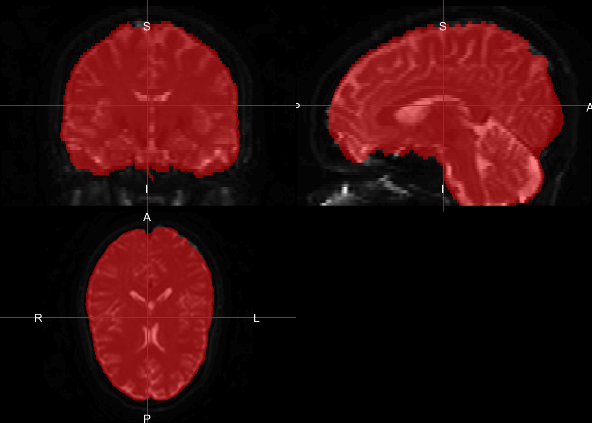
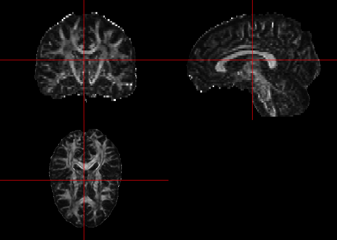
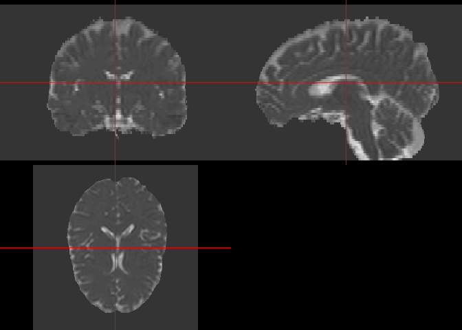
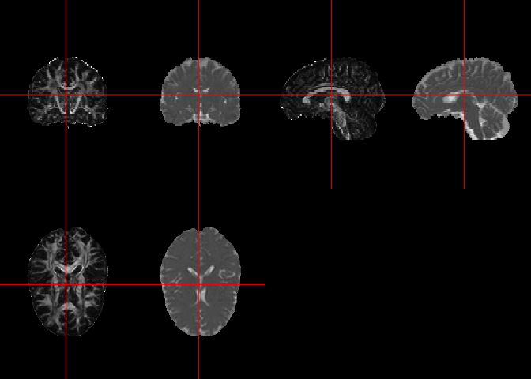
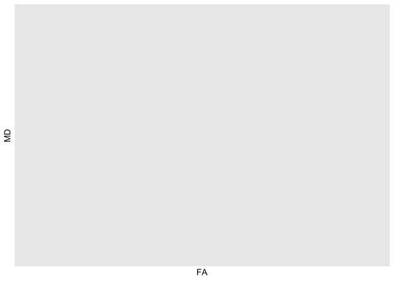

---
output:
  html_document:
    theme: null
---
---
title: "DTI Analysis in fslr"
author: "John Muschelli"
date: "2017-12-20"
output: 
  html_document:
    keep_md: true
    theme: cosmo
    toc: true
    toc_depth: 3
    toc_float:
      collapsed: false
    number_sections: true      
---


All code for this document is located at [here](https://raw.githubusercontent.com/muschellij2/neuroc/master/DTI_analysis_fslr/index.R).

# Resources and Goals
Much of this work has been adapted by the FSL guide for DTI: [http://fsl.fmrib.ox.ac.uk/fsl/fslwiki/FDT/UserGuide](http://fsl.fmrib.ox.ac.uk/fsl/fslwiki/FDT/UserGuide).  We will show you a few steps that have been implemented in `fslr`: `eddy_correct` and `dtifit`.  Although `xfibres` has been adapted for `fslr`, which is the backend for `bedpostx` from FSL, it takes a long time to run and the results are not seen in this vignette, though code is given to illustrate how it would be run.


# Data Packages

For this analysis, I will use one subject from the Kirby 21 data set.  The `kirby21.base` and `kirby21.dti` packages are necessary for this analysis and have the data we will be working on.  You need devtools to install these.  Please refer to [installing devtools](neuroc-help-installing-devtools) for additional instructions or troubleshooting.


```r
packages = installed.packages()
packages = packages[, "Package"]
if (!"kirby21.base" %in% packages) {
  source("https://neuroconductor.org/neurocLite.R")
  neuroc_install("kirby21.base")  
}
if (!"kirby21.dti" %in% packages) {
  source("https://neuroconductor.org/neurocLite.R")
  neuroc_install("kirby21.dti")  
}
```

# Loading Data

We will use the `get_image_filenames_df` function to extract the filenames on our hard disk for the T1 image.  


```r
library(kirby21.dti)
library(kirby21.base)
fnames = get_image_filenames_df(ids = 113, 
                    modalities = c("T1", "DTI"), 
                    visits = c(1),
                    long = FALSE)
t1_fname = fnames$T1[1]
dti_fname = fnames$DTI[1]
base_fname = nii.stub(dti_fname, bn = TRUE)
dti_data = get_dti_info_filenames(
  ids = 113, 
  visits = c(1))
b_fname = dti_data$fname[ dti_data$type %in% "b"]
grad_fname = dti_data$fname[ dti_data$type %in% "grad"]
```


## Making b-vectors and b-values
As `dtifit` requires the b-values and b-vectors to be separated, we will take a look at this data.


```r
b_vals = readLines(b_fname)
b_vals = as.numeric(b_vals)
b0 = which(b_vals == 0)[1]

b_vecs = read.delim(grad_fname, header = FALSE)
stopifnot(all(is.na(b_vecs$V4)))
b_vecs$V4 = NULL
colnames(b_vecs) = c("x", "y", "z")
```

## Printing out FSL Version


```r
library(fslr)
print(fsl_version())
```

```
## [1] "5.0.10"
```

## Checking our data
Here we ensure that the number of b-values/b-vectors is the same as the number of time points in the 4D image.


```r
n_timepoints = fslval(dti_fname, "dim4")
```

```
## fslval "/Library/Frameworks/R.framework/Versions/3.4/Resources/library/kirby21.dti/visit_1/113/113-01-DTI.nii.gz" dim4
```

```r
stopifnot(nrow(b_vecs) == n_timepoints)
stopifnot(length(b_vals) == n_timepoints)
```


# Running `eddy_correct`
Here, we will run an eddy current correction using FSL's `eddy_correct` through `fslr`.  We will save the result in a temporary file (`outfile`), but also return the result as a `nifti` object `ret`, as `retimg = TRUE`.  We will use the first volume as the reference as is the default in FSL.  *Note* FSL is zero-indexed so the first volume is the zero-ith index:


```r
eddy_fname = paste0(base_fname, "_eddy.nii.gz")
if (!file.exists(eddy_fname)) {
  eddy = eddy_correct(
    infile = dti_fname, 
    outfile = eddy_fname, 
    retimg = TRUE, 
    reference_no = 0)
} else {
  eddy = readnii(eddy_fname)
}
```

```
## eddy_correct "/Library/Frameworks/R.framework/Versions/3.4/Resources/library/kirby21.dti/visit_1/113/113-01-DTI.nii.gz"  "113-01-DTI_eddy" 0;
```

Let's look at the eddy current-corrected (left) and the non-corrected data (right).  Here we will look at the image where the b-value is equal to zero.  


```r
dti = readnii(dti_fname)
eddy0 = extrantsr::subset_4d(eddy, b0)
dti0 = extrantsr::subset_4d(dti, b0)
```


```r
double_ortho(robust_window(eddy0), robust_window(dti0))
```

<!-- -->

Note, from here on forward we will use either the filename for the output of the eddy current correction or the eddy-current-corrected `nifti` object.

# Getting a brain mask

Let's get a brain mask from the eddy-corrected data:


```r
mask_fname = paste0(base_fname, "_mask.nii.gz")
if (!file.exists(mask_fname)) {
  fsl_bet(infile = dti0, outfile = mask_fname)
} 
mask = readnii(mask_fname)
```


```r
ortho2(robust_window(dti0), mask, col.y = alpha("red", 0.5))
```

<!-- -->


# Running DTI Fitting as a cursor

Now that we have eddy current corrected our data, we can pass that result into `dtifit` to get FA maps and such:

```r
outprefix = base_fname
suffixes = c(paste0("V", 1:3),
             paste0("L", 1:3),
             "MD", "FA", "MO", "S0")
outfiles = paste0(outprefix, "_", 
                  suffixes, get.imgext())
names(outfiles) = suffixes
if (!all(file.exists(outfiles))) {
  res = dtifit(infile = eddy_fname, 
               bvecs = as.matrix(b_vecs),
               bvals = b_vals, 
               mask = mask_fname,
               outprefix = outprefix)
}
```

By default, the result of `dtifit` is the filenames of the resultant images.  Here we will read in those images:

```r
res_imgs = lapply(outfiles[c("FA", "MD")], readnii)
```

## Plotting an FA map
Using the `ortho2` function, you can plot the fractional anisotropy (FA) map

```r
ortho2(res_imgs$FA)
```

<!-- -->

and the mean diffusivity (MD) map:

```r
ortho2(res_imgs$MD)
```

<!-- -->

or both at the same time using the `double_ortho` function:

```r
double_ortho(res_imgs$FA, res_imgs$MD)
```

<!-- -->

You can look at a scatterplot of the FA vs MD values of all values inside the mask using the following code:

```r
mask = readnii(mask_fname)
df = data.frame(FA = res_imgs$FA[ mask == 1], 
                MD = res_imgs$MD[ mask == 1] )
ggplot(df, aes(x = FA, y = MD)) + stat_binhex()
```

<!-- -->

```r
rm(list = "df")
rm(list = "mask")
```

# Fitting bedpostx

Accoriding to [http://fsl.fmrib.ox.ac.uk/fsl/fslwiki/FDT/UserGuide](http://fsl.fmrib.ox.ac.uk/fsl/fslwiki/FDT/UserGuide), the `bedpostx` function from FSL stands for "Bayesian Estimation of Diffusion Parameters Obtained using Sampling Techniques. The X stands for modelling Crossing Fibres".  It also states "bedpostx takes about 15 hours to run".  We have implemented `xfibres`, the function `bedpostx` calls.  Running it with the default options, the command would be:


```r
xfibres(infile = outfile, 
        bvecs = b_vecs,
        bvals = b_vals,
        mask = mask_fname)
```
        
We are currently implementing `probtracx2` and an overall wrapper for all these functions to work as a pipeline.


# Session Info


```r
devtools::session_info()
```

```
## ─ Session info ──────────────────────────────────────────────────────────
##  setting  value                       
##  version  R version 3.4.2 (2017-09-28)
##  os       macOS Sierra 10.12.6        
##  system   x86_64, darwin15.6.0        
##  ui       X11                         
##  language (EN)                        
##  collate  en_US.UTF-8                 
##  tz       America/New_York            
##  date     2017-12-20                  
## 
## ─ Packages ──────────────────────────────────────────────────────────────
##  package      * version     date      
##  abind          1.4-5       2016-07-21
##  ANTsR        * 0.7.0       2017-09-30
##  ANTsRCore    * 0.4.6.1     2017-10-02
##  assertthat     0.2.0       2017-04-11
##  backports      1.1.1       2017-09-25
##  bindr          0.1         2016-11-13
##  bindrcpp       0.2         2017-06-17
##  bitops         1.0-6       2013-08-17
##  cli            1.0.0       2017-11-29
##  clisymbols     1.2.0       2017-06-29
##  colorout     * 1.1-0       2015-04-20
##  colorspace     1.3-2       2016-12-14
##  crayon         1.3.4       2017-10-10
##  desc           1.1.1.9999  2017-07-26
##  devtools       1.13.3.9000 2017-11-29
##  digest         0.6.13      2017-12-14
##  dplyr        * 0.7.4       2017-09-28
##  evaluate       0.10.1      2017-06-24
##  EveTemplate  * 0.99.14     2017-09-06
##  extrantsr    * 3.7.1       2017-12-18
##  foreign        0.8-69      2017-06-22
##  fslr         * 2.17.3      2017-12-15
##  ggplot2      * 2.2.1.9000  2017-11-07
##  git2r          0.19.0      2017-07-19
##  glue           1.2.0       2017-10-29
##  gtable         0.2.0       2016-02-26
##  hash           2.2.6       2013-02-21
##  hms            0.4.0       2017-11-23
##  htmltools      0.3.6       2017-04-28
##  htmlwidgets    0.9         2017-07-10
##  httpuv         1.3.5       2017-07-04
##  iterators      1.0.8       2015-10-13
##  ITKR           0.4.12.3    2017-08-22
##  jsonlite       1.5         2017-06-01
##  kirby21.base * 1.6.0       2017-12-14
##  kirby21.dti  * 1.5.1       2017-12-14
##  knitr        * 1.17        2017-08-10
##  lattice        0.20-35     2017-03-25
##  lazyeval       0.2.1.9000  2017-11-07
##  magic          1.5-6       2013-11-20
##  magrittr       1.5         2014-11-22
##  Matrix         1.2-12      2017-11-15
##  matrixStats    0.52.2      2017-04-14
##  memoise        1.1.0       2017-04-21
##  mgcv           1.8-22      2017-09-19
##  mime           0.5         2016-07-07
##  mnormt         1.5-5       2016-10-15
##  munsell        0.4.3       2016-02-13
##  neurobase    * 1.26.1      2017-12-14
##  neuroim        0.0.6       2016-01-07
##  nlme           3.1-131     2017-02-06
##  oro.nifti    * 0.9.2       2017-12-14
##  pkgbuild       0.0.0.9000  2017-11-29
##  pkgconfig      2.0.1       2017-03-21
##  pkgload        0.0.0.9000  2017-11-29
##  plyr         * 1.8.4       2016-06-08
##  psych          1.7.8       2017-09-09
##  R.matlab       3.6.1       2016-10-20
##  R.methodsS3    1.7.1       2016-02-16
##  R.oo           1.21.0      2016-11-01
##  R.utils        2.6.0       2017-11-05
##  R6             2.2.2       2017-06-17
##  Rcpp           0.12.14     2017-11-23
##  RcppEigen      0.3.3.3.1   2017-11-20
##  readr          1.1.1       2017-05-16
##  reshape2     * 1.4.2       2016-10-22
##  rgl            0.98.22     2017-12-13
##  rlang          0.1.4       2017-11-05
##  rmarkdown      1.8         2017-11-17
##  RNifti         0.7.1       2017-09-14
##  rprojroot      1.2         2017-01-16
##  rsvd           0.6         2016-07-29
##  scales         0.5.0.9000  2017-10-05
##  sessioninfo    1.0.1.9000  2017-11-29
##  shiny          1.0.5       2017-08-23
##  stapler        0.6.4       2017-12-05
##  stringi        1.1.6       2017-11-17
##  stringr        1.2.0       2017-02-18
##  testthat       1.0.2.9000  2017-11-29
##  tibble         1.3.4       2017-08-22
##  usethis        1.1.0.9000  2017-12-07
##  WhiteStripe    2.2.2       2017-10-12
##  withr          2.1.0       2017-11-01
##  xtable         1.8-2       2016-02-05
##  yaImpute       1.0-26      2015-07-20
##  yaml           2.1.16      2017-12-12
##  source                                   
##  CRAN (R 3.4.0)                           
##  local                                    
##  local                                    
##  CRAN (R 3.4.0)                           
##  CRAN (R 3.4.2)                           
##  CRAN (R 3.4.0)                           
##  CRAN (R 3.4.0)                           
##  CRAN (R 3.4.0)                           
##  Github (r-lib/cli@ab1c3aa)               
##  Github (gaborcsardi/clisymbols@e49b4f5)  
##  Github (jalvesaq/colorout@1539f1f)       
##  CRAN (R 3.4.0)                           
##  Github (gaborcsardi/crayon@b5221ab)      
##  Github (muschellij2/desc@d35a9db)        
##  Github (hadley/devtools@54498b6)         
##  CRAN (R 3.4.2)                           
##  CRAN (R 3.4.2)                           
##  CRAN (R 3.4.1)                           
##  Github (jfortin1/EveTemplate@b1e9166)    
##  local                                    
##  CRAN (R 3.4.2)                           
##  local                                    
##  Github (tidyverse/ggplot2@47c3f75)       
##  CRAN (R 3.4.1)                           
##  CRAN (R 3.4.2)                           
##  CRAN (R 3.4.0)                           
##  CRAN (R 3.4.0)                           
##  CRAN (R 3.4.3)                           
##  CRAN (R 3.4.0)                           
##  CRAN (R 3.4.1)                           
##  CRAN (R 3.4.0)                           
##  CRAN (R 3.4.0)                           
##  Github (stnava/ITKR@f071cb1)             
##  CRAN (R 3.4.0)                           
##  Github (muschellij2/kirby21.base@d250fd1)
##  Github (muschellij2/kirby21.dti@b4ef38b) 
##  CRAN (R 3.4.1)                           
##  CRAN (R 3.4.2)                           
##  Github (hadley/lazyeval@93c455c)         
##  CRAN (R 3.4.0)                           
##  CRAN (R 3.4.0)                           
##  CRAN (R 3.4.2)                           
##  CRAN (R 3.4.0)                           
##  CRAN (R 3.4.0)                           
##  CRAN (R 3.4.2)                           
##  CRAN (R 3.4.0)                           
##  CRAN (R 3.4.0)                           
##  CRAN (R 3.4.0)                           
##  Github (muschellij2/neurobase@63ecb9e)   
##  CRAN (R 3.4.0)                           
##  CRAN (R 3.4.2)                           
##  Github (muschellij2/oro.nifti@a799d19)   
##  Github (r-lib/pkgbuild@a70858f)          
##  CRAN (R 3.4.0)                           
##  Github (r-lib/pkgload@70eaef8)           
##  CRAN (R 3.4.0)                           
##  CRAN (R 3.4.1)                           
##  CRAN (R 3.4.0)                           
##  CRAN (R 3.4.0)                           
##  CRAN (R 3.4.0)                           
##  CRAN (R 3.4.2)                           
##  CRAN (R 3.4.0)                           
##  CRAN (R 3.4.3)                           
##  CRAN (R 3.4.3)                           
##  CRAN (R 3.4.0)                           
##  CRAN (R 3.4.0)                           
##  CRAN (R 3.4.2)                           
##  CRAN (R 3.4.2)                           
##  CRAN (R 3.4.2)                           
##  CRAN (R 3.4.1)                           
##  CRAN (R 3.4.0)                           
##  CRAN (R 3.4.0)                           
##  Github (hadley/scales@d767915)           
##  Github (r-lib/sessioninfo@c871d01)       
##  CRAN (R 3.4.1)                           
##  local                                    
##  CRAN (R 3.4.2)                           
##  CRAN (R 3.4.0)                           
##  Github (hadley/testthat@6dabfd2)         
##  CRAN (R 3.4.1)                           
##  Github (r-lib/usethis@3de3ac7)           
##  local                                    
##  CRAN (R 3.4.2)                           
##  CRAN (R 3.4.0)                           
##  CRAN (R 3.4.0)                           
##  CRAN (R 3.4.2)
```

# References

