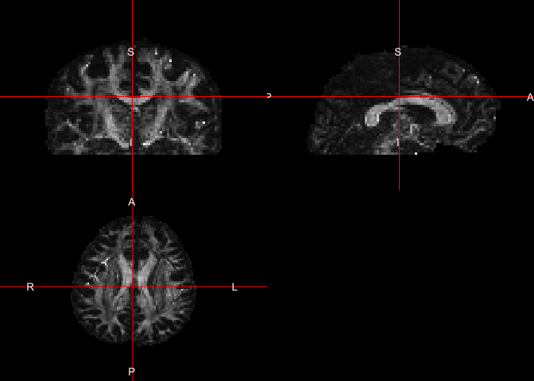
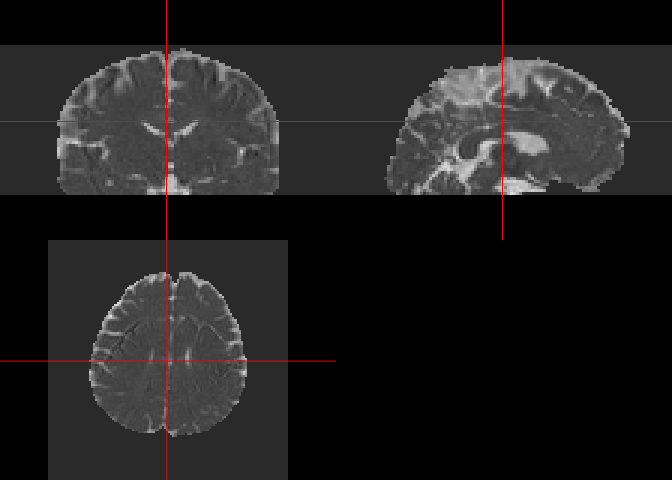

All code for this document is located at [here](https://raw.githubusercontent.com/muschellij2/neuroc/master/DTI_analysis_rcamino/index.R).


# Resources and Goals
Much of this work has been adapted by the FSL guide for DTI reconstruction: [http://camino.cs.ucl.ac.uk/index.php?n=Tutorials.DTI](http://camino.cs.ucl.ac.uk/index.php?n=Tutorials.DTI).  We will show you a few steps that have been implemented in `rcamino`: `camino_pointset2scheme`, `camino_modelfit`, `camino_fa`, `camino_md`, and `camino_dteig`.  

# Data Location
The data located in this tutorial is located at [http://cmic.cs.ucl.ac.uk/camino//uploads/Tutorials/example_dwi.zip](http://cmic.cs.ucl.ac.uk/camino//uploads/Tutorials/example_dwi.zip).  It contains 3 files:

1.  `4Ddwi_b1000.nii.gz` - a 4D image of the DWI data.
2.  `brain_mask.nii.gz` - A brain mask of the DTI data
3.  `grad_dirs.txt` - a 3 column text file with the b-vectors as the first 3 columns 

# Reading in the Data
First, we download the data into a temporary directory the unzip it:


```r
tdir = tempdir()
tfile = file.path(tdir, "example_dwi.zip")
download.file("http://cmic.cs.ucl.ac.uk/camino//uploads/Tutorials/example_dwi.zip",
              destfile = tfile)
files = unzip(zipfile = tfile, exdir = tdir, overwrite = TRUE)
```

## Making b-vectors and b-values
As `dtifit` requires the b-values and b-vectors to be separated, and this data has b-values of $1000$ when the b-vectors is not zero.  **This is very important and you must know where your b-values and b-vectors are when doing your analyses and what units they are in.**  


```r
library(rcamino)
b_data_file = grep("[.]txt$", files, value = TRUE)
scheme_file = camino_pointset2scheme(infile = b_data_file,
                                bvalue = 1e9)
```

```
/Library/Frameworks/R.framework/Versions/4.0/Resources/library/rcamino/camino/bin/pointset2scheme -inputfile '/var/folders/1s/wrtqcpxn685_zk570bnx9_rr0000gr/T//RtmpoGZTxY/grad_dirs.txt' -bvalue 1000000000 -outputfile /var/folders/1s/wrtqcpxn685_zk570bnx9_rr0000gr/T//RtmpoGZTxY/file1395d96e0bd7.scheme
```

## Checking our data
Here we ensure that the number of b-values/b-vectors is the same as the number of time points in the 4D image.


```r
img_fname = grep("4Ddwi_b1000", files, value = TRUE)
img = neurobase::readnii(img_fname)
ntim(img)
```

```
[1] 33
```

```r
grads = readLines(b_data_file)
length(grads)
```

```
[1] 33
```

```r
# cleanup
rm(list= "img"); gc()
```

```
          used (Mb) gc trigger  (Mb) limit (Mb)  max used  (Mb)
Ncells  785111 42.0    1275181  68.2         NA   1275181  68.2
Vcells 1344098 10.3  100702109 768.3      65536 107190963 817.9
```


# Running Image Conversion 
 We will save the result in a temporary file (`outfile`), but also return the result as a `nifti` object `ret`, as `retimg = TRUE`.  We will use the first volume as the reference as is the default in FSL.  *Note* FSL is zero-indexed so the first volume is the zero-ith index:


```r
float_fname = camino_image2voxel(infile = img_fname, 
                                outputdatatype = "float")
```

```
/Library/Frameworks/R.framework/Versions/4.0/Resources/library/rcamino/camino/bin/image2voxel -inputfile '/private/var/folders/1s/wrtqcpxn685_zk570bnx9_rr0000gr/T/RtmpoGZTxY/4Ddwi_b1000.nii.gz' -outputfile '/var/folders/1s/wrtqcpxn685_zk570bnx9_rr0000gr/T//RtmpoGZTxY/file1395dc0d8e31.Bfloat' -outputdatatype float
```

Note, from here on forward we will use either the filename for the output of the eddy current correction or the eddy-current-corrected `nifti` object.


# Fit the diffusion tensor


```r
mask_fname = grep("mask", files, value = TRUE)
model_fname = camino_modelfit(
  infile = float_fname,
  scheme = scheme_file,
  mask = mask_fname,
  outputdatatype = "double"
  )
```

```
/Library/Frameworks/R.framework/Versions/4.0/Resources/library/rcamino/camino/bin/modelfit -inputfile '/private/var/folders/1s/wrtqcpxn685_zk570bnx9_rr0000gr/T/RtmpoGZTxY/file1395dc0d8e31.Bfloat' -outputfile '/var/folders/1s/wrtqcpxn685_zk570bnx9_rr0000gr/T//RtmpoGZTxY/file1395d5985d41d.Bdouble' -inputdatatype float -schemefile /var/folders/1s/wrtqcpxn685_zk570bnx9_rr0000gr/T//RtmpoGZTxY/file1395d96e0bd7.scheme -bgmask /private/var/folders/1s/wrtqcpxn685_zk570bnx9_rr0000gr/T/RtmpoGZTxY/brain_mask.nii.gz -maskdatatype float -model dt
```


## Getting FA vlaues


```r
fa_fname = camino_fa(infile = model_fname)
```

```
cat '/private/var/folders/1s/wrtqcpxn685_zk570bnx9_rr0000gr/T/RtmpoGZTxY/file1395d5985d41d.Bdouble' |  /Library/Frameworks/R.framework/Versions/4.0/Resources/library/rcamino/camino/bin/fa -inputmodel dt -outputdatatype double > '/var/folders/1s/wrtqcpxn685_zk570bnx9_rr0000gr/T//RtmpoGZTxY/file1395d450fd0c8.Bdouble'
```

### Converting FA values back into an image


```r
library(neurobase)
fa_img_name = camino_voxel2image(infile = fa_fname, 
                            header = img_fname, 
                            gzip = TRUE, 
                            components = 1)
```

```
/Library/Frameworks/R.framework/Versions/4.0/Resources/library/rcamino/camino/bin/voxel2image -inputfile /private/var/folders/1s/wrtqcpxn685_zk570bnx9_rr0000gr/T/RtmpoGZTxY/file1395d450fd0c8.Bdouble -header /private/var/folders/1s/wrtqcpxn685_zk570bnx9_rr0000gr/T/RtmpoGZTxY/4Ddwi_b1000.nii.gz -outputroot /var/folders/1s/wrtqcpxn685_zk570bnx9_rr0000gr/T//RtmpoGZTxY/file1395d29766c9f_ -components 1 -gzip 
```

```r
fa_img = readnii(fa_img_name)
```

### Converting with piping

We can chain Camino commands using the `magrittr` pipe operation (`%>%`):


```r
library(magrittr)
fa_img2 = model_fname %>% 
  camino_fa() %>% 
  camino_voxel2image(header = img_fname, gzip = TRUE, components = 1) %>% 
  readnii
```

```
cat '/private/var/folders/1s/wrtqcpxn685_zk570bnx9_rr0000gr/T/RtmpoGZTxY/file1395d5985d41d.Bdouble' |  /Library/Frameworks/R.framework/Versions/4.0/Resources/library/rcamino/camino/bin/fa -inputmodel dt -outputdatatype double > '/var/folders/1s/wrtqcpxn685_zk570bnx9_rr0000gr/T//RtmpoGZTxY/file1395d1f767a58.Bdouble'
```

```
/Library/Frameworks/R.framework/Versions/4.0/Resources/library/rcamino/camino/bin/voxel2image -inputfile /private/var/folders/1s/wrtqcpxn685_zk570bnx9_rr0000gr/T/RtmpoGZTxY/file1395d1f767a58.Bdouble -header /private/var/folders/1s/wrtqcpxn685_zk570bnx9_rr0000gr/T/RtmpoGZTxY/4Ddwi_b1000.nii.gz -outputroot /var/folders/1s/wrtqcpxn685_zk570bnx9_rr0000gr/T//RtmpoGZTxY/file1395d1b5a378b_ -components 1 -gzip 
```

```r
all.equal(fa_img2, fa_img2)
```

```
[1] TRUE
```

### Visualizing FA images

Using `ortho2`, we can visualize these FA maps:

```r
ortho2(fa_img)
```

<!-- -->

## Getting MD vlaues

Similar to getting FA maps, we can get mean diffusivity (MD) maps, read them into `R`, and visualize them using `ortho2`:

```r
md_img = model_fname %>% 
  camino_md() %>% 
  camino_voxel2image(header = img_fname, gzip = TRUE, components = 1) %>% 
  readnii
```

```
cat '/private/var/folders/1s/wrtqcpxn685_zk570bnx9_rr0000gr/T/RtmpoGZTxY/file1395d5985d41d.Bdouble' |  /Library/Frameworks/R.framework/Versions/4.0/Resources/library/rcamino/camino/bin/md -inputmodel dt -outputdatatype double > '/var/folders/1s/wrtqcpxn685_zk570bnx9_rr0000gr/T//RtmpoGZTxY/file1395d35d26266.Bdouble'
```

```
/Library/Frameworks/R.framework/Versions/4.0/Resources/library/rcamino/camino/bin/voxel2image -inputfile /private/var/folders/1s/wrtqcpxn685_zk570bnx9_rr0000gr/T/RtmpoGZTxY/file1395d35d26266.Bdouble -header /private/var/folders/1s/wrtqcpxn685_zk570bnx9_rr0000gr/T/RtmpoGZTxY/4Ddwi_b1000.nii.gz -outputroot /var/folders/1s/wrtqcpxn685_zk570bnx9_rr0000gr/T//RtmpoGZTxY/file1395d73a3225_ -components 1 -gzip 
```

```r
ortho2(md_img)
```

<!-- -->

# Export DTs to NIfTI

Using `camino_dt2nii`, we can export the diffusion tensors into NIfTI files.  We see the result is the filenames of the NIfTI files, and that they all exist (otherwise there'd be an errors.) 

```r
nifti_dt = camino_dt2nii(
  infile = model_fname, 
  inputmodel = "dt",
  header = img_fname, 
  gzip = TRUE
)
```

```
/Library/Frameworks/R.framework/Versions/4.0/Resources/library/rcamino/camino/bin/dt2nii -inputfile /private/var/folders/1s/wrtqcpxn685_zk570bnx9_rr0000gr/T/RtmpoGZTxY/file1395d5985d41d.Bdouble -header /private/var/folders/1s/wrtqcpxn685_zk570bnx9_rr0000gr/T/RtmpoGZTxY/4Ddwi_b1000.nii.gz -inputmodel dt -outputroot /var/folders/1s/wrtqcpxn685_zk570bnx9_rr0000gr/T//RtmpoGZTxY/file1395d3906f5b9_ -gzip 
```

```r
stopifnot(all(file.exists(nifti_dt)))
print(nifti_dt)
```

```
[1] "/var/folders/1s/wrtqcpxn685_zk570bnx9_rr0000gr/T//RtmpoGZTxY/file1395d3906f5b9_exitcode.nii.gz"
[2] "/var/folders/1s/wrtqcpxn685_zk570bnx9_rr0000gr/T//RtmpoGZTxY/file1395d3906f5b9_lns0.nii.gz"    
[3] "/var/folders/1s/wrtqcpxn685_zk570bnx9_rr0000gr/T//RtmpoGZTxY/file1395d3906f5b9_dt.nii.gz"      
```

We can read these DT images into `R` again using `readnii`, but we must set `drop_dim = FALSE` for diffusion tensor images because the pixel dimensions are zero and `readnii` assumes you want to drop "empty" dimensions


```r
dt_imgs = lapply(nifti_dt, readnii, drop_dim = FALSE)
```
