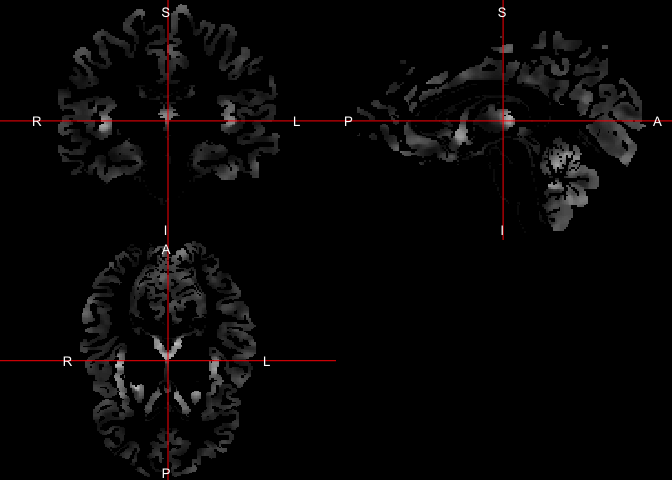
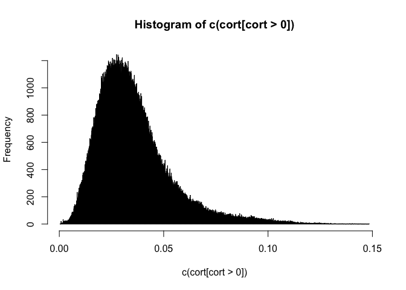
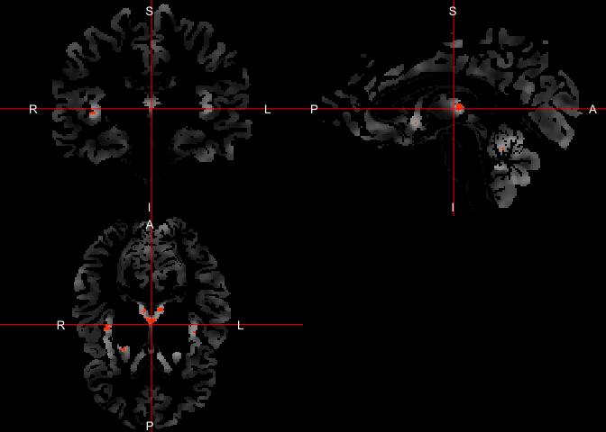
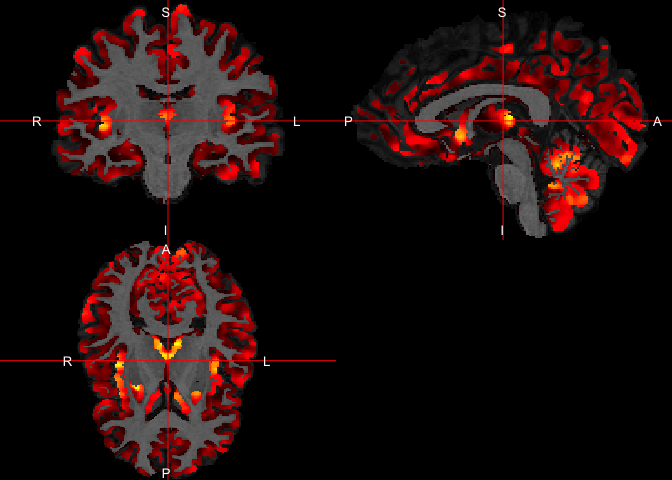

---
output:
  html_document:
    theme: null
    self_contained: false
bibliography: ../refs.bib
---

All code for this document is located at [here](https://raw.githubusercontent.com/muschellij2/neuroc/master/cortical_thickness/index.R).


```r
base_fname = "113-01-T1"
orig = file.path("..", 
                 "brain_extraction",
                 paste0(base_fname, "_SS.nii.gz")
)
stub = file.path("..", "tissue_class_segmentation", 
                base_fname)
seg = paste0(stub, "_Seg.nii.gz")
wm_prob = paste0(stub, "_prob_2.nii.gz")
gm_prob = paste0(stub, "_prob_3.nii.gz")
```


```r
s = antsImageRead(seg)
g = antsImageRead(gm_prob)
w = antsImageRead(wm_prob)
out = kellyKapowski(s = s, g = g, w = w, its = 50, r = 0.025, m = 1.5)
cort = extrantsr::ants2oro(out)
```


```r
ortho2(cort)
```

<!-- -->


```r
hist(c(cort[cort > 0]), breaks = 2000)
```

<!-- -->


```r
ortho2(cort, cort > 0.1)
```

<!-- -->


```r
ortho2(img, cort)
```

<!-- -->


# Session Info


```r
devtools::session_info()
```

```
Session info -------------------------------------------------------------
```

```
 setting  value                       
 version  R version 3.3.1 (2016-06-21)
 system   x86_64, darwin13.4.0        
 ui       X11                         
 language (EN)                        
 collate  en_US.UTF-8                 
 tz       America/New_York            
 date     2016-12-21                  
```

```
Packages -----------------------------------------------------------------
```

```
 package      * version     date       source                             
 abind          1.4-5       2016-07-21 cran (@1.4-5)                      
 ANTsR        * 0.3.3       2016-11-17 Github (stnava/ANTsR@063700b)      
 assertthat     0.1         2013-12-06 CRAN (R 3.2.0)                     
 backports      1.0.4       2016-10-24 CRAN (R 3.3.0)                     
 bitops         1.0-6       2013-08-17 CRAN (R 3.2.0)                     
 colorout     * 1.1-0       2015-04-20 Github (jalvesaq/colorout@1539f1f) 
 devtools       1.12.0.9000 2016-12-08 Github (hadley/devtools@1ce84b0)   
 digest         0.6.10      2016-08-02 cran (@0.6.10)                     
 evaluate       0.10        2016-10-11 CRAN (R 3.3.0)                     
 extrantsr    * 2.8         2016-11-20 local                              
 fslr           2.5.1       2016-12-21 Github (muschellij2/fslr@5e46b66)  
 hash           2.2.6       2013-02-21 CRAN (R 3.2.0)                     
 htmltools      0.3.6       2016-12-08 Github (rstudio/htmltools@4fbf990) 
 igraph         1.0.1       2015-06-26 CRAN (R 3.2.0)                     
 iterators      1.0.8       2015-10-13 CRAN (R 3.2.0)                     
 kirby21.base   1.4.2       2016-10-05 local                              
 kirby21.t1   * 1.4         2016-09-29 local                              
 knitr          1.15.1      2016-11-22 cran (@1.15.1)                     
 lattice        0.20-34     2016-09-06 CRAN (R 3.3.0)                     
 magrittr       1.5         2014-11-22 CRAN (R 3.2.0)                     
 Matrix         1.2-7.1     2016-09-01 CRAN (R 3.3.0)                     
 matrixStats    0.51.0      2016-10-09 cran (@0.51.0)                     
 memoise        1.0.0       2016-01-29 CRAN (R 3.2.3)                     
 mgcv           1.8-16      2016-11-07 CRAN (R 3.3.0)                     
 mmap           0.6-12      2013-08-28 CRAN (R 3.3.0)                     
 neurobase    * 1.9.1       2016-12-21 local                              
 neuroim        0.1.0       2016-09-27 local                              
 nlme           3.1-128     2016-05-10 CRAN (R 3.3.1)                     
 oro.nifti    * 0.7.2       2016-12-21 Github (bjw34032/oro.nifti@a713047)
 pkgbuild       0.0.0.9000  2016-12-08 Github (r-pkgs/pkgbuild@65eace0)   
 pkgload        0.0.0.9000  2016-12-08 Github (r-pkgs/pkgload@def2b10)    
 plyr           1.8.4       2016-06-08 CRAN (R 3.3.0)                     
 R.matlab       3.6.1       2016-10-20 CRAN (R 3.3.0)                     
 R.methodsS3    1.7.1       2016-02-16 CRAN (R 3.2.3)                     
 R.oo           1.21.0      2016-11-01 cran (@1.21.0)                     
 R.utils        2.5.0       2016-11-07 cran (@2.5.0)                      
 Rcpp           0.12.8.2    2016-12-08 Github (RcppCore/Rcpp@8c7246e)     
 rmarkdown      1.2.9000    2016-12-08 Github (rstudio/rmarkdown@7a3df75) 
 RNifti         0.3.0       2016-12-08 cran (@0.3.0)                      
 rprojroot      1.1         2016-10-29 cran (@1.1)                        
 stringi        1.1.2       2016-10-01 CRAN (R 3.3.0)                     
 stringr        1.1.0       2016-08-19 cran (@1.1.0)                      
 WhiteStripe    2.0.1       2016-12-02 local                              
 withr          1.0.2       2016-06-20 CRAN (R 3.3.0)                     
 yaImpute       1.0-26      2015-07-20 CRAN (R 3.2.0)                     
 yaml           2.1.14      2016-11-12 CRAN (R 3.3.2)                     
```

# References
