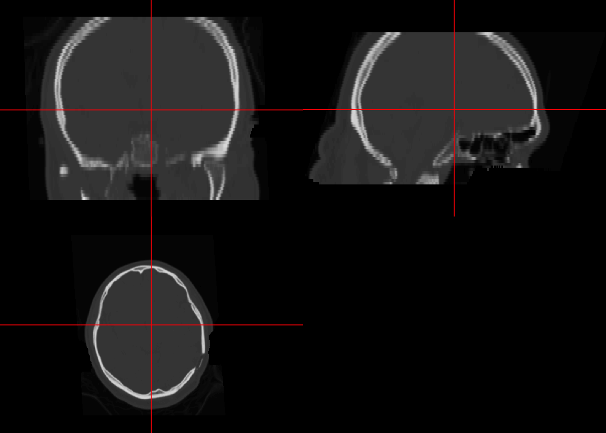
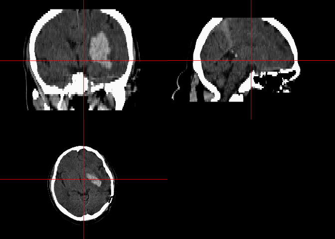
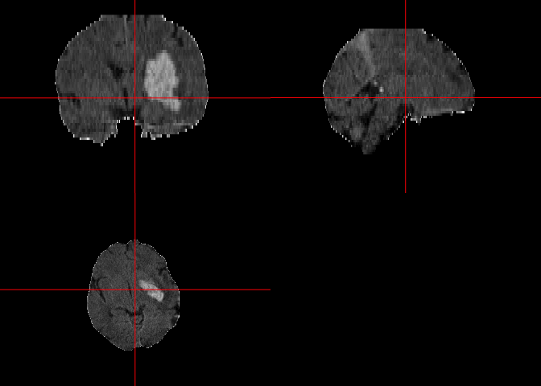
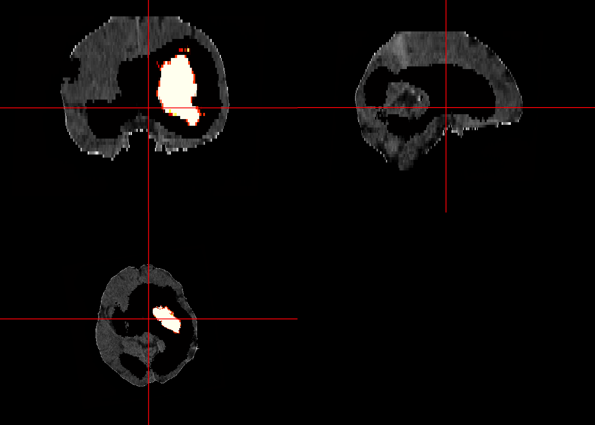
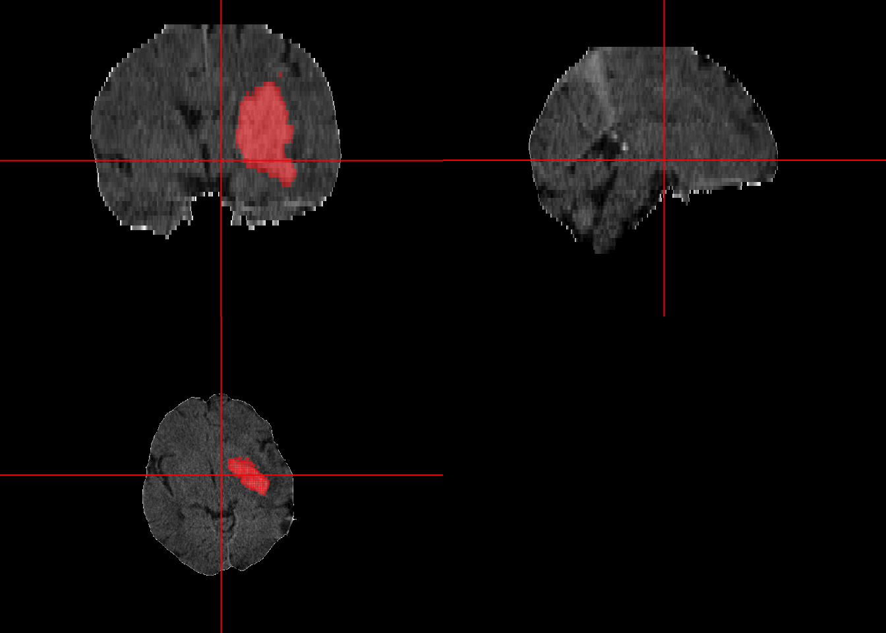
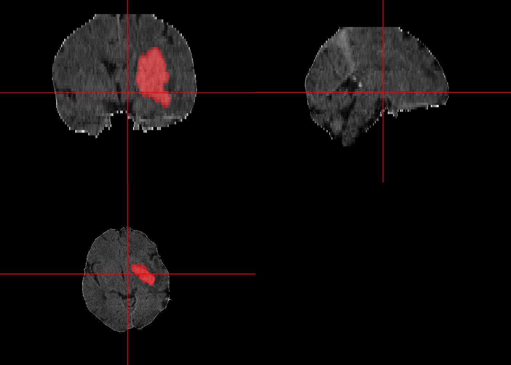

All code for this document is located at [here](https://raw.githubusercontent.com/muschellij2/neuroc/master/ct_ich_seg/index.R).


# Goal
In this tutorial, we will discuss segmentation of X-ray computed tomography (CT) scans.  The data is discussed in Validated automatic brain extraction of head CT images" (http://doi.org/10.1016/j.neuroimage.2015.03.074).  The data is located at https://archive.data.jhu.edu/dataset.xhtml?persistentId=doi:10.7281/T1/CZDPSX and was from the MISTIE (https://doi.org/10.1016/S1474-4422(16)30234-4Get) and CLEAR (https://doi.org/10.1111/ijs.12097) studies.  The MISTIE study focused on patients with intraparenchymal/intracerebral hemorrhage (ICH) and CLEAR focused on intraventricular hemorrhage (IVH), but also has patients with ICH.


## Setting up the Dataverse

The JHU archive is a [Dataverse](https://guides.dataverse.org/en/latest/) archive.  We can use the [`dataverse`](https://github.com/iqss/dataverse-client-r) package.  We will set the `DATAVERSE_SERVER` variable as this is the default variable that is used in the `dataverse` package.  I have set the environment variable `JHU_DATAVERSE_API_TOKEN` with the API token for this repository.  


```r
library(dataverse)
Sys.setenv("DATAVERSE_SERVER" = "archive.data.jhu.edu")
token = Sys.getenv("JHU_DATAVERSE_API_TOKEN")
```

With these set up, we can use the `dataverse` functions, by passing in `key = token` for all functions.  Alternatively, we can set:

```r
Sys.setenv("DATAVERSE_KEY" = Sys.getenv("JHU_DATAVERSE_API_TOKEN"))
```
and not have to set anything again.

## Finding the ID of the Dataset
Although we know the DOI is `10.7281/T1/CZDPSX` as we can see this in the URL itself https://archive.data.jhu.edu/dataset.xhtml?persistentId=doi:10.7281/T1/CZDPSX, we will use the `dataverse` functionality:

```r
x = dataverse_search("muschelli AND head ct")
```

```
1 of 1 result retrieved
```

```r
doi = x$global_id
doi
```

```
[1] "doi:10.7281/T1/CZDPSX"
```

## Listing the Data Files

We will get the tiles from the data set so that we can download individual files and show how to segment a specific scan.


```r
files = dataverse::get_dataset(doi)
files
```

```
Dataset (304): 
Version: 1.0, RELEASED
Release Date: 2019-09-18T15:58:57Z
License: NONE
21 Files:
                  label version   id               contentType
1          00_README.md       6 1241  application/octet-stream
2         00_README.pdf       5 1239           application/pdf
3             01.tar.xz       2 1311          application/x-xz
4             02.tar.xz       1 1283          application/x-xz
5             03.tar.xz       1 1298          application/x-xz
6             04.tar.xz       1 1289          application/x-xz
7             05.tar.xz       1 1288          application/x-xz
8             06.tar.xz       1 1286          application/x-xz
9             07.tar.xz       1 1295          application/x-xz
10            08.tar.xz       1 1306          application/x-xz
11            09.tar.xz       1 1309          application/x-xz
12            10.tar.xz       1 1296          application/x-xz
13            11.tar.xz       1 1297          application/x-xz
14            12.tar.xz       1 1287          application/x-xz
15            13.tar.xz       1 1299          application/x-xz
16            14.tar.xz       1 1291          application/x-xz
17            15.tar.xz       1 1302          application/x-xz
18            16.tar.xz       1 1310          application/x-xz
19            17.tar.xz       1 1284          application/x-xz
20            18.tar.xz       1 1279          application/x-xz
21            19.tar.xz       1 1303          application/x-xz
22            20.tar.xz       1 1305          application/x-xz
23            21.tar.xz       1 1290          application/x-xz
24            22.tar.xz       1 1300          application/x-xz
25            23.tar.xz       1 1308          application/x-xz
26            24.tar.xz       1 1285          application/x-xz
27            25.tar.xz       1 1312          application/x-xz
28            26.tar.xz       1 1280          application/x-xz
29            27.tar.xz       1 1292          application/x-xz
30            28.tar.xz       1 1278          application/x-xz
31            29.tar.xz       1 1294          application/x-xz
32            30.tar.xz       1 1293          application/x-xz
33            31.tar.xz       1 1304          application/x-xz
34            32.tar.xz       1 1301          application/x-xz
35            33.tar.xz       1 1282          application/x-xz
36            34.tar.xz       1 1307          application/x-xz
37            35.tar.xz       1 1281          application/x-xz
38     Demographics.tab       2 1238 text/tab-separated-values
39 ichseg_0.16.1.tar.gz       5 1240        application/x-gzip
```

We can download the demographics data from the repository so we can see some information about these patients.  We will create a wrapper function as the `get_file` function always returns a raw vector:


```r
library(readr)
dl_file = function(file, ...) {
  outfile = file.path(tempdir(), basename(file))
  out = get_file(file, ...)
  writeBin(out, outfile)
  return(outfile)
}
fname = grep("Demog", files$files$label, value = TRUE)
demo_file = dl_file(fname, dataset = doi)
demo = readr::read_csv(demo_file)
```

```

── Column specification ────────────────────────────────────────────────────────
cols(
  id = col_character(),
  age = col_double(),
  sex = col_character(),
  race = col_character(),
  hispanic = col_character(),
  dx = col_character(),
  site = col_character()
)
```

```r
head(demo)
```

```
# A tibble: 6 x 7
  id      age sex    race                    hispanic          dx          site 
  <chr> <dbl> <chr>  <chr>                   <chr>             <chr>       <chr>
1 01       50 Female Black/African American  Not Hispanic/Lat… ICH with I… 02   
2 02       66 Female Black/African American  Not Hispanic/Lat… ICH         15   
3 03       43 Male   Black/African American  Not Hispanic/Lat… ICH         10   
4 04       70 Male   White/Caucasian         Not Hispanic/Lat… ICH         14   
5 05       78 Male   Asian or Pacific Islan… Not Hispanic/Lat… ICH with I… 16   
6 06       52 Male   Black/African American  Not Hispanic/Lat… ICH with I… 02   
```

Here we will grab one patient, download the tarball, and then `untar` the files:


```r
library(dplyr)
set.seed(20210217)
run_id = demo %>% 
  filter(dx == "ICH") %>% 
  sample_n(1) %>% 
  pull(id)
fname = paste0(run_id, ".tar.xz")
tarball = dl_file(fname, dataset = doi)
xz_files = untar(tarball, list = TRUE)
```

Here we create a temporary directory and extract the tarball to that directory.  We create a vector of the file names and extract specifically the image and the mask:

```r
tdir = tempfile()
dir.create(tdir)
untar(tarball, exdir = tdir)
nii_files = list.files(path = tdir, recursive = TRUE, full.names = TRUE)
nii_file = nii_files[!grepl("Mask", nii_files) & grepl(".nii.gz", nii_files)]
mask_file = nii_files[grepl("_Mask.nii.gz", nii_files)]
```

## Reading in the Data

Here we read the data into `R` into a `nifti` object:

```r
library(neurobase)
```

```
Loading required package: oro.nifti
```

```
oro.nifti 0.11.0
```

```

Attaching package: 'oro.nifti'
```

```
The following object is masked from 'package:dplyr':

    slice
```

```r
img = readnii(nii_file)
mask = readnii(mask_file)
ortho2(img)
```

<!-- -->

```r
range(img)
```

```
[1] -1024  3068
```

Here we plot the image and the Winsorized version to see the brain tissue:


```r
ortho2(img, window = c(0, 100))
```

<!-- -->

```r
masked = window_img(mask_img(img, mask))
ortho2(masked)
```

<!-- -->

## Segment Image

We can segment the image using `ichseg::ich_segment` to segment the image using PItcHPERFeCT (https://doi.org/10.1016/j.nicl.2017.02.007).  We will use the `ichseg::predict_deepbleed`, which implements the DeepBleed model from https://github.com/msharrock/deepbleed (https://doi.org/10.1007/s12021-020-09493-5).  We will pass in the image and the mask.  The model weights will be downloaded and the model will be run.  The `outdir` argument can be used if you would like to download the model weights to a temporary directory or if you cannot write to your R library folder. 


```r
library(ichseg)
segmentation = ichseg::predict_deepbleed(nii_file, mask_file)
```

```
Loading DeepBleed Model
```

```
Masking Image
```

```
Registration
```

```
Prediction
```

```
Projecting back into Native Space
```

```r
print(names(segmentation))
```

```
[1] "skull_stripped"      "brain_mask"          "template_space"     
[4] "registration_matrix" "native_prediction"   "template_prediction"
```

```r
print(segmentation)
```

```
$skull_stripped
NIfTI-1 format
  Type            : nifti
  Data Type       : 4 (INT16)
  Bits per Pixel  : 16
  Slice Code      : 0 (Unknown)
  Intent Code     : 0 (None)
  Qform Code      : 1 (Scanner_Anat)
  Sform Code      : 1 (Scanner_Anat)
  Dimension       : 512 x 616 x 56
  Pixel Dimension : 0.46 x 0.46 x 2.54
  Voxel Units     : mm
  Time Units      : sec

$brain_mask
NIfTI-1 format
  Type            : nifti
  Data Type       : 2 (UINT8)
  Bits per Pixel  : 8
  Slice Code      : 0 (Unknown)
  Intent Code     : 0 (None)
  Qform Code      : 1 (Scanner_Anat)
  Sform Code      : 1 (Scanner_Anat)
  Dimension       : 512 x 616 x 56
  Pixel Dimension : 0.46 x 0.46 x 2.54
  Voxel Units     : mm
  Time Units      : sec

$template_space
NIfTI-1 format
  Type            : nifti
  Data Type       : 16 (FLOAT32)
  Bits per Pixel  : 32
  Slice Code      : 0 (Unknown)
  Intent Code     : 0 (None)
  Qform Code      : 1 (Scanner_Anat)
  Sform Code      : 1 (Scanner_Anat)
  Dimension       : 128 x 128 x 128
  Pixel Dimension : 1.5 x 1.5 x 1.5
  Voxel Units     : mm
  Time Units      : Unknown

$registration_matrix
[1] "/var/folders/1s/wrtqcpxn685_zk570bnx9_rr0000gr/T//Rtmp7olonD/file21631ece5ddb0GenericAffine.mat"

$native_prediction
NIfTI-1 format
  Type            : nifti
  Data Type       : 16 (FLOAT32)
  Bits per Pixel  : 32
  Slice Code      : 0 (Unknown)
  Intent Code     : 0 (None)
  Qform Code      : 1 (Scanner_Anat)
  Sform Code      : 1 (Scanner_Anat)
  Dimension       : 512 x 616 x 56
  Pixel Dimension : 0.46 x 0.46 x 2.54
  Voxel Units     : mm
  Time Units      : Unknown

$template_prediction
NIfTI-1 format
  Type            : nifti
  Data Type       : 16 (FLOAT32)
  Bits per Pixel  : 32
  Slice Code      : 0 (Unknown)
  Intent Code     : 0 (None)
  Qform Code      : 1 (Scanner_Anat)
  Sform Code      : 1 (Scanner_Anat)
  Dimension       : 128 x 128 x 128
  Pixel Dimension : 1.5 x 1.5 x 1.5
  Voxel Units     : mm
  Time Units      : Unknown
```

We see the segmentation returns a number of things, and we want to overlay the image with the segmentation in native space (template space registered and predicted images are also included):

```r
ortho2(masked, segmentation$native_prediction)
```

<!-- -->

We see that some areas are dark in this image, which is because the prediction is not binary.  Areas with any values > 0 are imposed on the data.  Here we will threshold the data at a number of thresholds to show the segmentation overlaid on the image


```r
ortho2(masked, segmentation$native_prediction > 0.5, col.y = scales::alpha("red", 0.5))
```

<!-- -->

```r
ortho2(masked, segmentation$native_prediction > 0.9, col.y = scales::alpha("red", 0.5))
```

<!-- -->

We can create a simple function to perform the extraction and segmentation of any of the patient data in our complete data set:


```r
predict_ich_data = function(id) {
  fname = paste0(id, ".tar.xz")
  tarball = dl_file(fname, dataset = doi)
  xz_files = untar(tarball, list = TRUE)
  tdir = tempfile()
  dir.create(tdir)
  untar(tarball, exdir = tdir)
  nii_files = list.files(path = tdir, recursive = TRUE, full.names = TRUE)
  nii_file = nii_files[!grepl("Mask", nii_files) & grepl(".nii.gz", nii_files)]
  mask_file = nii_files[grepl("_Mask.nii.gz", nii_files)]
  ichseg::predict_deepbleed(nii_file, mask_file)
}
```


