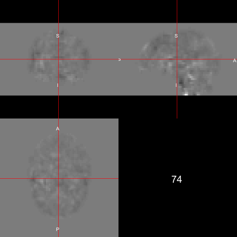

```{r setup, include=FALSE}
library(kirby21.fmri)
library(kirby21.base)
library(dplyr)
library(neurobase)
library(ANTsR)
library(R.utils)
library(RColorBrewer)
library(matrixStats)
library(ggplot2)
library(reshape2)
library(animation)
library(zoo)
knitr::opts_chunk$set(echo = TRUE, cache = TRUE, comment = "")
```

In this tutorial we will discuss performing some preprocessing of a single subject functional MRI in FSL.  

# Data Packages

For this analysis, I will use one subject from the Kirby 21 data set.  The `kirby21.base` and `kirby21.fmri` packages are necessary for this analysis and have the data we will be working on.  You need devtools to install these.  Please refer to [installing devtools](installing_devtools.html) for additional instructions or troubleshooting.


```{r, eval = FALSE}
packages = installed.packages()
packages = packages[, "Package"]
if (!"kirby21.base" %in% packages) {
  devtools::install_github("muschellij2/kirby21.base")
}
if (!"kirby21.fmri" %in% packages) {
  devtools::install_github("muschellij2/kirby21.fmri")
}
```

# Loading Data

We will use the `get_image_filenames_df` function to extract the filenames on our hard disk for the T1 image and the fMRI images (4D).  

```{r data}
library(kirby21.fmri)
library(kirby21.base)
fnames = get_image_filenames_df(ids = 113, 
                    modalities = c("T1", "fMRI"), 
                    visits = c(1),
                    long = FALSE)
t1_fname = fnames$T1[1]
fmri_fname = fnames$fMRI[1]
```

## Parameter file

If you'd like to see the header information from the fMRI data, it is located by the following commands:

```{r par_data}
library(R.utils)
par_file = system.file("visit_1/113/113-01-fMRI.par.gz", 
                       package = "kirby21.fmri")
# unzip it
con = gunzip(par_file, temporary = TRUE, 
             remove = FALSE, overwrite = TRUE)
info = readLines(con = con)
info[11:23]
```

From the paper ["Multi-parametric neuroimaging reproducibility: A 3-T resource study"](http://dx.doi.org/10.1016/j.neuroimage.2010.11.047), which this data is based on, it describes the fMRI sequence:

> The sequence used for resting state functional connectivity MRI is typically identical to that used for BOLD functional MRI studies of task activation. Here, we used a 2D EPI sequence with SENSE partial-parallel imaging acceleration to obtain 3 × 3 mm (80 by 80 voxels) in-plane resolution in thirty-seven 3 mm transverse slices with 1 mm slice gap. An ascending slice order with TR/TE = 2000/30 ms, flip angle of 75°, and SENSE acceleration factor of 2 were used. SPIR was used for fat suppression. This study used an ascending slice acquisition order because a pilot studies revealed smaller motion induced artifacts with ascending slice order than with interleaved slice order. While using an ascending slice order, it was necessary to use a small slice gap to prevent cross talk between the slices. One 7-min run was recorded which provided 210 time points (discarding the first four volumes to achieve steady state).


# Outline 
The steps I will perform in this analysis:

1. Calculation of Motion Parameters (`fslr::mcflirt`)
1. Slice timing correction (`fslr::fsl_slicetimer`), but we need to know how the scan was taken/slice order and repetition time (TR)
2. Motion Correction on Corrected Data (`fslr::mcflirt`)
3. Coregistration of fMRI and a T1-weighted image (`fslr::flirt`)
4. Registration to the Template space (`fslr::fnirt_with_affine` )
5. De-meaning the data (fslr::fslmean(ts = TRUE))
6. Skull stripping (fslr::fslbet)
7. Registration to a template using the T1 and then transforming the fMRI with it
8. Spatially smoothing the data (fslr:fslsmooth)
9. Tissue-class segmentation (fslr::fast, ANTsR::atropos or extrantsr::otropos)?
10. Bandpass/butterworth filtering (signal::butter, signal::buttord)
11. Get a connectivity matrix of certain regions, you need to specify an atlas.


Now we know that the head is first in (as usual) and the data was acquired in ascending order (i.e. bottom -> up) and the repetition time (TR) was 2 seconds   The 

```{r fmri, cache = TRUE}
library(neurobase)
fmri = readnii(fmri_fname)
ortho2(fmri, w = 1, add.orient = FALSE)
rm(list = "fmri") # just used for cleanup 
```

## Side note

Throughout this tutorial, I may be re-reading in data using `antsImageRead`.  This is due to the nature of the `antsImage` class.  It represents the data as a pointer in memory.  As I'm running RMarkdown and knitting the document, different chunks are necessarily going to keep the pointers, especially if one chunk was run in one session and then R was restarted.   It's a somewhat technical issue, but that is why I keep calling `antsImageRead` even when it seems as though that object is in memory in an earlier code chunk.

# Stabilization of Signal

Volumes corresponding to the first 10 seconds of the rs-fMRI scan were dropped to allow for magnetization stabilization.

```{r subset_run, eval = TRUE}
library(extrantsr)
library(oro.nifti)
library(ANTsR)
ants_fmri = antsImageRead(fmri_fname)
tr = 2 # 2 seconds
first_scan = floor(10.0 / tr) + 1 # 10 seconds "stabilization of signal"
sub_fmri = extrantsr::subset_4d(ants_fmri, first_scan:ntim(ants_fmri))
```

# Motion Correction

Here we will average over the fMRI to get an average 3D image.  We then run `antsMotionCalculation` to perform a rigid registration to the average image.  We will then save those images and the parameters out to files.

```{r motion_corr_run, echo = TRUE, message=FALSE, dependson="subset_run"}
library(dplyr)
library(neurobase)
library(ANTsR)
base_fname = nii.stub(fmri_fname, bn = TRUE)
avg_img = getAverageOfTimeSeries(sub_fmri)

#####################
# Full with Half Max twice the vox size
##################
all_vox_dim = voxdim(sub_fmri)


#####################
# Motion Calculation
##################
moco_file = paste0(base_fname, 
                   "_Motion_Params.rda")
moco_fname = paste0(base_fname, "_moco_img.nii.gz")
if (all(file.exists(c(moco_file, 
                      moco_fname)))) { 
  load(moco_file)
  moco_img = antsImageRead(moco_fname)
  motion_res$moco_img = 
    moco_img
} else {
  motion_res = 
    antsMotionCalculation(sub_fmri, 
                          fixed = avg_img, 
                          moreaccurate = 1,
                          txtype = "Rigid",
                          verbose = TRUE)
  save(motion_res, 
       file = moco_file)
  moco_img = 
    motion_res$moco_img
  antsImageWrite(moco_img, 
                 filename = moco_fname)
}
moco_params = 
    motion_res$moco_params
moco_params = moco_params %>% 
    select(starts_with("MOCO"))
nuisanceVariables = moco_params
mp = round(moco_params, 4)
print(head(mp, 3))
rm(list = c("mp"))
```

### Plotting the motion parameters

Here we will multiply the 3 first motion parameters (roll, pitch, yaw) by 50 to convert radians to millimeters by assuming a brain radius of 50 mm, as similar to @power2012spurious.  The next 3 parameters are in terms of millimeters (x, y, z). We will plot each of the parameters on the same scale to look at the motion for each scan.

```{r moco_run_plot, echo = TRUE, fig.height = 4, fig.width= 8, dependson="motion_corr_run"}
mp = moco_params
mp[, 1:3] = mp[, 1:3] * 50
r = range(mp)
plot(mp[,1], type = "l", xlab = "Scan Number", main = "Motion Parameters",
     ylab = "Displacement (mm)",
     ylim = r * 1.25, 
     lwd = 2,
     cex.main = 2,
     cex.lab = 1.5,
     cex.axis = 1.25)
for (i in 2:ncol(mp)) {
  lines(mp[, i], col = i)
}
rm(list = "mp")
```

## Let's Make a Matrix!

`timeseries2matrix` creates $T\times V$ matrix, $V$ voxels in mask.  We will get the average of the co-registered image.  We wil use this average image to get a mask using the `getMask` function.  We will then zero out the average image using the mask image.

```{r ts_run, echo = TRUE, dependson="motion_corr_run"}
moco_img = antsImageRead(moco_fname)
moco_avg_img = 
    getAverageOfTimeSeries(moco_img)
maskImage = getMask(moco_avg_img, 
    mean(moco_avg_img), 
    Inf, cleanup = 2)
mask_fname = paste0(base_fname, "_mask.nii.gz")
antsImageWrite(maskImage, filename = mask_fname)
double_ortho(moco_avg_img, maskImage, 
  col.y = "white")
moco_avg_img[maskImage == 0] = 0
boldMatrix = timeseries2matrix(
    moco_img, 
    maskImage)
```


### Calculation of DVARS

With this `boldMatrix`, we can calculate a series of information.  For example, we can calculate DVARS based on the motion corrected data.  We can also compare the DVARS to the DVARS calculated from the non-realigned data.  

```{r compute_dvars, echo = TRUE, dependson = "ts_run" }
dvars = computeDVARS(boldMatrix)
uncorr_dvars = motion_res$dvars
plot(dvars, uncorr_dvars,
  xlab = "Realigned DVARS",
  ylab = "Non-Realigned DVARS")
abline( a = 0, b = 1, col = "red")
```

We see that the realigned DVARS are lower for each image after coregistration.

### Framewise Displacement

Similarly for framewise displacement (FD), we can calculate the global FD as computed in @power2012spurious.

```{r dvars_show, echo = TRUE, eval = FALSE}
mp = moco_params
mp[, 1:3] = mp[, 1:3] * 50
mp = apply(mp, 2, diff)
mp = rbind(rep(0, 6), mp)
mp = abs(mp)
fd = rowSums(mp)
plot(fd, type ="h", 
  xlab = "Scan", ylab = "FD")
```

### Heatmap of the values

We can look at the full trajectory of each voxel over each scan.  We scaled the data (by column, which is voxel), which is somewhat equivalent to doing whole-brain z-score normalization of the fMRI.

We can find the index which has the highest mean value, which may indicate some motion artifact.

```{r ts_heatmap, echo = TRUE, dependson="ts_run", fig.height = 3.5, fig.width = 8}
library(RColorBrewer)
library(matrixStats)
rf <- colorRampPalette(rev(brewer.pal(11,'Spectral')))
r <- rf(32)
mat = scale(boldMatrix)
image(x = 1:nrow(mat), 
      y = 1:ncol(mat), 
      mat, useRaster=TRUE, 
      col = r,
      xlab = "Scan Number", ylab = "Voxel",
      main = paste0("Dimensions: ", 
                    dim(mat)[1], "×", dim(mat)[2]),
     cex.main = 2,
     cex.lab = 1.5,
     cex.axis = 1.25)
rmeans = rowMeans(mat)
bad_ind = which.max(rmeans)
print(bad_ind)
abline(v = bad_ind)
sds = rowSds(mat)
print(which.max(sds))
rm(list = "mat")
```

```{r plot_bad_ortho, echo = TRUE, dependson="ts_heatmap"}
library(animation)
ani.options(autobrowse = FALSE)
gif_name = "bad_dimension.gif"
if (!file.exists(gif_name)) {
  arr = as.array(moco_img)
  pdim = pixdim(moco_img)
  saveGIF({
    for (i in seq(bad_ind-1, bad_ind + 1)) {
      ortho2(arr[,,,i], pdim = pdim, text = i)
    }
  }, movie.name = gif_name)
}
```


### FD and DVARS together

Instead of calculating DVARS and FD from the realigned data, we can use the estimates from the non-realigned data.  If there are problems here, they are likely to affect the results of our analysis later, even after correction.  Here we show the DVARS and FD (scaled to be on similar scales) to show how they track together.

```{r dvars_run, echo = TRUE, fig.height = 4, fig.width= 8, dependson="ts_run"}
fd = motion_res$fd
mult = 0.25
cDVARS = dvars/max(dvars) * mult
plot(cDVARS, type = "l", xlab = "Scan Number", main = "DVARS and Framewise Displacement",
     ylab = "",
     yaxt = "n",
     ylim = c(0, mult*1.4), lwd = 2,
     cex.main = 2,
     cex.lab = 2,
     cex.axis = 1.5)
lines(fd$MaxDisplacement, col = "red", lwd = 2)
lines(fd$MeanDisplacement, col = "blue", lwd = 2)
legend(x = 10, y = mult * 1.4, 
       legend = c("DVARS", "FD-mean", "FD-max"),
       col = c("black", "blue", "red"),
       lwd = 4, horiz = TRUE, cex = 1.2, 
       text.width = 40)
```


# Nuisance Variables: CompCor

In order to reduce some of these artifacts, there are numerous methods that exist.  One of those methods is described as CompCor or components correction.  In the implementation in ANTsR, `compcor` is described as PCA on high-variance voxels [@behzadi2007component].

You must specify the number of components you want to use (not necessarily variance explained).


```{r ccor_run, echo = TRUE, dependson="motion_corr_run"}
library(reshape2)
library(ggplot2)
ccor_file = paste0(base_fname, 
    "_CompCor.rda")
if (all(file.exists(ccor_file))) { 
    load(ccor_file)
} else {
    highvar = compcor(
        moco_img, 
        maskImage, 
        ncompcor = 6, 
        variance_extreme = 0.975,
        returnhighvarmatinds = TRUE)
    compCorNuisanceVariables = compcor(
        moco_img, 
        maskImage, 
        ncompcor = 6, 
        variance_extreme = 0.975)
    save(compCorNuisanceVariables, 
        highvar,
        file = ccor_file)
}
n = ncol(compCorNuisanceVariables)
r = range(compCorNuisanceVariables)
long = reshape2::melt(compCorNuisanceVariables)
colnames(long) = c("scan_num", "component", "value")

ggplot(long, aes(x = scan_num, y = value)) + geom_line() + facet_wrap(~component, ncol = 1)
```


## Nuisance Variables: CompCor Voxels

We ran 2 separate calls to `compcor` and we saved one of those to the `highvar` object in R.  This call had the `returnhighvarmatinds` set to `TRUE`, which allowed us to keep the indices of the voxels used for the calculation.  We show below how we can map these back to the spatial data.  We reread the data and remake the mask for simplicity here.  We use some simple functions to put the matrix back into a time series and take the average (average of just 1 repeated or 0 repeated) to ensure we get back a `antsImage` object. 

We then use `extrantsr::ants2oro` to convert these to `nifti` objects so that certain functions such as `dropEmptyImageDimensions` operate on them.  The function `dropEmptyImageDimensions` drops slices of the image that have no brain in them whatsoever, as to "zoom in" when plotting the brain mask.  Here we see that some of the high variance voxels are in the CSF areas and outer areas of the brain which don't seem to have much biologic signal.

```{r ccor_vox, echo = TRUE, fig.height = 5, fig.width= 8, dependson="ccor_run"}
moco_img = antsImageRead(moco_fname)
maskImage = antsImageRead(mask_fname)
averageImage = getAverageOfTimeSeries(moco_img)
pc_mask2 = boldMatrix
pc_mask2 = pc_mask2 * 0
pc_mask2[, highvar] = 1
vec = pc_mask2[1,]
pc_mask2 = matrix2timeseries(
    moco_img, 
    maskImage, 
    pc_mask2)
pc_mask2 = getAverageOfTimeSeries(pc_mask2)
m = ants2oro(maskImage)
a = ants2oro(averageImage)
p = ants2oro(pc_mask2)
dd = dropEmptyImageDimensions(
  m,
  other.imgs = list(avg = a,
       pc = p))
avg_img = dd$other.imgs$avg
pc_img = dd$other.imgs$pc
avg_img = robust_window(avg_img, probs = c(0, .99))
avg_img = mask_img(avg_img, dd$outimg)
ortho2(avg_img, pc_img, NA.x = TRUE, crosshairs = FALSE, add.orient = FALSE, text = "High Variance Voxels")
rm(list = c("m", "a", "p", "avg_img", "pc_img", "dd"))
```

# Nuisance Regression 

Here we also show how you can calculate the "global signal", which is the mean intensity value for each scan over time.

```{r gsig, dependson="ccor_run"}
globalSignal = rowMeans(boldMatrix)
reg = compCorNuisanceVariables
reg = cbind(global = globalSignal, reg)
long = reshape2::melt(reg)
colnames(long) = c("scan_num", "component", "value")

ggplot(long, aes(x = scan_num, y = value)) + 
  geom_line() + facet_wrap(~component, ncol = 1,
    scales = "free_y")
mod = lm(globalSignal ~ compCorNuisanceVariables)
smod = summary(mod)
smod$r.squared
```

We see that the components from CompCor explain about `r round(smod$r.squared*100)`% of the variance of the global signal.  So we will not include it in our regression model.  You may want to, but we won't here.

Now that we have the motion parameters and the "nuisance" variables shown by compcor, we can regress these out of our matrix.  

```{r regress_plot, dependson=c("ccor_run", "gsig")}
nuisanceVariables = cbind(
    # globalSignal = globalSignal,
    moco_params, 
    compCorNuisanceVariables)
nuisanceVariables = as.matrix(nuisanceVariables)
long = reshape2::melt(nuisanceVariables)
colnames(long) = c("scan_num", "component", "value")

ggplot(long, aes(x = scan_num, y = value)) + 
  geom_line() + facet_wrap(~component, ncol = 1,
    scales = "free_y")
```

Here we will scale the `nuisanceVariables` as using a linear model, it won't affect the predictions (and therefore not affect the residuals).  It will allow us to see some information about variance reduction for each individual regressor if we so choose though.

Note, we only calculate the design matrix square and inverse once in this calculation.  The `lm` function does not notice if $Y$ is a vector or a matrix, but will calculate
$$
(X^{t}X)^{-1}X^{t} Y
$$
to estimate the beta matrix and subsequent calculations to calculate p-values, test statistics, and residuals.

```{r regress_correct, dependson=c("ccor_run", "gsig")}
nuisanceVariables = scale(nuisanceVariables)
nuisance_mod = lm(boldMatrix ~ nuisanceVariables)
rMatrix = residuals(nuisance_mod)
print(dim(rMatrix))
rm(list = "nuisance_mod")
```

We now have a co-registered, "nuisance-corrected" matrix of values for all the values within the brain mask.

## Alternative to ANTsR CompCor

You can also do a SVD/PCA on the entire image, but this may reduce the amount of signal that you have, as voxels of the gray matter are present.  We will later discuss tissue-class segmentation from the T1 image and registration to the T1 image to potentially mask these areas out prior to calculating the PCA.  We can also consider doing 2 separate PCAs -- one for the white matter (WM) and one for the cerebrospinal fluid (CSF) and combining the PCs from each PCA into the regression model.

```{r ccor_plot, echo = TRUE, fig.height = 3.5, fig.width= 8, dependson="ccor_run"}
moco_img = antsImageRead(moco_fname)
maskImage = antsImageRead(mask_fname)
amat = timeseries2matrix(moco_img, maskImage)
mat = scale(amat[, highvar])
compcorrsvd = svd(mat, nu = 6)
mat = compcorrsvd$u
r = range(mat)
plot(mat[, 1], xlab = "Scan Number", 
     ylab = "PC Intensity", main = paste0("High Variance PCs"),
     ylim = r, 
     cex.main = 2,
     cex.lab = 1.5,
     cex.axis = 1.25,
     type = "l"
     )
for (i in 2:ncol(mat)) {
  lines(mat[, i], col = i)
}
rm(list = c("mat", "compcorrsvd"))
```

# Nuisance Filtering

For resting state fMRI, we also generally perform some temporal filtering on the data.  Here we will pass in the TR and the low and high frequencies to keep within.  Here we happened to use a trigonometric filter but others are avilable.  

The function `frequencyFilterfMRI` calls `mFilter::cffilter`.  Please see that documentation for discussion of the filtering options.   Other filtering packages are available such as the `signal` package.

```{r filt_run, echo = TRUE, eval = TRUE, cache=FALSE}
moco_img = antsImageRead(moco_fname)
maskImage = antsImageRead(mask_fname)
filtered_resid = frequencyFilterfMRI(rMatrix, tr = 2, 
    freqLo = 0.01, 
    freqHi = 0.1, 
    opt = "trig")
cleanBoldImage = matrix2timeseries(
    referenceImage = moco_img,
    maskImage, 
    filtered_resid)
clean_fname = paste0(base_fname, "_moco_nuisance_filtered.nii.gz")
antsImageWrite(cleanBoldImage, 
               filename = clean_fname)
```

# Smooth Image 

After running the filtering, another common step is to perform spatial smoothing to reduce the noise in the individual voxel level data.  A common smoother is to use a Gaussian with a full width half max (FWHM) of twice the voxel size.  We have aniosotropic voxels here, and we are setting the Gaussian to have different FWHM (and therefore different sigmas) for the 3 directionswe are using a FWHM of `fwhm` mm.  The 0 at the end for sigma denotes we do not want to smooth across time.

```{r smooth_run, echo = TRUE, eval = TRUE, cache = FALSE}
cleanBoldImage = antsImageRead(clean_fname)
maskImage = antsImageRead(mask_fname)
smoothCleanBoldImage = cleanBoldImage * 1
print(round(all_vox_dim, 3))
smoothCleanBoldImage = smoothImage(
    cleanBoldImage, 
    sigma = c(2 * all_vox_dim, 0),
    FWHM = TRUE)
smoothMat = timeseries2matrix(smoothCleanBoldImage, 
    maskImage)
```

```{r smooth_heat}
rf <- colorRampPalette(rev(brewer.pal(11,'Spectral')))
r <- rf(32)
image(x = 1:nrow(smoothMat), 
      y = 1:ncol(smoothMat), 
      smoothMat, useRaster=TRUE, 
      col = r,
      xlab = "Scan Number", ylab = "Voxel",
      main = paste0("Dimensions: ", 
                    dim(smoothMat)[1], "×", dim(smoothMat)[2]),
     cex.main = 2,
     cex.lab = 1.5,
     cex.axis = 1.25)
sds = rowSds(smoothMat)
bad_ind = which.max(sds)
abline(v = bad_ind)
abline(v = 84, col = "red")
plot(sds, type = "h")
```

```{r plot_bad_smooth_ortho, echo = TRUE}
ani.options(autobrowse = FALSE)
gif_name = "bad_smooth_dimension.gif"
if (!file.exists(gif_name)) {
  arr = as.array(smoothCleanBoldImage)
  pdim = pixdim(smoothCleanBoldImage)
  inds = seq(bad_ind-5, bad_ind + 5)
  vals = c(smoothMat[inds,])
  ran = range(vals)
  saveGIF({
    for (i in inds) {
      ortho2(arr[,,,i], pdim = pdim, text = i,
        zlim = ran)
    }
  }, movie.name = gif_name)
}
```



Maybe that's signal, or maybe that's artifact.  


# Rigid T1 to fMRI

For brain segmentation and tissue-class segmentation, please see the [tissue class segmentation](../tissue_class_segmentation/index.html) and the [brain extraction](../brain_extraction/index.html) tutorials.  We will use the reduced skull-stripped image, hard image segmentation, and tissue probability maps for the next section.

```{r t1_ss, cache = FALSE}
outfile = nii.stub(t1_fname, bn = TRUE)
outfile = file.path("..", "brain_extraction", outfile)
outfile = paste0(outfile, "_SS.nii.gz")
ss = readnii(outfile)
ss_red = dropEmptyImageDimensions(ss)
```


```{r t1reg, cache = FALSE}
moco_img = antsImageRead(moco_fname)
outfile = neurobase::nii.stub(t1_fname, bn = TRUE)
outfile = paste0(outfile, "_Coreg.nii.gz")
outprefix = "coreg"
if (!file.exists(outfile)) {
  reg = extrantsr::registration(
    filename = ss_red,
    template.file = moco_img,
    outfile = outfile,
    typeofTransform = "Rigid",
    interpolator = "LanczosWindowedSinc",
    outprefix = outprefix
    )
  coreg = reg$outimg
} else {
  coreg = readnii(outfile)
}
```

We can apply these registration transformations to the probability maps and the hard segmentations to have a tissue-class segmentations in the space of the fMRI.  

```{r t1_seg, cache = FALSE}
outfile = nii.stub(t1_fname, bn = TRUE)
outfile = file.path("..", "tissue_class_segmentation", outfile)
prob_files = paste0(outfile,
                    "_prob_", 1:3,
                    ".nii.gz")
seg_outfile = paste0(outfile, "_Seg.nii.gz")
hard_seg = readnii(seg_outfile)
seg = vector(mode = "list", length = 2)
names(seg) = c("segmentation", "probabilityimages")
seg$segmentation = hard_seg
seg$probabilityimages = vector(mode = "list", length = 3)
for (i in 1:3) {
  seg$probabilityimages[[i]] = readnii(prob_files[i]) 
}  
```


```{r image_values, eval = FALSE, include = FALSE}
library(zoo)
library(dplyr)
hdr_ind = grep("^# === IMAGE INFORMATION =", info) + 1
print(info[hdr_ind])
start_ind = hdr_ind + 2
end_ind = grep("^# === END OF DATA", info) - 1
vals = info[seq(start_ind, end_ind)]

hdr = info[hdr_ind]
hdr = gsub("^#", "", hdr)
hdr = trimws(hdr, which = "left")
ss_hdr = strsplit(hdr, " ")[[1]]
nc = nchar(ss_hdr)
# add for the space
nc = nc + 1
df = data.frame(hdr = ss_hdr,
                nc = nc,
                stringsAsFactors = FALSE)
df$hdr[ df$hdr %in% ""] = NA
df$hdr = zoo::na.locf(df$hdr, fromLast = TRUE)
df = df %>% group_by(hdr) %>% summarise(width = sum(nc))
ss_hdr = setdiff(ss_hdr, "")
df$hdr = factor(df$hdr, levels = ss_hdr)
df = df %>% arrange(hdr)
widths = df$width

vals = sub("^ ", "", vals)
tmpfile = tempfile(fileext = ".txt")
writeLines(text = vals, con = tmpfile)

df = read.fwf(file = tmpfile, widths = widths, header = FALSE)

vals = trimws(vals)
vals = strsplit(vals, " ")
vals = sapply(vals, setdiff, y = "")
```

