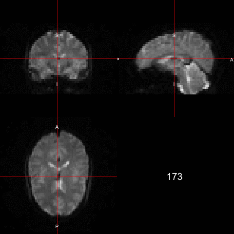

All code for this document is located at [here](https://raw.githubusercontent.com/muschellij2/neuroc/master/fmri_analysis_fslr/index.R).


```{r setup, include=FALSE}
knitr::opts_chunk$set(echo = TRUE, cache = TRUE, comment = "")
```

```{r libs, cache = FALSE}
library(methods)
library(fslr)
library(neurobase)
library(extrantsr)
```

In this tutorial we will discuss performing some preprocessing of a single subject functional MRI in FSL.  

# Data Packages

For this analysis, I will use one subject from the Kirby 21 data set.  The `kirby21.base` and `kirby21.fmri` packages are necessary for this analysis and have the data we will be working on.  You need devtools to install these.  Please refer to [installing devtools](../installing_devtools/index.html) for additional instructions or troubleshooting.


```{r, eval = FALSE}
packages = installed.packages()
packages = packages[, "Package"]
if (!"kirby21.base" %in% packages) {
  devtools::install_github("muschellij2/kirby21.base")
}
if (!"kirby21.fmri" %in% packages) {
  devtools::install_github("muschellij2/kirby21.fmri")
}
```

# Loading Data

We will use the `get_image_filenames_df` function to extract the filenames on our hard disk for the T1 image and the fMRI images (4D).  

```{r data}
library(kirby21.fmri)
library(kirby21.base)
fnames = get_image_filenames_df(ids = 113, 
                    modalities = c("T1", "fMRI"), 
                    visits = c(1),
                    long = FALSE)
t1_fname = fnames$T1[1]
fmri_fname = fnames$fMRI[1]
base_fname = nii.stub(fmri_fname, bn = TRUE)
```

## Parameter file

If you'd like to see the header information from the fMRI data, it is located by the following commands:

```{r par_data}
library(R.utils)
par_file = system.file("visit_1/113/113-01-fMRI.par.gz", 
                       package = "kirby21.fmri")
# unzip it
con = gunzip(par_file, temporary = TRUE, 
             remove = FALSE, overwrite = TRUE)
info = readLines(con = con)
info[11:23]
```

From the paper ["Multi-parametric neuroimaging reproducibility: A 3-T resource study"](http://dx.doi.org/10.1016/j.neuroimage.2010.11.047), which this data is based on, it describes the fMRI sequence:

> The sequence used for resting state functional connectivity MRI is typically identical to that used for BOLD functional MRI studies of task activation. Here, we used a 2D EPI sequence with SENSE partial-parallel imaging acceleration to obtain 3 × 3 mm (80 by 80 voxels) in-plane resolution in thirty-seven 3 mm transverse slices with 1 mm slice gap. An ascending slice order with TR/TE = 2000/30 ms, flip angle of 75°, and SENSE acceleration factor of 2 were used. SPIR was used for fat suppression. This study used an ascending slice acquisition order because a pilot studies revealed smaller motion induced artifacts with ascending slice order than with interleaved slice order. While using an ascending slice order, it was necessary to use a small slice gap to prevent cross talk between the slices. One 7-min run was recorded which provided 210 time points (discarding the first four volumes to achieve steady state).


# Outline 
The steps I will perform in this analysis:

1. Calculation of Motion Parameters (`fslr::mcflirt`)
1. Slice timing correction (`fslr::fsl_slicetimer`), but we need to know how the scan was taken/slice order and repetition time (TR)
2. Motion Correction on Corrected Data (`fslr::mcflirt`)
3. Coregistration of fMRI and a T1-weighted image (`fslr::flirt`)
4. Registration to the Template space (`fslr::fnirt_with_affine` )
5. De-meaning the data (fslr::fslmean(ts = TRUE))
6. Skull stripping (fslr::fslbet)
7. Registration to a template using the T1 and then transforming the fMRI with it
8. Spatially smoothing the data (fslr:fslsmooth)
9. Tissue-class segmentation (fslr::fast, ANTsR::atropos or extrantsr::otropos)?
10. Bandpass/butterworth filtering (signal::butter, signal::buttord)
11. Get a connectivity matrix of certain regions, you need to specify an atlas.


Now we know that the head is first in (as usual) and the data was acquired in ascending order (i.e. bottom -> up) and the repetition time (TR) was 2 seconds   The 

```{r fmri, cache = TRUE}
fmri = readnii(fmri_fname)
ortho2(fmri, w = 1, add.orient = FALSE)
rm(list = "fmri") # just used for cleanup 
```

# Stabilization of Signal

Volumes corresponding to the first 10 seconds of the rs-fMRI scan were dropped to allow for magnetization stabilization.

```{r subset_run, eval = TRUE, cache = FALSE}
fmri = readnii(fmri_fname)
tr = 2 # 2 seconds
first_scan = floor(10.0 / tr) + 1 # 10 seconds "stabilization of signal"
sub_fmri = subset_4d(fmri, first_scan:ntim(fmri))
```
# Slice Timing Correction

```{r slice_timer, cache = FALSE}
library(fslr)
scorr_fname = paste0(base_fname, "_scorr.nii.gz")
if (!file.exists(scorr_fname)) {
  scorr = fsl_slicetimer(file = sub_fmri, 
                 outfile = scorr_fname, 
                 tr = 2, direction = "z", acq_order = "contiguous",
                 indexing = "up")
} else {
  scorr = readnii(scorr_fname)
}
```

# Slice Timing Correction

Similarly to the ANTsR processing, we can set `opts = "-meanvol"` so that the motion correction registers the images to the mean of the time series.  The default otherwise is to register to the scan in the middle (closest to number of time points / 2).  You can supercede this with either specifying `-refvol` for which time point to register to, or `-reffile` to specify a volume to register to.  You can think of `-meanvol` as a wrapper for making the mean time series (using `fslmaths(opt = "-Tmean")`) and then passing that in as a `reffile`.  We will do this explicitly in the code below.  The `-plots` arguments outputs a `.par` file so that we can read the motion parameters after `mcflirt` is run.

```{r mcflirt, cache = FALSE}
moco_fname = paste0(base_fname, 
                    "_motion_corr.nii.gz")
par_file = paste0(nii.stub(moco_fname), ".par")
avg_fname = paste0(base_fname, 
                   "_avg.nii.gz")
if (!file.exists(avg_fname)) {
  fsl_maths(file = sub_fmri, 
            outfile = avg_fname,
            opts = "-Tmean")
}

if (!all(file.exists(c(moco_fname, par_file)))) {
  moco_img = mcflirt(
    file = sub_fmri, 
    outfile = moco_fname,
    verbose = 2,
    opts = paste0("-reffile ", avg_fname, " -plots")
  )
} else {
  moco_img = readnii(moco_fname)
}
moco_params = readLines(par_file)
moco_params = strsplit(moco_params, split = " ")
moco_params = sapply(moco_params, function(x) {
  as.numeric(x[ !(x %in% "")])
})
moco_params = t(moco_params)
colnames(moco_params) = paste0("MOCOparam", 1:ncol(moco_params))
head(moco_params)
```


## Let's Make a Matrix!

`img_ts_to_matrix` creates $V\times T$ matrix, $V$ voxels in mask, unlike `ANTsR::timeseries2matrix`.  Therefore, we transpose the matrix so that it is consistent with the [ANTsR tutorial for fMRI](../fmri_analysis_ANTsR/index.html) and so `boldMatrix` is $T\times V$.  We will get the average of the co-registered image using `fslmaths`.  We wil use this average image to get a mask using the `oMask` function, which calls `getMask`, but for `nifti` objects.  We will then zero out the average image using the mask image.


```{r ts_run, echo = TRUE, cache = FALSE}
moco_avg_img = fslmaths(moco_fname, opts = "-Tmean")
maskImage = oMask(moco_avg_img, 
    mean(moco_avg_img), 
    Inf, cleanup = 2)
mask_fname = paste0(base_fname, "_mask.nii.gz")
writenii(maskImage, filename = mask_fname)

bet_mask = fslbet(moco_avg_img) > 0
bet_mask_fname = paste0(base_fname, "_bet_mask.nii.gz")
writenii(bet_mask, filename = bet_mask_fname)
```

We can also look at the differences.  We will assume the `maskImage` as the "gold standard" and `bet_mask` to be the "prediction".

```{r plot_masks, cache = TRUE}
double_ortho(moco_avg_img, maskImage, 
  col.y = "white")
double_ortho(moco_avg_img, bet_mask, 
  col.y = "white")
ortho_diff( moco_avg_img, roi = maskImage, pred = bet_mask )
```

Here we will create a matrix of time by voxels.

```{r boldmat, cache=FALSE}
moco_avg_img[maskImage == 0] = 0
boldMatrix = img_ts_to_matrix(
    moco_img)
boldMatrix = t(boldMatrix)
boldMatrix = boldMatrix[ , maskImage == 1]
```


### Calculation of DVARS

With this `boldMatrix`, we can calculate a series of information.  For example, we can calculate DVARS based on the motion corrected data.  We can also compare the DVARS to the DVARS calculated from the non-realigned data.  

Here we show how you can still use `ANTsR::computeDVARS` to calculate DVARS.  The first element of `dvars` is the mean of the `my_dvars`.  By the definition of @power2012spurious, the first element of DVARS should be zero.

Here we will multiply the 3 first motion parameters (roll, pitch, yaw) by 50 to convert radians to millimeters by assuming a brain radius of 50 mm, as similar to @power2012spurious.  The next 3 parameters are in terms of millimeters (x, y, z). We will plot each of the parameters on the same scale to look at the motion for each scan.


```{r compute_dvars, echo = TRUE }
dvars = ANTsR::computeDVARS(boldMatrix)
dMatrix = apply(boldMatrix, 2, diff)
dMatrix = rbind(rep(0, ncol(dMatrix)), dMatrix)
my_dvars = sqrt(rowMeans(dMatrix^2))
head(cbind(dvars = dvars, my_dvars = my_dvars))
print(mean(my_dvars))
```

Similarly, we can calculate the marginal framewise displacement (FD).  The rotation parameters are again in radians so we can translate these to millimeters based on a 50 mm radius of the head.

```{r compute_fd, echo = TRUE }
mp = moco_params
mp[, 1:3] = mp[, 1:3] * 50
mp = apply(mp, 2, diff)
mp = rbind(rep(0, 6), mp)
mp = abs(mp)
fd = rowSums(mp)
```

```{r moco_run_plot, echo = TRUE, cache = FALSE, fig.height = 4, fig.width= 8}
mp = moco_params
mp[, 1:3] = mp[, 1:3] * 50
r = range(mp)
plot(mp[,1], type = "l", xlab = "Scan Number", main = "Motion Parameters",
     ylab = "Displacement (mm)",
     ylim = r * 1.25, 
     lwd = 2,
     cex.main = 2,
     cex.lab = 1.5,
     cex.axis = 1.25)
for (i in 2:ncol(mp)) {
  lines(mp[, i], col = i)
}
rm(list = "mp")
```

### Heatmap of the values

We can look at the full trajectory of each voxel over each scan.  We scaled the data (by column, which is voxel), which is somewhat equivalent to doing whole-brain z-score normalization of the fMRI.

We can find the index which has the highest mean value, which may indicate some motion artifact.

```{r ts_heatmap, echo = TRUE, fig.height = 3.5, fig.width = 8}
library(RColorBrewer)
library(matrixStats)
rf <- colorRampPalette(rev(brewer.pal(11,'Spectral')))
r <- rf(32)
mat = scale(boldMatrix)
image(x = 1:nrow(mat), 
      y = 1:ncol(mat), 
      mat, useRaster = TRUE, 
      col = r,
      xlab = "Scan Number", ylab = "Voxel",
      main = paste0("Dimensions: ", 
                    dim(mat)[1], "×", dim(mat)[2]),
     cex.main = 2,
     cex.lab = 1.5,
     cex.axis = 1.25)
rmeans = rowMeans(mat)
bad_ind = which.max(rmeans)
print(bad_ind)
abline(v = bad_ind)
sds = rowSds(mat)
print(which.max(sds))
rm(list = "mat")
```


```{r plot_bad_ortho, echo = TRUE, dependson="ts_heatmap"}
library(animation)
ani.options(autobrowse = FALSE)
gif_name = "bad_dimension.gif"
if (!file.exists(gif_name)) {
  arr = as.array(moco_img)
  pdim = pixdim(moco_img)
  saveGIF({
    for (i in seq(bad_ind - 1, bad_ind + 1)) {
      ortho2(arr[,,,i], pdim = pdim, text = i)
    }
  }, movie.name = gif_name)
}
```



Much of the rest of the commands are again within R or already implemented in `ANTSR`.  Analyses in FSL commonly use independent components analysis (ICA) with the `melodic` command.  We will not cover that here and will cover it in a subsequent tutorial.


# Session Info

```{r, cache = FALSE}
devtools::session_info()
```

# References
