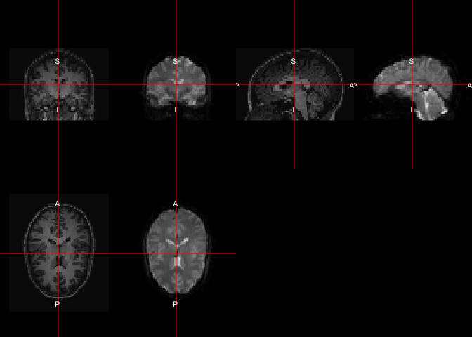
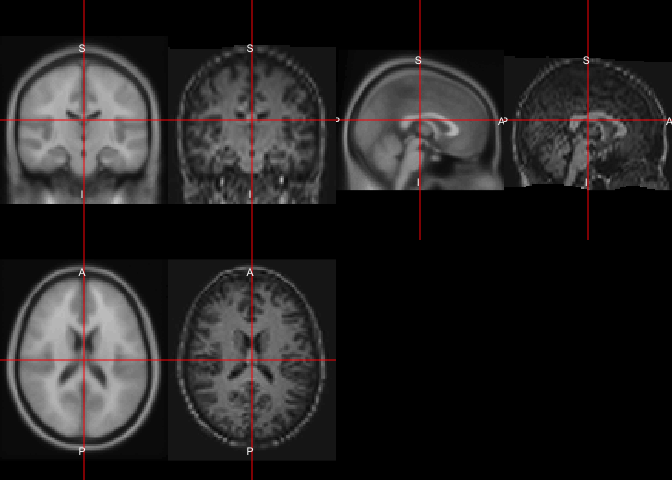
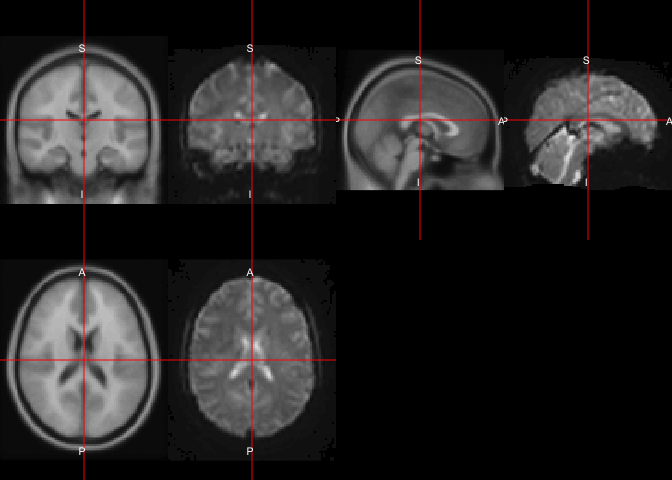
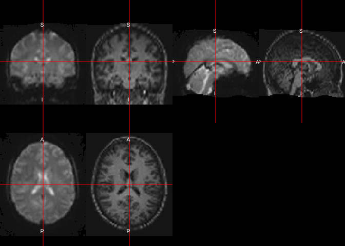
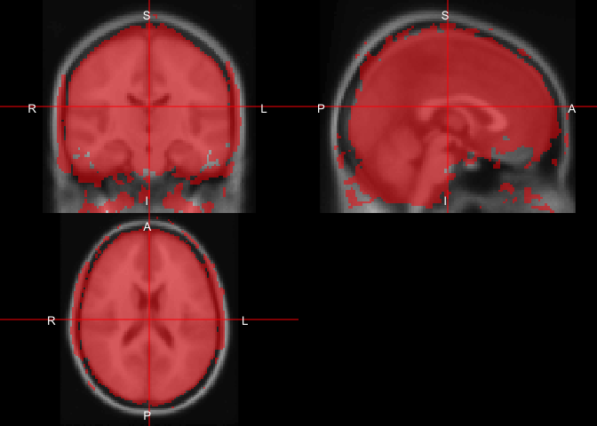
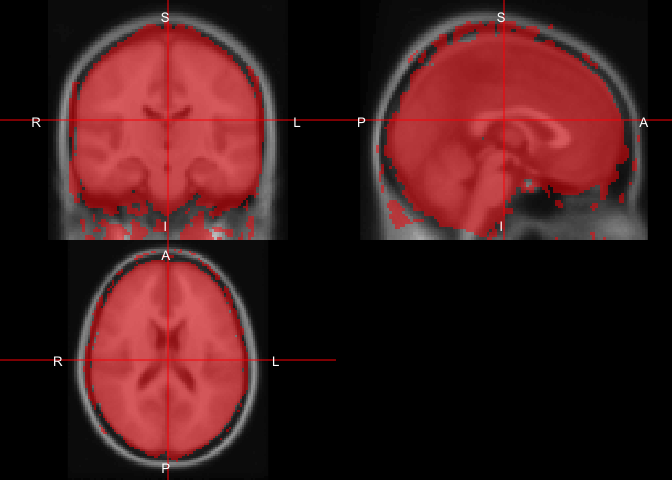
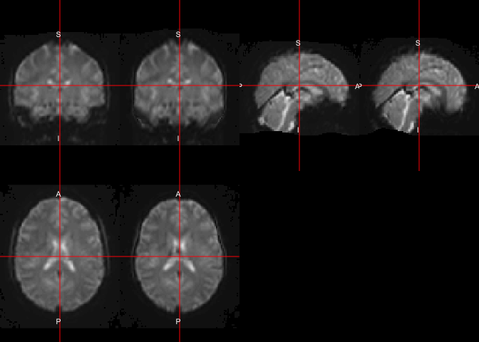
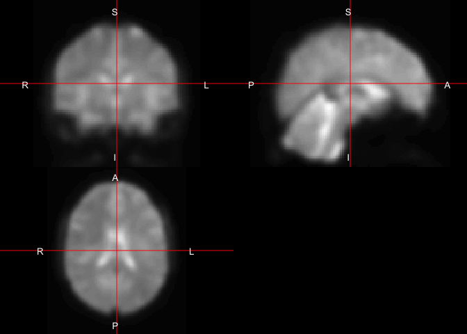

# An example of an fMRI analysis in SPM12
John Muschelli  
`r Sys.Date()`  


# Overview of `spm12r` functions

Requires MATLAB (installs SPM to R library)

- `spm12_slice_timing` - slices are not taken instantaneously
- `spm12_realign` - people move
- `spm12_coregister` - structural imaging is higher resolution
- `spm12_segment` - where's the gray matter?
- `spm12_normalize` - brains look better in MNI
- `spm12_smooth` - turn that noise down

# Kirby21 Data usd

We will use the subject 113 from the Kirby21 data set to illustrate some basic operations of functional magnetic resonance imaging (fMRI).  We will load in the T1 anatomical image and the fMRI from the respective packages. 


```r
library(kirby21.t1)
library(kirby21.fmri)
stopifnot(download_fmri_data())
stopifnot(download_t1_data())
functional = get_fmri_filenames(ids = 113, visit = 1)
anatomical = get_t1_filenames(ids = 113, visit = 1)
files = c(anatomical = anatomical,
          functional = functional)
files
```

```
                                                                                                  anatomical 
    "/Library/Frameworks/R.framework/Versions/3.3/Resources/library/kirby21.t1/visit_1/113/113-01-T1.nii.gz" 
                                                                                                  functional 
"/Library/Frameworks/R.framework/Versions/3.3/Resources/library/kirby21.fmri/visit_1/113/113-01-fMRI.nii.gz" 
```

We know the repetition time (TR) is 2 seconds for this data.  It may be encoded in the NIfTI file itself or come from a parameter file from the scanner.  We will drop the first 20 seconds to allow for signal stabilization.


```r
library(neurobase)
tr = 2 # seconds
DROP = 10 # 20 seconds for stabilization

fmri = readnii(files["functional"])

times = (DROP + 1):ntim(fmri)
run_fmri = copyNIfTIHeader(fmri, fmri[,,,times], drop = TRUE)
```

Now `run_fmri` contains a `nifti` object with the first 10 volumes dropped.  We will pass this into the subsequent functions.


```
           used  (Mb) gc trigger   (Mb)  max used   (Mb)
Ncells   731659  39.1    1168576   62.5   1168576   62.5
Vcells 48832126 372.6  494071668 3769.5 590072426 4501.9
```

```
           used  (Mb) gc trigger   (Mb)  max used   (Mb)
Ncells   731661  39.1    1168576   62.5   1168576   62.5
Vcells 48832182 372.6  395257334 3015.6 590072426 4501.9
```


# Checking MATLAB
As SPM requires MATLAB and calls all the functions through the `matlabr` package, we will have checks in this vignette/workflow that the user has MATLAB.  The `have_matlab()` function returns a logical that is `TRUE` when `matlabr` can find MATLAB to run the subsequent commands.  


```r
library(matlabr)
have_matlab()
```

```
[1] TRUE
```

If this is not `TRUE`, almost none of the functionality below will run because it would simply result in errors.

# Overall Processing

We will show how to do spatial realignment, slice-timing correction, spatial normalization to the MNI template (2 different ways), and spatial smoothing.  Overall, there are many different ways to order these operations, with different options, so this represents just one way to organize a preprocessing pipeline.

## Image Realignment 

Realignment is referring to in this case as within-subject registration of the 4D fMRI data.


```r
library(spm12r)
####################################
# Realignment
####################################
if (have_matlab()) {
  realigned = spm12_realign( 
	filename = run_fmri, 
	register_to = "mean",
	reslice = "mean",
	clean = FALSE
	)
  print(realigned)
}
```

```
# Getting Number of Time Points
```

```
# Reslice is mean
```

```
# Adding SPMDIR: /Library/Frameworks/R.framework/Versions/3.3/Resources/library/spm12r/spm12
```

```
# Running script /var/folders/1s/wrtqcpxn685_zk570bnx9_rr0000gr/T//Rtmpko4uTU/Executable.m
which calls /var/folders/1s/wrtqcpxn685_zk570bnx9_rr0000gr/T//Rtmpko4uTU/Realign_job.m
```

```
# Result is 0
```

```
$outfiles
[1] "/private/var/folders/1s/wrtqcpxn685_zk570bnx9_rr0000gr/T/Rtmpko4uTU/file24dc6012c109.nii"

$rp
[1] "/private/var/folders/1s/wrtqcpxn685_zk570bnx9_rr0000gr/T/Rtmpko4uTU/rp_file24dc6012c109.txt"

$mean
[1] "/private/var/folders/1s/wrtqcpxn685_zk570bnx9_rr0000gr/T/Rtmpko4uTU/meanfile24dc6012c109.nii"

$mat
[1] "/private/var/folders/1s/wrtqcpxn685_zk570bnx9_rr0000gr/T/Rtmpko4uTU/file24dc6012c109.mat"
```

Overall the `spm12_realign` does the realignment.  There is some discussion of performing realignment **before** slice-timing correction because estimation of motion parameters may be skewed after slice-timing correction.  We see that the output `realigned` has the output 4D fMRI data (`outfiles`), the realignment parameters (`rp`), voxel-wise mean after realignment (`mean`), and the matrix of transformations for the 4D series (`mat`).

### Reading in the RP file

Here we can read in the `rp` file to show the estiamted parameters.  These can be used as regressors in motion correction for further analyses.


```r
####################################
# Read in Motion data
####################################
if (have_matlab()) {
  rpfile = realigned[['rp']]
  rp = read.table(file = rpfile, header = FALSE)
  colnames(rp) = c("x", "y", "z", 
  	"roll", "pitch", "yaw")
  rp = as.matrix(rp)
  print(head(rp))
  print(dim(rp))
}
```

```
               x            y             z          roll         pitch
[1,]  0.00000000  0.000000000 -4.410886e-16 -2.507721e-37  2.507721e-37
[2,] -0.03250006  0.022276041  6.105989e-02 -3.616417e-04 -1.389442e-04
[3,]  0.02884634 -0.005311455  5.649025e-02 -3.774759e-04 -1.798493e-04
[4,]  0.02379671 -0.056644719  2.574345e-02  5.180747e-05 -1.756995e-04
[5,]  0.04293237 -0.056942376  2.414558e-02 -2.210120e-05 -8.367122e-05
[6,]  0.02858868 -0.038461745  8.289177e-02 -2.785027e-04 -3.532936e-04
               yaw
[1,]  6.288666e-74
[2,] -2.732142e-04
[3,]  1.048090e-04
[4,] -6.489734e-06
[5,]  2.291027e-04
[6,] -8.279382e-06
[1] 200   6
```

## Slice-Timing Correction

A slice-timing correction does interpolation since each slice was not actually taken at the same time point, but a shifted time point over the course of an entire TR.  The correction requires you to input the reference slice (in this case the median, `ref_slice`), the repetition time (`tr`), time between the first and the last slice within one scan (`ta`), and the order the slices were acquired.  In our case, it was done in an ascending, contiguous order, so we created the slice order as such.  If you used descending or interleaved acquisition, then this must be changed accordingly. 


```r
####################################
# Slice Timing Correction
####################################
nslices = oro.nifti::nsli(run_fmri)
slice_order = 1:nslices
ref_slice = slice_order[median(seq(nslices))]
ta = tr - tr/nslices
n_time_points = ntim(run_fmri)
if (have_matlab()) {
  aimg = spm12_slice_timing(
  	filename = realigned[['outfiles']],
  	nslices = nslices,
  	tr = tr, 
  	slice_order = slice_order,
  	ta = ta, 
  	ref_slice = ref_slice,
  	prefix = "a", 
  	clean = FALSE, 
  	retimg = FALSE)
  print(aimg)
  mean_img = realigned[["mean"]]
  mean_nifti = readnii(mean_img)
}
```

```
# Getting Number of Time Points
```

```
# Adding SPMDIR: /Library/Frameworks/R.framework/Versions/3.3/Resources/library/spm12r/spm12
```

```
# Running script /var/folders/1s/wrtqcpxn685_zk570bnx9_rr0000gr/T//Rtmpko4uTU/Executable.m
which calls /var/folders/1s/wrtqcpxn685_zk570bnx9_rr0000gr/T//Rtmpko4uTU/Slice_Timing_job.m
```

```
# Result is 0
```

```
[1] "/var/folders/1s/wrtqcpxn685_zk570bnx9_rr0000gr/T//Rtmpko4uTU/file24dc2f9e99f4/afile24dc6012c109.nii"
```
We see the output `aimg` has the filename of the slice-timing corrected 4D image.  We also read in the mean image into a `nifti` object (`mean_nifti`).


## Spatial Normalization

### AC-PC Alignment

For the subsequent image normalization steps, SPM assumes the data is aligned along the anterior commissure (AC) posterior commissure (PC) line (AC-PC).  The `acpc_reorient` function (based on `nii_setOrigin` from Dr. Chris Rorden) will do this.  The syntax is that the first file (`mean_img`) is used to estimate the line/plane and the subsequent files are reoriented using this estimation (`aimg`).  These are changes to the header of the image and the image with the new header is written to the same file as the input file.


```r
if (have_matlab()) {
  acpc_reorient(
    infiles = c(mean_img, aimg),
    modality = "T1")
}
```

```

 #Reorientation /private/var/folders/1s/wrtqcpxn685_zk570bnx9_rr0000gr/T/Rtmpko4uTU/meanfile24dc6012c109.nii
```

```
/var/folders/1s/wrtqcpxn685_zk570bnx9_rr0000gr/T//Rtmpko4uTU/file24dc3b6bbd09.m
```

```
                /private/var/folders/1s/wrtqcpxn685_zk570bnx9_rr0000gr/T/Rtmpko4uTU/meanfile24dc6012c109.nii 
              "/private/var/folders/1s/wrtqcpxn685_zk570bnx9_rr0000gr/T/Rtmpko4uTU/meanfile24dc6012c109.nii" 
         /var/folders/1s/wrtqcpxn685_zk570bnx9_rr0000gr/T//Rtmpko4uTU/file24dc2f9e99f4/afile24dc6012c109.nii 
"/private/var/folders/1s/wrtqcpxn685_zk570bnx9_rr0000gr/T/Rtmpko4uTU/file24dc2f9e99f4/afile24dc6012c109.nii" 
```

### Direct Normalization

Here, we will spatially normalize the fMRI to the MNI template using `spm12_normalize`.  Here we specify a standard bounding box for a 2mm MNI template.  We are taking the mean image and directly registering it to the MNI template (T1-weighted), and applying that transform to the `other.files`, in this case the mean image and the 4D fMRI image.


```r
if (have_matlab()) {
  bbox = matrix(
  		c(-90, -126, -72, 
  		90, 90, 108), 
  		nrow = 2, byrow = TRUE)
  print(bbox)
  direct_norm = spm12_normalize(
  	filename = mean_img,
  	other.files = c(mean_img, aimg),
  	bounding_box = bbox,
  	clean = FALSE
  	)
  print(direct_norm)
  dnorm_files = direct_norm$outfiles
  dnorm_mean_img = readnii(dnorm_files[1])
}
```

```
     [,1] [,2] [,3]
[1,]  -90 -126  -72
[2,]   90   90  108
```

```
# Adding SPMDIR: /Library/Frameworks/R.framework/Versions/3.3/Resources/library/spm12r/spm12
```

```
# Running script /var/folders/1s/wrtqcpxn685_zk570bnx9_rr0000gr/T//Rtmpko4uTU/Executable.m
which calls /var/folders/1s/wrtqcpxn685_zk570bnx9_rr0000gr/T//Rtmpko4uTU/Normalize_Estimate_and_Write_job.m
```

```
# Result is 0
```

```
$outfiles
[1] "/private/var/folders/1s/wrtqcpxn685_zk570bnx9_rr0000gr/T/Rtmpko4uTU/wmeanfile24dc6012c109.nii"              
[2] "/private/var/folders/1s/wrtqcpxn685_zk570bnx9_rr0000gr/T/Rtmpko4uTU/file24dc2f9e99f4/wafile24dc6012c109.nii"
```
We see tbe output `direct_norm` is a list with the output files (`outfiles`).  The order of these files is the same as the order of those put in.  In this case, the first file of `outfiles` is the normalized mean image and second is the normalized 4D image.   Here we read in the spatially normalized mean image to compare to the template later.


### Indirect Normalization

Indirect normalization refers to spatially normalizing the co-registered anatomical T1-weighted image to the MNI template.  This transformation is applied to the mean image and 4D fMRI image.  This is also referred to as Unified Segmentation.


#### Anatomical MRI Coregistration to Mean fMRI
Here we will perform the registration of the T1-weigted anatomical image into the space of the mean fMRI image after realignment.  This is referred to as "co-registration" as it is within-subject registration, but across modalities (where we referred to within-subject, within-modality as realignment).  

Here, we also reorient the anatomical image the AC-PC line.  We then perform the coregistration using `spm12_coregister`, where the fixed image is the mean image and the moving image is the anatomical.


```r
if (have_matlab()) {
  anatomical = files["anatomical"]
  anat_img = checknii(anatomical)
  print(anat_img)
  acpc_reorient(
    infiles = anat_img,
    modality = "T1")

  coreg = spm12_coregister(
  	fixed = mean_img,
  	moving = anat_img,
  	prefix = "r")
  
  coreg_anat = coreg$outfile
  coreg_img = readnii(coreg_anat)
  double_ortho(coreg_img, mean_nifti)
}
```

```
[1] "/var/folders/1s/wrtqcpxn685_zk570bnx9_rr0000gr/T/Rtmpko4uTU/113-01-T1.nii"
attr(,"nbrOfBytes")
[1] 44564832
```

```

 #Reorientation /private/var/folders/1s/wrtqcpxn685_zk570bnx9_rr0000gr/T/Rtmpko4uTU/113-01-T1.nii
```

```
/var/folders/1s/wrtqcpxn685_zk570bnx9_rr0000gr/T//Rtmpko4uTU/file24dc225e18ff.m
```

```
# Adding SPMDIR: /Library/Frameworks/R.framework/Versions/3.3/Resources/library/spm12r/spm12
```

```
# Running script /var/folders/1s/wrtqcpxn685_zk570bnx9_rr0000gr/T//Rtmpko4uTU/Executable.m
which calls /var/folders/1s/wrtqcpxn685_zk570bnx9_rr0000gr/T//Rtmpko4uTU/Coregister_job.m
```

```
# Result is 0
```

```
# Removing scripts
```

<!-- -->

We see the anatomical image has been transformed and resliced into the mean fMRI image space (and thus has the resolution of that image).  


## Anatomical MRI Segmentation (and Spatial Normalize Estimation)

Here we perform the segmentation of the co-registered anatomical image from above.  This will segment the image into 6 different regions, where the regions are gray matter, white matter, cerebrospinal fluid (CSF), bone, soft tissue, and the background.  You should inspect these visually before using them to ensure quality and no reordering due to artifacts.  


```r
if (have_matlab()) {
  seg_res = spm12_segment(
  	filename = coreg_anat,
  	set_origin = FALSE,
  	retimg = FALSE)
  print(seg_res)
}
```

```
# Adding SPMDIR: /Library/Frameworks/R.framework/Versions/3.3/Resources/library/spm12r/spm12
```

```
# Running script /var/folders/1s/wrtqcpxn685_zk570bnx9_rr0000gr/T//Rtmpko4uTU/Executable.m
which calls /var/folders/1s/wrtqcpxn685_zk570bnx9_rr0000gr/T//Rtmpko4uTU/Segment_job.m
```

```
# Result is 0
```

```
# Removing scripts
```

```
$outfiles
[1] "/private/var/folders/1s/wrtqcpxn685_zk570bnx9_rr0000gr/T/Rtmpko4uTU/c1r113-01-T1.nii"
[2] "/private/var/folders/1s/wrtqcpxn685_zk570bnx9_rr0000gr/T/Rtmpko4uTU/c2r113-01-T1.nii"
[3] "/private/var/folders/1s/wrtqcpxn685_zk570bnx9_rr0000gr/T/Rtmpko4uTU/c3r113-01-T1.nii"
[4] "/private/var/folders/1s/wrtqcpxn685_zk570bnx9_rr0000gr/T/Rtmpko4uTU/c4r113-01-T1.nii"
[5] "/private/var/folders/1s/wrtqcpxn685_zk570bnx9_rr0000gr/T/Rtmpko4uTU/c5r113-01-T1.nii"
[6] "/private/var/folders/1s/wrtqcpxn685_zk570bnx9_rr0000gr/T/Rtmpko4uTU/c6r113-01-T1.nii"

$outmat
[1] "/private/var/folders/1s/wrtqcpxn685_zk570bnx9_rr0000gr/T/Rtmpko4uTU/r113-01-T1_seg8.mat"

$deformation
[1] "/private/var/folders/1s/wrtqcpxn685_zk570bnx9_rr0000gr/T/Rtmpko4uTU/y_r113-01-T1.nii"
```

In order to segment the image, SPM spatially normalizes the image to the MNI template, however. This transformation will be the one we use to transform the fMRI data to MNI space.  We see in `seg_reg` a `deformation` file, which is the transformation.  We also see the output segmentation files of the probability of each class, in native space.  We only tend to care about the first 3 categories.  

### "Hard" Segmentations

If you would like to convert these class probabilities to a "hard" segmentation, you must read the data in and use `spm_probs_to_seg` for that.  In `spm_probs_to_seg`, each voxel is assigned the class with the maximum probability, with options on how to choose ties (first is default).  We can then remove the labels for bone, soft tissue, and background (`> 3`).  


```r
alpha = function(col, alpha = 1) {
  cols = t(col2rgb(col, alpha = FALSE)/255)
  rgb(cols, alpha = alpha)
} 
if (have_matlab()) {
  seg_files = check_nifti(seg_res$outfiles)
  hard_seg = spm_probs_to_seg(seg_files)
  hard_seg[ hard_seg > 3] = 0
  
  ortho2(coreg_img, hard_seg, 
         col.y = alpha(c("red", "green", "blue"), 0.5))
}
```

<!-- -->

### Applying Spatial Normalization Transformation

Now that we have esimated the transformation from the T1 image, we can take that deformation and apply it to the fMRI data using `spm12_normalize_write`.  Again, we are registering to the MNI template and will use a standard bounding box.  We pass the anatomical, mean fMRI, and 4D fMRI data in to be transformed.  


```r
bbox = matrix(
  c(-90, -126, -72, 
    90, 90, 108), 
  nrow = 2, byrow = TRUE)
if (have_matlab()) {
  norm = spm12_normalize_write(
  	deformation = seg_res$deformation,
  	other.files = c(coreg_anat, mean_img, aimg),
  	bounding_box = bbox,
  	retimg = FALSE, 
  	clean = FALSE)
  print(norm)
  norm_data = norm$outfiles
  names(norm_data) = c("anat", "mean", "fmri")
  norm_mean_img = readnii(norm_data["mean"])
  norm_anat_img = readnii(norm_data["anat"])
}
```

```
# Adding SPMDIR: /Library/Frameworks/R.framework/Versions/3.3/Resources/library/spm12r/spm12
```

```
# Running script /var/folders/1s/wrtqcpxn685_zk570bnx9_rr0000gr/T//Rtmpko4uTU/Executable.m
which calls /var/folders/1s/wrtqcpxn685_zk570bnx9_rr0000gr/T//Rtmpko4uTU/Normalize_Write_job.m
```

```
# Result is 0
```

```
$outfiles
[1] "/private/var/folders/1s/wrtqcpxn685_zk570bnx9_rr0000gr/T/Rtmpko4uTU/wr113-01-T1.nii"                        
[2] "/private/var/folders/1s/wrtqcpxn685_zk570bnx9_rr0000gr/T/Rtmpko4uTU/wmeanfile24dc6012c109.nii"              
[3] "/private/var/folders/1s/wrtqcpxn685_zk570bnx9_rr0000gr/T/Rtmpko4uTU/file24dc2f9e99f4/wafile24dc6012c109.nii"
```

Now we have the indirect spatially normalized data in MNI template space


### Comparison of Direct and Indirect Normalization
Here we will use the MNI 152 template to view results (the one we registered to).  We create some crude masks to see how the overall brain overlaps with the template to make some comparisons.


```r
if (have_matlab()) {
  template_path = file.path(spm_dir(), 
                            "canonical", "avg152T1.nii")

  template = readnii(template_path)
  
  dnorm_mask = dnorm_mean_img > quantile(
    dnorm_mean_img[dnorm_mean_img > 0], 
    probs = 0.6)
  norm_mask = norm_mean_img > quantile(
    norm_mean_img[norm_mean_img > 0], 
    probs = 0.6)  
  
  double_ortho(template, norm_anat_img)
  double_ortho(template, norm_mean_img)
  double_ortho(norm_mean_img, norm_anat_img)
  ortho2(template, norm_mask, col.y = alpha("red", 0.5))

  double_ortho(template, dnorm_mean_img)
  ortho2(template, dnorm_mask, col.y = alpha("red", 0.5))
  double_ortho(norm_mean_img, dnorm_mean_img)
}
```

<!-- --><!-- --><!-- --><!-- --><!-- --><!-- --><!-- -->


## Spatial Smoothing

Here we will perform spatial smoothing of the 4D fMRI data in template space.  We can set the full-width half max (FWHM) for the Gaussian smoother.  The relationship between the FWHM and the Gaussian standard deviation is:

$$
FWHM = \sigma \sqrt{8 \log(2)}
$$
where $\log$` is the natural log.  


```r
if (have_matlab()) {
  smoothed = spm12_smooth(
  	filename = norm_data["fmri"],
  	fwhm = 8,
  	prefix = "s",
  	retimg = FALSE
  	)
  smoothed_data = smoothed$outfiles
}
```

```
# Adding SPMDIR: /Library/Frameworks/R.framework/Versions/3.3/Resources/library/spm12r/spm12
```

```
# Running script /var/folders/1s/wrtqcpxn685_zk570bnx9_rr0000gr/T//Rtmpko4uTU/Executable.m
which calls /var/folders/1s/wrtqcpxn685_zk570bnx9_rr0000gr/T//Rtmpko4uTU/Smooth_job.m
```

```
# Result is 0
```

```
# Removing scripts
```

In many applications, this is the data you will use for post-processing and analysis.  Motion correction has usually been applied above, but some motion correct this data as well. 


```r
if (have_matlab()) {
  smoothed_mean = spm12_smooth(
  	filename = norm_data["mean"],
  	prefix = "s",
  	retimg = FALSE
  	)  
  smoothed_mean_data = smoothed_mean$outfiles
}
```

```
# Adding SPMDIR: /Library/Frameworks/R.framework/Versions/3.3/Resources/library/spm12r/spm12
```

```
# Running script /var/folders/1s/wrtqcpxn685_zk570bnx9_rr0000gr/T//Rtmpko4uTU/Executable.m
which calls /var/folders/1s/wrtqcpxn685_zk570bnx9_rr0000gr/T//Rtmpko4uTU/Smooth_job.m
```

```
# Result is 0
```

```
# Removing scripts
```

Here we can smooth the mean image in MNI space.  We could have also calculated a new mean image and smoothed that.  Or we could have calculated a mean of the smoothed 4D data.  They all may be slightly different.


```r
if (have_matlab()) {
  smooth_mean_img = readnii(smoothed_mean_data)
  ortho2(smooth_mean_img)
}
```

<!-- -->

## Bibliography


```r
bib = '@article{ashburner2005unified,
  title={Unified segmentation},
  author={Ashburner, John and Friston, Karl J},
  journal={Neuroimage},
  volume={26},
  number={3},
  pages={839--851},
  year={2005},
  publisher={Elsevier}
}'
```
