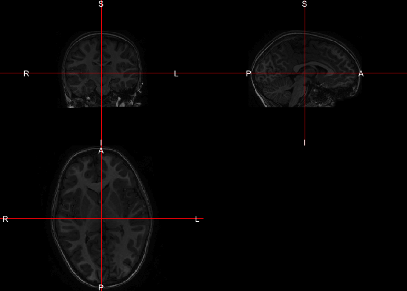
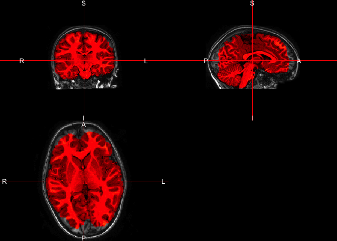
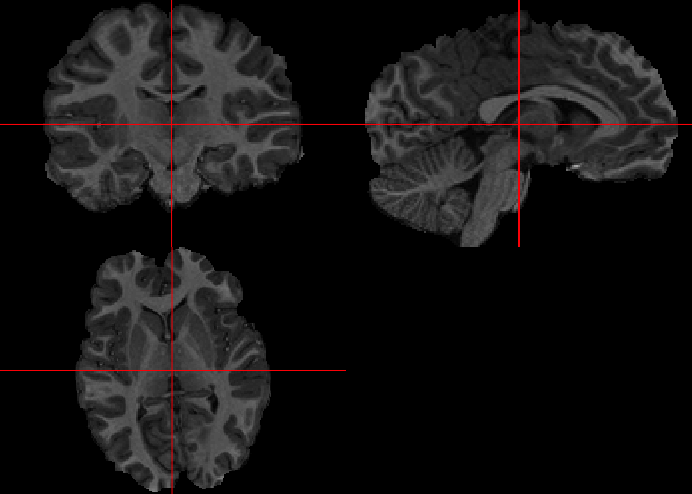
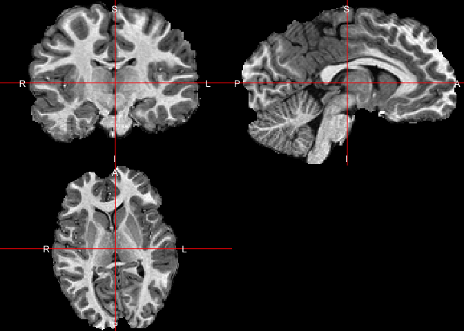

All code for this document is located at [here](https://raw.githubusercontent.com/muschellij2/neuroc/master/malf_insula/index.R).


# Package Version

This tutorial requires the `neurohcp` package (>= 0.5):


```r
ver = installed.packages()["neurohcp", "Version"]
if (compareVersion(ver, "0.5") < 0) {
  stop(paste0("Need to update neurohcp, ", 
              'source("https://neuroconductor.org/neurocLite.R");',
              'neuroc_install("ITKR")')
  )
}
```
# Data

We will be using the data from the Autism Brain Imaging Data Exchange [ABIDE](http://fcon_1000.projects.nitrc.org/indi/abide/) [@di2014autism].  The data consists of a children with and without autism from the 1000 Functional Connectomes Project and INDI. I chose a child that was young (around 8 years old) so that we can see if this method works for younger brains:


```r
library(neurohcp)
fcp_data = download_hcp_file(
    paste0("data/Projects/ABIDE/RawData/", 
        "KKI/0050784/session_1/anat_1/",
        "mprage.nii.gz"),
    bucket = "fcp-indi",
    sign = FALSE)
```

```

  |                                                                            
  |                                                                      |   0%
  |                                                                            
  |=                                                                     |   1%
  |                                                                            
  |=                                                                     |   2%
  |                                                                            
  |==                                                                    |   2%
  |                                                                            
  |==                                                                    |   3%
  |                                                                            
  |===                                                                   |   4%
  |                                                                            
  |===                                                                   |   5%
  |                                                                            
  |====                                                                  |   5%
  |                                                                            
  |====                                                                  |   6%
  |                                                                            
  |=====                                                                 |   6%
  |                                                                            
  |=====                                                                 |   7%
  |                                                                            
  |======                                                                |   8%
  |                                                                            
  |======                                                                |   9%
  |                                                                            
  |=======                                                               |   9%
  |                                                                            
  |=======                                                               |  10%
  |                                                                            
  |=======                                                               |  11%
  |                                                                            
  |========                                                              |  11%
  |                                                                            
  |========                                                              |  12%
  |                                                                            
  |=========                                                             |  13%
  |                                                                            
  |=========                                                             |  14%
  |                                                                            
  |==========                                                            |  14%
  |                                                                            
  |==========                                                            |  15%
  |                                                                            
  |===========                                                           |  15%
  |                                                                            
  |===========                                                           |  16%
  |                                                                            
  |============                                                          |  17%
  |                                                                            
  |============                                                          |  18%
  |                                                                            
  |=============                                                         |  18%
  |                                                                            
  |=============                                                         |  19%
  |                                                                            
  |==============                                                        |  20%
  |                                                                            
  |===============                                                       |  21%
  |                                                                            
  |===============                                                       |  22%
  |                                                                            
  |================                                                      |  22%
  |                                                                            
  |================                                                      |  23%
  |                                                                            
  |=================                                                     |  24%
  |                                                                            
  |=================                                                     |  25%
  |                                                                            
  |==================                                                    |  25%
  |                                                                            
  |==================                                                    |  26%
  |                                                                            
  |===================                                                   |  27%
  |                                                                            
  |====================                                                  |  28%
  |                                                                            
  |====================                                                  |  29%
  |                                                                            
  |=====================                                                 |  29%
  |                                                                            
  |=====================                                                 |  30%
  |                                                                            
  |=====================                                                 |  31%
  |                                                                            
  |======================                                                |  31%
  |                                                                            
  |======================                                                |  32%
  |                                                                            
  |=======================                                               |  33%
  |                                                                            
  |=======================                                               |  34%
  |                                                                            
  |========================                                              |  34%
  |                                                                            
  |========================                                              |  35%
  |                                                                            
  |=========================                                             |  35%
  |                                                                            
  |=========================                                             |  36%
  |                                                                            
  |==========================                                            |  37%
  |                                                                            
  |==========================                                            |  38%
  |                                                                            
  |===========================                                           |  38%
  |                                                                            
  |===========================                                           |  39%
  |                                                                            
  |============================                                          |  40%
  |                                                                            
  |=============================                                         |  41%
  |                                                                            
  |=============================                                         |  42%
  |                                                                            
  |==============================                                        |  42%
  |                                                                            
  |==============================                                        |  43%
  |                                                                            
  |===============================                                       |  44%
  |                                                                            
  |===============================                                       |  45%
  |                                                                            
  |================================                                      |  45%
  |                                                                            
  |================================                                      |  46%
  |                                                                            
  |=================================                                     |  47%
  |                                                                            
  |==================================                                    |  48%
  |                                                                            
  |==================================                                    |  49%
  |                                                                            
  |===================================                                   |  49%
  |                                                                            
  |===================================                                   |  50%
  |                                                                            
  |===================================                                   |  51%
  |                                                                            
  |====================================                                  |  51%
  |                                                                            
  |====================================                                  |  52%
  |                                                                            
  |=====================================                                 |  53%
  |                                                                            
  |=====================================                                 |  54%
  |                                                                            
  |======================================                                |  54%
  |                                                                            
  |======================================                                |  55%
  |                                                                            
  |=======================================                               |  55%
  |                                                                            
  |=======================================                               |  56%
  |                                                                            
  |========================================                              |  57%
  |                                                                            
  |========================================                              |  58%
  |                                                                            
  |=========================================                             |  58%
  |                                                                            
  |=========================================                             |  59%
  |                                                                            
  |==========================================                            |  60%
  |                                                                            
  |==========================================                            |  61%
  |                                                                            
  |===========================================                           |  61%
  |                                                                            
  |===========================================                           |  62%
  |                                                                            
  |============================================                          |  62%
  |                                                                            
  |============================================                          |  63%
  |                                                                            
  |=============================================                         |  64%
  |                                                                            
  |=============================================                         |  65%
  |                                                                            
  |==============================================                        |  65%
  |                                                                            
  |==============================================                        |  66%
  |                                                                            
  |===============================================                       |  66%
  |                                                                            
  |===============================================                       |  67%
  |                                                                            
  |===============================================                       |  68%
  |                                                                            
  |================================================                      |  68%
  |                                                                            
  |================================================                      |  69%
  |                                                                            
  |=================================================                     |  70%
  |                                                                            
  |==================================================                    |  71%
  |                                                                            
  |==================================================                    |  72%
  |                                                                            
  |===================================================                   |  72%
  |                                                                            
  |===================================================                   |  73%
  |                                                                            
  |====================================================                  |  74%
  |                                                                            
  |====================================================                  |  75%
  |                                                                            
  |=====================================================                 |  75%
  |                                                                            
  |=====================================================                 |  76%
  |                                                                            
  |======================================================                |  77%
  |                                                                            
  |======================================================                |  78%
  |                                                                            
  |=======================================================               |  78%
  |                                                                            
  |=======================================================               |  79%
  |                                                                            
  |========================================================              |  80%
  |                                                                            
  |=========================================================             |  81%
  |                                                                            
  |=========================================================             |  82%
  |                                                                            
  |==========================================================            |  82%
  |                                                                            
  |==========================================================            |  83%
  |                                                                            
  |==========================================================            |  84%
  |                                                                            
  |===========================================================           |  84%
  |                                                                            
  |===========================================================           |  85%
  |                                                                            
  |============================================================          |  85%
  |                                                                            
  |============================================================          |  86%
  |                                                                            
  |=============================================================         |  87%
  |                                                                            
  |==============================================================        |  88%
  |                                                                            
  |==============================================================        |  89%
  |                                                                            
  |===============================================================       |  90%
  |                                                                            
  |===============================================================       |  91%
  |                                                                            
  |================================================================      |  91%
  |                                                                            
  |================================================================      |  92%
  |                                                                            
  |=================================================================     |  92%
  |                                                                            
  |=================================================================     |  93%
  |                                                                            
  |==================================================================    |  94%
  |                                                                            
  |==================================================================    |  95%
  |                                                                            
  |===================================================================   |  95%
  |                                                                            
  |===================================================================   |  96%
  |                                                                            
  |====================================================================  |  97%
  |                                                                            
  |====================================================================  |  98%
  |                                                                            
  |===================================================================== |  98%
  |                                                                            
  |===================================================================== |  99%
  |                                                                            
  |======================================================================|  99%
  |                                                                            
  |======================================================================| 100%
```

```r
print(fcp_data)
```

```
[1] "/var/folders/1s/wrtqcpxn685_zk570bnx9_rr0000gr/T//Rtmpkrhaql/mprage.nii.gz"
```

Note, you do not need an API key for this data.  We have an MPRAGE for this child downloaded to the disk.

## Visualization


```r
library(neurobase)
```

```
Loading required package: oro.nifti
```

```
oro.nifti 0.11.0
```

```r
std_img = readnii(fcp_data)
ortho2(std_img)
```

<!-- -->

## Reorientation
Although this image seems to be in RPI orientation, we can check using `getForms`:


```r
library(fslr)
getForms(fcp_data)[c("ssor", "sqor")]
```

```
$ssor
[1] "RL" "PA" "IS"

$sqor
[1] "RL" "PA" "IS"
```

This image is indeed in RPI, but we may want to ensure this is the case an use the `rpi_orient` function from fslr so that each image would be in the same orientation:


```r
reor = rpi_orient(fcp_data)
```

```
Warning: 'rpi_orient_file' is deprecated.
Use 'rpi_orient_file is going to be deprecated in the coming releases of fslr, and things this relies on,  including readrpi and rpi_orient.  Please use orient_rpi_file, orient_rpi, and read_rpi in the future.' instead.
See help("Deprecated")
```

```
fslhd "/private/var/folders/1s/wrtqcpxn685_zk570bnx9_rr0000gr/T/Rtmpkrhaql/mprage.nii.gz" 
```

```
fslorient -getorient "/private/var/folders/1s/wrtqcpxn685_zk570bnx9_rr0000gr/T/Rtmpkrhaql/mprage.nii.gz"
```

```
fslswapdim "/private/var/folders/1s/wrtqcpxn685_zk570bnx9_rr0000gr/T/Rtmpkrhaql/mprage.nii.gz"  RL PA IS "/var/folders/1s/wrtqcpxn685_zk570bnx9_rr0000gr/T//Rtmpkrhaql/file39f3e69c158";
```

```r
img = reor$img
```

## Brain Extraction

Here we will use `fslbet_robust` to skull strip the image.  The "robust"

```r
library(extrantsr)
```

```

Attaching package: 'extrantsr'
```

```
The following object is masked from 'package:neurobase':

    zero_pad
```

```
The following objects are masked from 'package:oro.nifti':

    origin, origin<-
```

```r
bet = fslbet_robust(img, swapdim = FALSE)
```

```
# Running Bias-Field Correction
```

```
# Registration to template
```

```
# Running Registration of file to template
```

```
# Applying Registration output is
```

```
$warpedmovout
antsImage
  Pixel Type          : float 
  Components Per Pixel: 1 
  Dimensions          : 256x200x256 
  Voxel Spacing       : 0.999999940395355x1x0.999999940395355 
  Origin              : -140.9919 108.048 -138.5018 
  Direction           : 1 0 0 0 -1 0 0 0 1 


$warpedfixout
antsImage
  Pixel Type          : float 
  Components Per Pixel: 1 
  Dimensions          : 182x218x182 
  Voxel Spacing       : 1x1x1 
  Origin              : -90 126 -72 
  Direction           : 1 0 0 0 -1 0 0 0 1 


$fwdtransforms
[1] "/var/folders/1s/wrtqcpxn685_zk570bnx9_rr0000gr/T//Rtmpkrhaql/file39f3123ac58b0GenericAffine.mat"

$invtransforms
[1] "/var/folders/1s/wrtqcpxn685_zk570bnx9_rr0000gr/T//Rtmpkrhaql/file39f3123ac58b0GenericAffine.mat"

$prev_transforms
character(0)
```

```
# Applying Transformations to file
```

```
# Applying Transforms to other.files
```

```
# Writing out file
```

```
# Writing out other.files
```

```
# Removing Warping images
```

```
# Reading data back into R
```

```
# Reading in Transformed data
```

```
# Dropping slices not in mask
```

```
# Skull Stripping for COG
```

```
bet2 "/private/var/folders/1s/wrtqcpxn685_zk570bnx9_rr0000gr/T/Rtmpkrhaql/file39f354ae139f.nii.gz" "/var/folders/1s/wrtqcpxn685_zk570bnx9_rr0000gr/T//Rtmpkrhaql/file39f34ead5133" 
```

```
# Skull Stripping with new cog
```

```
bet2 "/private/var/folders/1s/wrtqcpxn685_zk570bnx9_rr0000gr/T/Rtmpkrhaql/file39f3236287b8.nii.gz" "/var/folders/1s/wrtqcpxn685_zk570bnx9_rr0000gr/T//Rtmpkrhaql/file39f3a5ffb2a"  -c 128 96 129
```

```
# Filling Holes 
```


```r
ortho2(robust_window(img), bet)
```

<!-- -->


```r
rb = robust_window(img)
bet2 = fslbet_robust(rb, swapdim = FALSE)
```

```
# Running Bias-Field Correction
```

```
# Registration to template
```

```
# Running Registration of file to template
```

```
# Applying Registration output is
```

```
$warpedmovout
antsImage
  Pixel Type          : float 
  Components Per Pixel: 1 
  Dimensions          : 256x200x256 
  Voxel Spacing       : 0.999999940395355x1x0.999999940395355 
  Origin              : -140.9919 108.048 -138.5018 
  Direction           : 1 0 0 0 -1 0 0 0 1 


$warpedfixout
antsImage
  Pixel Type          : float 
  Components Per Pixel: 1 
  Dimensions          : 182x218x182 
  Voxel Spacing       : 1x1x1 
  Origin              : -90 126 -72 
  Direction           : 1 0 0 0 -1 0 0 0 1 


$fwdtransforms
[1] "/var/folders/1s/wrtqcpxn685_zk570bnx9_rr0000gr/T//Rtmpkrhaql/file39f31565ba760GenericAffine.mat"

$invtransforms
[1] "/var/folders/1s/wrtqcpxn685_zk570bnx9_rr0000gr/T//Rtmpkrhaql/file39f31565ba760GenericAffine.mat"

$prev_transforms
character(0)
```

```
# Applying Transformations to file
```

```
# Applying Transforms to other.files
```

```
# Writing out file
```

```
# Writing out other.files
```

```
# Removing Warping images
```

```
# Reading data back into R
```

```
# Reading in Transformed data
```

```
# Dropping slices not in mask
```

```
# Skull Stripping for COG
```

```
bet2 "/private/var/folders/1s/wrtqcpxn685_zk570bnx9_rr0000gr/T/Rtmpkrhaql/file39f317075634.nii.gz" "/var/folders/1s/wrtqcpxn685_zk570bnx9_rr0000gr/T//Rtmpkrhaql/file39f37277cc52" 
```

```
# Skull Stripping with new cog
```

```
bet2 "/private/var/folders/1s/wrtqcpxn685_zk570bnx9_rr0000gr/T/Rtmpkrhaql/file39f323b58e51.nii.gz" "/var/folders/1s/wrtqcpxn685_zk570bnx9_rr0000gr/T//Rtmpkrhaql/file39f329ef6499"  -c 128 97 129
```

```
# Filling Holes 
```

```r
ortho2(robust_window(img), bet2)
```

<!-- -->

### Zooming in 

Now that we have only the brain image, we can drop extraneous dimensions.  This dropping is for visualization, but also we may not want these extra dimensions affecting any registration.  


```r
dd = dropEmptyImageDimensions(bet > 0,
    other.imgs = bet)
run_img = dd$other.imgs
```


```r
ortho2(run_img)
```

<!-- -->

```r
ortho2(robust_window(run_img))
```

<!-- -->


## Labeled data


```r
root_template_dir = file.path(
    "/dcl01/smart/data", 
    "structural", 
    "Templates", 
    "MICCAI-2012-Multi-Atlas-Challenge-Data")
template_dir = file.path(root_template_dir,
    "all-images")
```


```r
library(readr)
labs = read_csv(file.path(root_template_dir,
    "MICCAI-Challenge-2012-Label-Information.csv"))

niis = list.files(
    path = template_dir,
    pattern = ".nii.gz", 
    full.names = TRUE)
bases = nii.stub(niis, bn = TRUE)
templates = niis[grep("_3$", bases)]

df = data.frame(
    template = templates,
    stringsAsFactors = FALSE)
df$ss_template = paste0(
    nii.stub(df$template),
    "_SS.nii.gz")
df$label = paste0(
    nii.stub(df$template),
    "_glm.nii.gz")
stopifnot(all(file.exists(unlist(df))))

indices = labs[grep("sula", tolower(labs$name)),]
indices = indices$label
```


```r
library(pbapply)
lab_list = pblapply(df$label,
    function(x) {
    img = fast_readnii(x)
    niftiarr(img, 
        img %in% indices
        )    
})

temp_list = pblapply(df$ss_template, readnii)

inds = 1:10
tlist = temp_list[inds]
llist = lab_list[inds]
```


```r
res = malf(infile = run_img,
    template.images = tlist,
    template.structs = llist,
    keep_images = FALSE,
    outfile = "test_malf_mprage_insula.nii.gz")

wimg = robust_window(run_img)
png("test_malf_image.png")
ortho2(wimg, xyz = xyz(res))
dev.off()


png("test_malf_image_overlay.png")
ortho2(wimg, res, xyz = xyz(res), 
    col.y = scales::alpha("red", 0.5))
dev.off()
```

