---
output:
  html_document: {}
bibliography: ../refs.bib
---

All code for this document is located at [here](https://raw.githubusercontent.com/muschellij2/neuroc/master/nifti_basics/index.R).


# The nifti object

Note: Throughout this post, I will refer to an image on hard disk as a NIfTI, which is a file that generally has the extension ".nii" or ".nii.gz".  I will refer to the object in R as a `nifti` (note the change of font and case).  

In this tutorial we will discuss the basics of the `nifti` object in R.  There are many objects in R that represent imaging data.  The Neuroconductor project chose the `nifti` object from the `oro.nifti` package as one of the the basic building blocks because it has been widely used in other packages, has been tested over a period of time, and inherits the properties of an `array` in R. 

To run this code, you must have `oro.nifti` installed.  You can either use the stable version on CRAN (using `install.packages`) or the development version (using `devtools::install_github`):


```r
packages = installed.packages()
packages = packages[, "Package"]
if (!"oro.nifti" %in% packages) {
  install.packages("oro.nifti")
  ### development version
  # devtools::install_github("bjw34032/oro.nifti")
}
```

## S4 Implementation

As `nifti` objects inherits the properties of an `array`, you can perform a series of operations on them, such as addition/subtraction/division, as you would an `array`.  A `nifti` object has additional attributes and the `nifti` object is an S4 object.  This means that you do not reference additional information using the `$` operator.  


```r
library(oro.nifti)
set.seed(20161007)
dims = rep(10, 3)
arr = array(rnorm(10*10*10), dim = dims)
nim = oro.nifti::nifti(arr)
print(nim)
```

```
NIfTI-1 format
  Type            : nifti
  Data Type       : 2 (UINT8)
  Bits per Pixel  : 8
  Slice Code      : 0 (Unknown)
  Intent Code     : 0 (None)
  Qform Code      : 0 (Unknown)
  Sform Code      : 0 (Unknown)
  Dimension       : 10 x 10 x 10
  Pixel Dimension : 1 x 1 x 1
  Voxel Units     : Unknown
  Time Units      : Unknown
```

```r
print(class(nim))
```

```
[1] "nifti"
attr(,"package")
[1] "oro.nifti"
```

```r
oro.nifti::is.nifti(nim)
```

```
[1] TRUE
```

### Accessing Information from a `nifti`
To access additional information, called a slot, you can use the `@` operator.  We do not recommend this, as there should be a function implemented to "access" this slot.  These are hence called accessor functions (they access things!).  For example, if you want to get the `cal_max` slot of a `nifti` object, you should use the `cal_max` function.  If an accessor function is not implemented, you should still use the `slot(object, name)` syntax over `@`.  

Here's an example where we make an array of random normal data, and put that array into a `nifti` object with the `nifti` function:


```r
nim@cal_max
```

```
[1] 2.706524
```

```r
cal_max(nim)
```

```
[1] 2.706524
```

```r
slot(nim, "cal_max")
```

```
[1] 2.706524
```

### Accessing the "data"

If you want to access the "data" of the image, you can access that using:


```r
data = slot(nim, ".Data")
class(data)
```

```
[1] "array"
```

With newer versions of `oro.nifti` (especially that on GitHub and in Neuroconductor), there is a `img_data` function to access the data:


```r
data = oro.nifti::img_data(nim)
class(data)
```

```
[1] "array"
```

```r
dim(data)
```

```
[1] 10 10 10
```
This `array` is 3-dimensional and can be subset using normal square-bracket notations (`[row, column, slice]`).  Thus, if we want the 3rd "slice" of the image, we can use:


```r
slice = data[,,3]
class(slice)
```

```
[1] "matrix"
```

Thus we see we get a matrix of values from the 3rd "slice".  We should note that we generally reference an image by x, y, and z planes (in that order).   Most of the time, the x direction refers to going left/right on an image, y refers to front/back (or anterior/posterior), and the z direction refers to up/down (superior/inferior).  The actual direction depends on the header information of the NIfTI image.


```r
slice = data[,,3, drop = FALSE]
class(slice)
```

```
[1] "array"
```

### Show all slots

You can see which slots exist for a `nifti` object by using `slotNames`


```r
slotNames(nim)
```

```
 [1] ".Data"          "sizeof_hdr"     "data_type"      "db_name"       
 [5] "extents"        "session_error"  "regular"        "dim_info"      
 [9] "dim_"           "intent_p1"      "intent_p2"      "intent_p3"     
[13] "intent_code"    "datatype"       "bitpix"         "slice_start"   
[17] "pixdim"         "vox_offset"     "scl_slope"      "scl_inter"     
[21] "slice_end"      "slice_code"     "xyzt_units"     "cal_max"       
[25] "cal_min"        "slice_duration" "toffset"        "glmax"         
[29] "glmin"          "descrip"        "aux_file"       "qform_code"    
[33] "sform_code"     "quatern_b"      "quatern_c"      "quatern_d"     
[37] "qoffset_x"      "qoffset_y"      "qoffset_z"      "srow_x"        
[41] "srow_y"         "srow_z"         "intent_name"    "magic"         
[45] "extender"       "reoriented"    
```

If you would like to see information about each one of these slots, please see [this blog post](https://brainder.org/2012/09/23/the-nifti-file-format/) about the NIfTI header.  

# Other objects
Other packages, such as `ANTsR` and `RNifti` have implemented faster reading/writing functions of NIfTI images.  These rely on pointers to object in memory and are very useful.  They have specific implementations for extracting information from them and saving them out, such as in an Rda/rda (R data file).  A series of conversion tools for `ANTsR` objects are included in the `extrantsr` package (function `ants2oro`) and `nii2oro` in `oro.nifti` for RNifti objects.  


# NIfTI Input/Output: `readnii`/`writenii` vs. `readNIfTI`/`writeNIfTI`

In the `neurobase` package, we provide wrapper functions `readnii`/`writenii`, which wrap the `oro.nifti` functions `readNIfTI`/`writeNIfTI`.  There are a few reasons for this:

1.  You can pass a filename with a ".nii.gz" extension to `writenii` and an additional ".nii.gz" will not be added, whereas this will happen in `writeNIfTI`.
2.  `writenii` will try to discern the data type of the image before writing, which may be useful if you created a `nifti` by copying information from a previous `nifti` object.
3.  The default in `readnii` is `reorient = FALSE`, which generally does not error when reading in data, whereas `readNIfTI` defaults to `reorient = TRUE`.  This is discussed below.
4.  Extraneous dimensions are automatically deleted with `readnii`.  Note this may cause errors and is **not desired 100% of the time**.

## Option `reorient = FALSE`

In `readNIfTI` default `reorient = TRUE` implicity uses the `reorient` function from `oro.nifti`.  Although many neuroimaging software suites read the header and reorient the data based on that information, `oro.nifti::reorient` can only handle simple orientations, see `oro.nifti::performPermutation` documentation.  Although reading the data in without reorienting can cause problems, such as not knowing right/left orientation, if multiple NIfTI files were created in the same way (assumingly from `dcm2nii`), they should ideally have the same orientation.  

Derived data from an image will have the exact same orientation because derived `nifti` objects will copy the `nifti` header information from the `nifti` object it was derived from.  Moreover, in many analyses, registration to an image or a template is common, and these have known orientations.  We have found that if a user wants to reorient their data in R, using the `reorient` function can be used, but we prefer the default to be `FALSE`, otherwise reading in many NIfTI files result in an error from the orientation.  

# Operations of `nifti` objects

Although the `nifti` object is not a standard R object, you can perform standard operations on these objects, such as addition/subtraction and logic.  This is referred to "overloaded" operators.  

## Logical operators
For example, if we want to create a `nifti` object with binary values, where the values are `TRUE` if the values in `nim` are greater than 0, we can simply write:


```r
above_zero = nim > 0
class(above_zero)
```

```
[1] "nifti"
attr(,"package")
[1] "oro.nifti"
```

```r
img_data(above_zero)[1]
```

```
[1] TRUE
```

We will refer to binary images/`nifti` objects as "masks".

We can combine multiple operators, such as creating a binary mask for value greater than 0 and less than 2.


```r
class(nim > 0 & nim < 2)
```

```
[1] "nifti"
attr(,"package")
[1] "oro.nifti"
```

## Arithmetic on `nifti` objects

We can also show the 

```r
class(nim * 2)
```

```
[1] "nifti"
attr(,"package")
[1] "oro.nifti"
```

```r
class(nim + (nim / 4))
```

```
[1] "nifti"
attr(,"package")
[1] "oro.nifti"
```

```r
class(nim * nim)
```

```
[1] "nifti"
attr(,"package")
[1] "oro.nifti"
```

```r
class(nim^2)
```

```
[1] "nifti"
attr(,"package")
[1] "oro.nifti"
```

## Summaries 

How many values actually are greater than zero?  Here, we can use standard statistical functions, such as `sum` to count the number of `TRUE` indices:


```r
sum(above_zero)
```

```
[1] 513
```

and similarly find the proportion of `TRUE` indices by taking the `mean` of these indicators:


```r
mean(above_zero)
```

```
[1] 0.513
```

Again, as `nifti` is an S4 object, it should have the functionality described in the details of the help file for `methods::S4groupGeneric`:


```r
min(nim)
```

```
[1] -3.517075
```

```r
max(nim)
```

```
[1] 2.706524
```

```r
range(nim)
```

```
[1] -3.517075  2.706524
```

```r
class(abs(nim))
```

```
[1] "nifti"
attr(,"package")
[1] "oro.nifti"
```


# Visualization of `nifti` objects

Here we will use real imaging data from the `EveTemplate` package:


```r
library(EveTemplate)
eve = readEve(what = "Brain")
```

## Orthographic view

The `oro.nifti::orthographic` function provides great functionality on displaying `nifti` objects in 3 different planes.  


```r
oro.nifti::orthographic(eve)
```

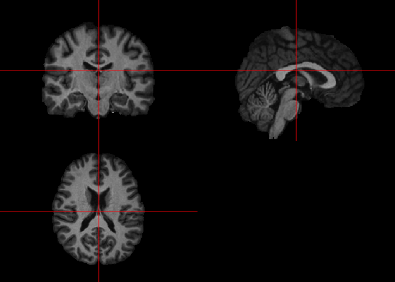<!-- -->

The `neurobase::ortho2` function expands upon this with some different defaults.


```r
neurobase::ortho2(eve)
```

<!-- -->

We see that in `ortho2` there are annotations of the orientation of the image.  Again, if the image was not reoriented, then these many not be corrrect.  You can turn these off with the `add.orient` argument:


```r
neurobase::ortho2(eve, add.orient = FALSE)
```

<!-- -->

### Differences between `orthographic` and `ortho2`

The above code does not fully illustrate the differences between `orthographic` and `ortho2`.  One marked difference is when you would like to "overlay" an image on top of another in an orthograhic view.  Here we will highlight voxels greater than the 90th quantile of the image:


```r
orthographic(eve, y = eve > quantile(eve, 0.9))
```

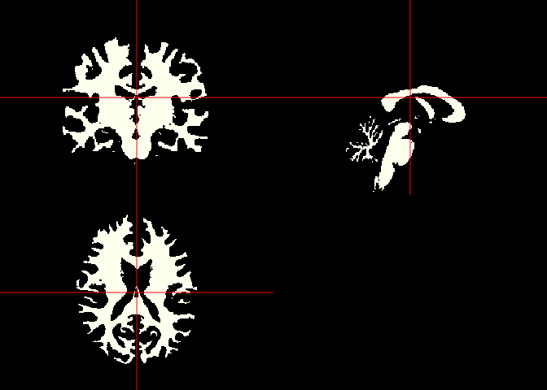<!-- -->

We see that the white matter is represented here, but we would like to see areas of the brain that are not over this quantile to be shown as the image.  Let us contrast this with:


```r
ortho2(eve, y = eve > quantile(eve, 0.9))
```

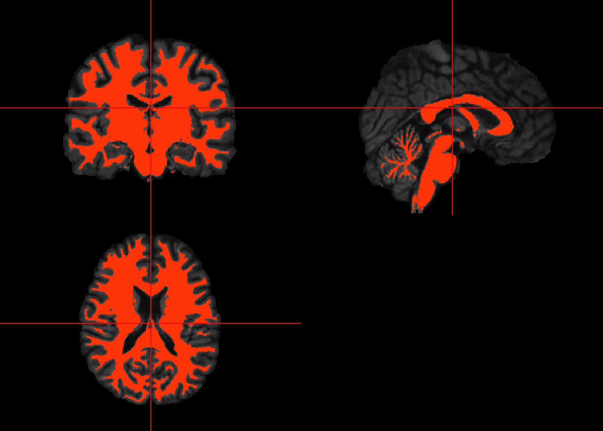<!-- -->

We see the image where the mask is 0 shows the original image.  This is due to the `NA.y` argument in `ortho2`.  The `ortho2` (and `orthograhic`) function is based on the `graphics::image` function in R, as well as many other functions we will discuss below.  When `graphics::image` sees an `NA` value, it does not plot anything there.  The `NA.y` argument in `ortho2` makes it so any values in the `y` argument (in this case the mask) that are equal to zero are turned to `NA`.  

### Bright values 

If you have artifacts or simply large values of an image, it can "dampen" the viewing of an image.  Let's make one value of the eve template very large.  We will set the voxel with the largest value to be that value times 5 :


```r
eve2 = eve
eve2[which.max(eve)] = eve2[which.max(eve)] * 5
```

Let's plot this image again:

```r
ortho2(eve2)
```

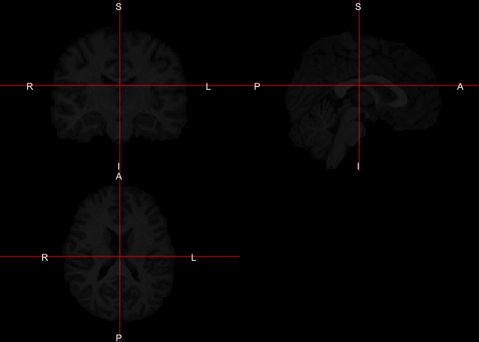<!-- -->

We see a faint outline of the image, but this single large value affects how we view the image.  The function `robust_window` calculates quantiles of an image, by default the 0 (min) and 99.9th quantile, and sets values outside of this range to that quantile.  If you are familiar with the process of [Winsorizing](https://en.wikipedia.org/wiki/Winsorizing), this is the exact same procedure.  Many times we use this function to plotting, but could be thought of an outlier dampening procedure.  Let's plot this windowed image:


```r
ortho2(robust_window(eve2))
```

<!-- -->

Changing the `probs` argument in `robust_window`, which is passed to `quantile`, can also be used to limit artifacts with remarkably low values.  The `zlim` option can also denote which range of intensities that can be plotted:


```r
ortho2(eve2, zlim = quantile(eve2, probs = c(0, 0.999)))
```

<!-- -->

This is a bit more like trimming, however.

### Double orthographic view

Sometimes you would like to represent 2 images side by side, of the same dimensions and orientation of course.  The `double_ortho` function allows you to do this.  Let's read in the full Eve image, not just the brain


```r
eve_full = readEve(what = "T1")
```

We can view the original T1 alongside the brain-extracted image:


```r
double_ortho(eve_full, eve)
```

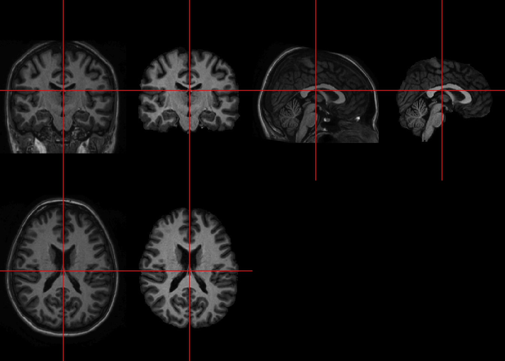<!-- -->

## Single slice view

We may want to view a single slice of an image.  The `oro.nifti::image` function can be used here.  Note, `graphics::image` exists and `oro.nifti::image` both exist.  The `oro.nifti::image` allows you to just write `image(nifti_object)`, which performs operations and calls functions using `graphics::image`.  This allows the user to use a "generic" version of `image`, which `oro.nifti` adapted specifically for `nifti` objects.  You can see the help for this function in `?image.nifti`.

Let's plot an image of the 90th slice of `eve`

```r
image(eve, z = 90)
```

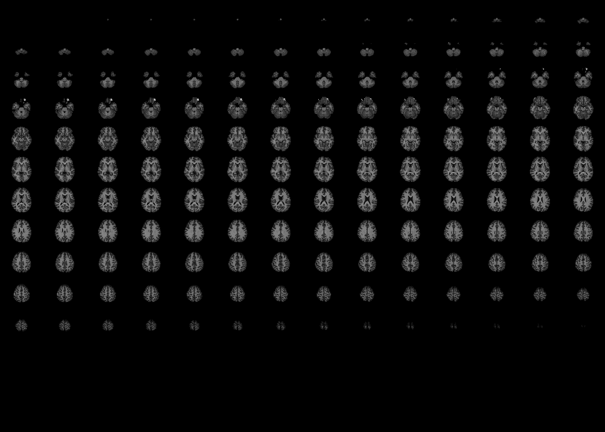<!-- -->

What happened? Well, the default argument `plot.type` in `image.nifti` is set for `"multiple"`, so that even if you specify a slice, it will plot **all** slices.  Here, if we pass `plot.type = "single"`, we get the single slice we want.


```r
image(eve, z = 90, plot.type = "single")
```

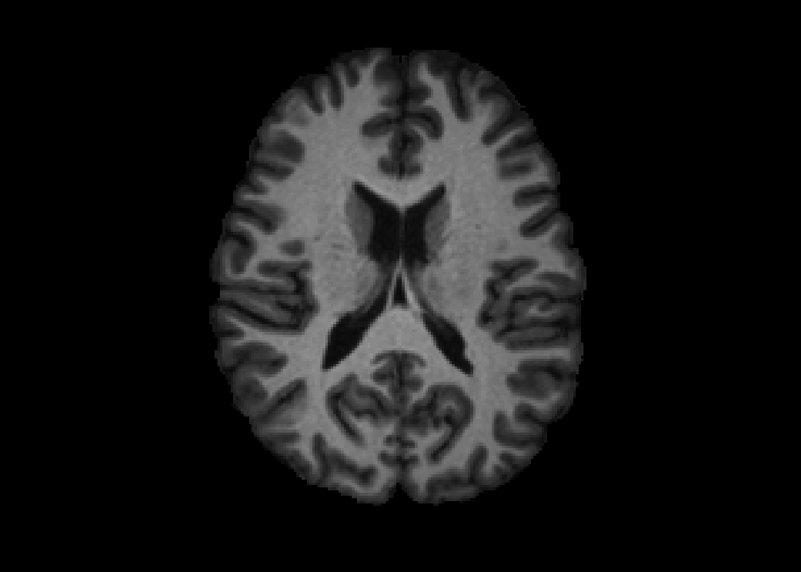<!-- -->

If we put multiple slices with `plot.type = "single"`, then we will get a view of these 2 slices.

```r
image(eve, z = c(90, 100), plot.type = "single")
```

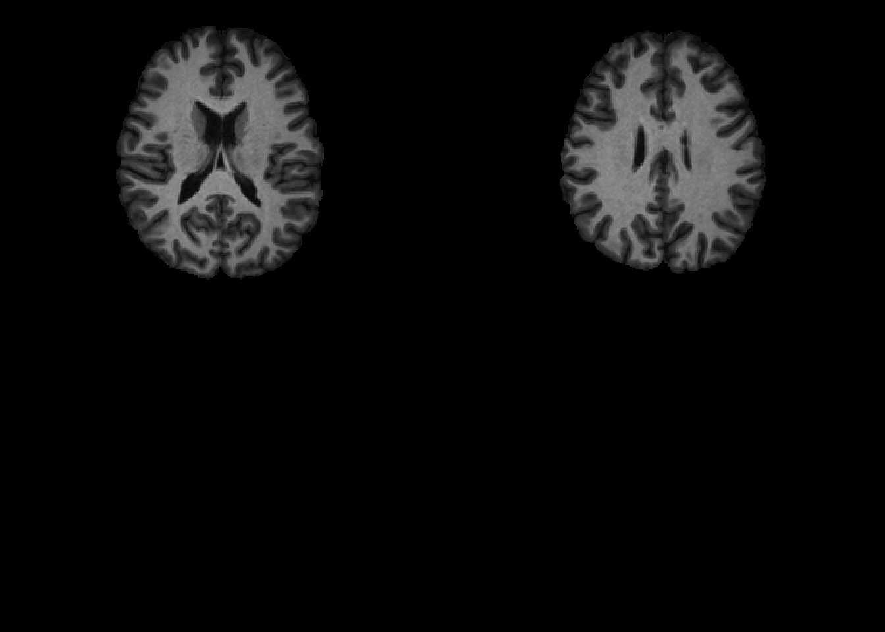<!-- -->

### Different Planes

We can specify `z` the same way but change the `plane` to be different to get a different slice of the brain:


```r
image(eve, z = 98, plot.type = "single", plane = "sagittal")
```

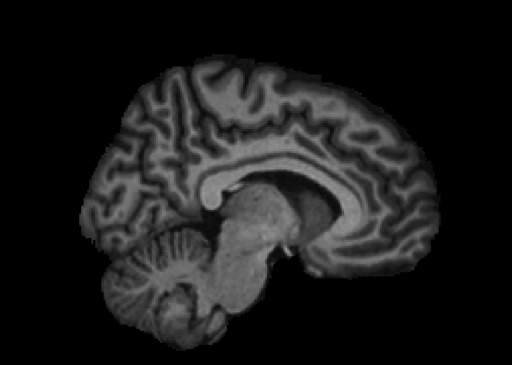<!-- -->
We can similarly do the same for "coronal" slices.

## Overlaying slices

We can also overlay one slice of an image upon another using the `oro.nifti::overlay` function.  Here we must specify `plot.type` again for only one slice.

```r
overlay(eve, y = eve > quantile(eve, 0.9), z = 90, plot.type = "single")
```

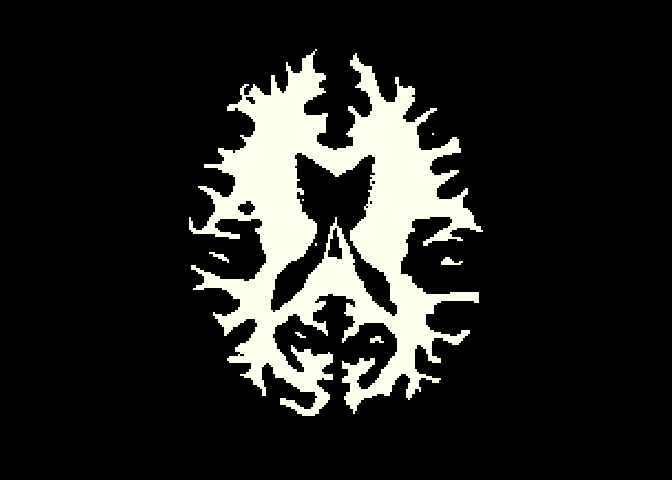<!-- -->

We have not yet implemented `overlay2` (at the time of running this), which has the `NA.y` option, but will in the future.  We can do this prior to plotting and pass in this `NA`'d mask:


```r
mask = eve > quantile(eve, 0.9)
mask[ mask == 0] = NA
overlay(eve, y = mask, z = 90, plot.type = "single")
```

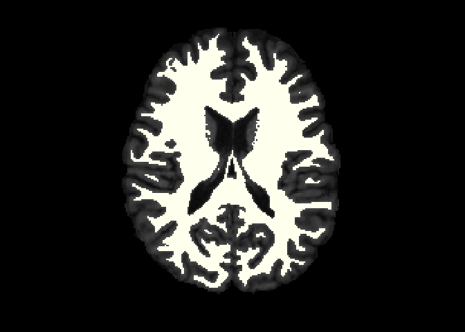<!-- -->

```r
rm(list = "mask")
```

## Dropping empty dimensions

In some instances, there are extraneous slices to an image.  For example, in the Eve template image we read in, it is just the brain.  Areas of the skull and extracranial tissue are removed, but the slices remain so that the brain image and the original image are in the same space with the same dimensions.  For plotting or further analyses, we can drop these empty dimensions using the `neurobase::dropEmptyImageDimensions` function or `drop_empty_dim` shorthand function.  
By default, if one `nifti` is passed to the function and `keep_ind = FALSE`, then the return is a `nifti` object. 


```r
reduced = dropEmptyImageDimensions(eve)
dim(eve)
```

```
[1] 181 217 181
```

```r
dim(reduced)
```

```
[1] 148 182 152
```

We can now plot the reduced image:


```r
ortho2(reduced)
```

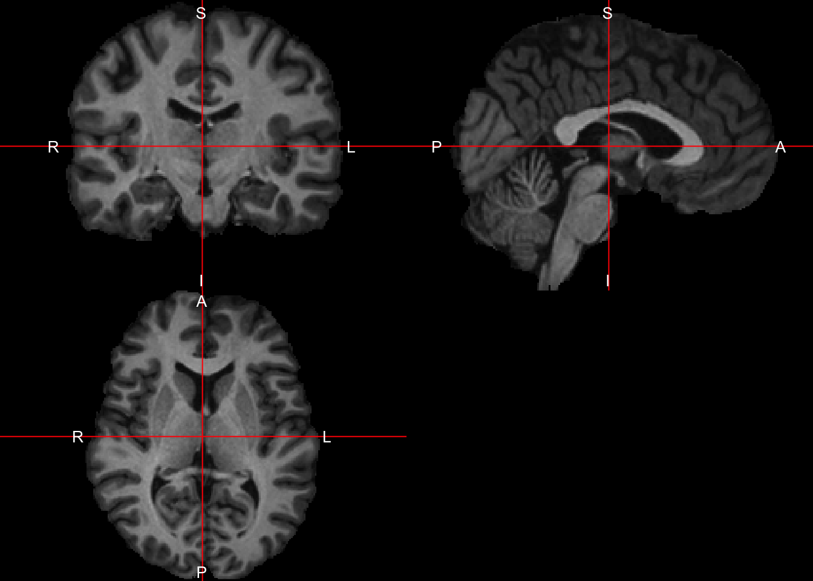<!-- -->

which we can contrast with the plotting the full image


```r
ortho2(eve)
```

<!-- -->

### Dropping with multiple images

You can pass in other images in the `other.imgs` function to applying this dropping procedure.  For example, let's say you have 3 images, a T1, T2, and FLAIR image that are all registered to the T1 image and have a brain mask from the T1 image.  You can pass in the mask image and pass in the other images into `other.imgs` so they all drop the same slices and are the same dimensions after the procedure (as they were the same prior), whereas if you performed the operation you may not be ensured to drop exactly the same slices due to some modalities allowing values of zero (albeit highly unlikely).

### Adding back the dropped dimensions

To reverse this procedure, the `replace_dropped_dimensions` function will add back dimensions to the image correctly using the indices from `drop_empty_dim`.  Here is an example:


```r
dd = dropEmptyImageDimensions(eve, keep_ind = TRUE)
reduced = dd$outimg
reversed = replace_dropped_dimensions(img = reduced, 
                                      inds = dd$inds,
                                      orig.dim = dd$orig.dim)
all(reversed == eve)
```

```
[1] TRUE
```


# Manipulating `nifti` images

## Creating copies of `nifti`

Sometimes you want to create a copy of a `nifti` object.  Many times performing an operation will create this output for you.  Other times, you may want a shell `nifti` object.  

### Copying header information

If you have an array, you can simply write:


```r
dims = dim(eve)
arr = array(rnorm(prod(dims)), dim = dims)
nim = nifti(arr)
nim
```

```
NIfTI-1 format
  Type            : nifti
  Data Type       : 2 (UINT8)
  Bits per Pixel  : 8
  Slice Code      : 0 (Unknown)
  Intent Code     : 0 (None)
  Qform Code      : 0 (Unknown)
  Sform Code      : 0 (Unknown)
  Dimension       : 181 x 217 x 181
  Pixel Dimension : 1 x 1 x 1
  Voxel Units     : Unknown
  Time Units      : Unknown
```
but the header information of the `nifti` output `nim` does not match that of `eve`.  The `copyNIfTIHeader` function allows you to...copy the NIfTI header:


```r
nim = copyNIfTIHeader(img = eve, arr = nim)
nim
```

```
NIfTI-1 format
  Type            : nifti
  Data Type       : 16 (FLOAT32)
  Bits per Pixel  : 32
  Slice Code      : 0 (Unknown)
  Intent Code     : 0 (None)
  Qform Code      : 2 (Aligned_Anat)
  Sform Code      : 1 (Scanner_Anat)
  Dimension       : 181 x 217 x 181
  Pixel Dimension : 1 x 1 x 1
  Voxel Units     : mm
  Time Units      : Unknown
```

### Creating a "shell"

The `niftiarr` function does much of the same functionality of `copyNIfTIHeader`, but `copyNIfTIHeader` you have an `array` or `nifti` in the `arr` argument.  If you wanted a `nifti` object with the same header as `eve`, but all zeroes, you can use `niftiarr`:


```r
zeroes = niftiarr(eve, 0)
```

The main difference is the line in `niftiarr`:
```r
if (!is(arr, "array")){
  arr = array(arr, dim=dim(img))
}
```
which implies that if you pass in a `vector` instead of an `array`, it will create an `array` on the fly.  Sometimes you want an operation to error if `arr` is not an `array` (as in `copyNIfTIHeader`) or be able to pass in a vector and get the correct output `niftiarr`.  

Technical note: This code is legacy and somewhat old and probably can (and may be) replaced by making `copyNIfTIHeader` a generic and having different versions for when `arr` is an `array` or `vector`.  

## Masking

Many times you mask an image based on a binary mask.  This means any values where the mask is 1, the values will remain, and if the mask is zero or `NA`, they will be changed (to either zero or `NA`).  

The operation of masking is simply multiplication, multiplying an array by a binary (with or without `NA`s).  Although this is simple, we have created the `mask_img` function to perform some checking on the `mask`, such as are all values 0/1.  It also has the argument `allow.NA`, which denotes whether `NA`s should be allowed or not in the mask.  

Here we will simply mask out values of `eve` that are less than the mean:


```r
eve_masked = mask_img(eve, eve > mean(eve))
```


```r
ortho2(eve_masked)
```

<!-- -->


## Vectorizing a `nifti`

To convert a `nifti` to a `vector`, you can simply use the `c()` operator:


```r
vals = c(eve)
class(vals)
```

```
[1] "numeric"
```

Note an `array` can be reconstructed by using `array(vals, dim = dim(eve))` and will be in the correct order as the way R creates vectors and arrays.  

From these values we can do all the standard plotting/manipulations of data.  For example, let's do a marginal density of the values:


```r
plot(density(vals))
```

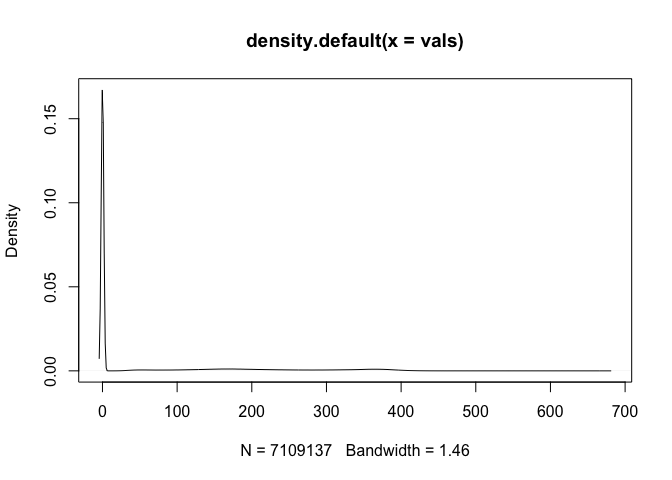<!-- -->

This plot is good, but it's over all voxels in the image, which are mostly zero due to the background.  Therefore we see a large spike at zero, but not much information of the distribution of values within the mask.  We need to subset the values by the mask.


### Subsetting via masks
In a previous example, we calculated the mean of `eve` over the entire image.  Many times we want to calculate values over a mask.  For example, let's get the mean of all voxels in the mask, where the mask is any value of `eve` greater than zero.  We can do this by subsetting the values in the mask and then calculating the mean:


```r
vals = eve[ eve > 0 ]
mean(vals)
```

```
[1] 224.1273
```

```r
mean(eve)
```

```
[1] 58.11317
```

We see that the mean of the voxels in the mask versus all voxels is very different, because the voxels not in the mask are simply adding zeroes to the calculation.  We could simply do the same by making zero voxels `NA` and adding the `na.rm` argument to `TRUE` for the mean.


```r
mask = eve > 0
mask[ mask == 0 ] = NA
eve_masked = mask_img(eve, mask)
mean(eve_masked)
```

```
[1] NA
```

```r
mean(eve_masked, na.rm = TRUE)
```

```
[1] 224.1273
```

Again, as `nifti` objects inherits properties from `array` objects, we can subset using logical indices, as above in `mask == 0` and could use indices such as `which(mask == 0)`.  

We can do a marginal density of the values only in the mask:

```r
vals = eve[ eve > 0 ]
```


```r
plot(density(vals))
```

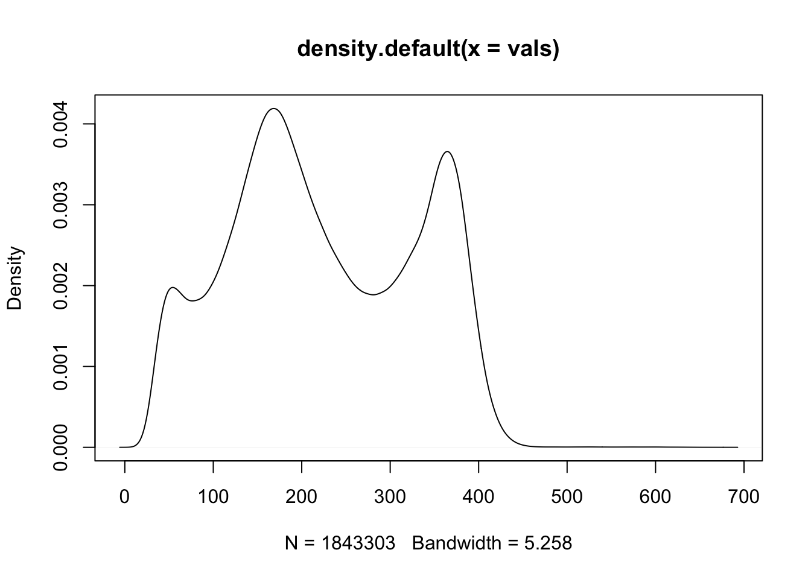<!-- -->


## Creating `data.frame`s 

In many cases, we may have multiple images in the same space.  We can simply create a `data.frame` by vectorizing each image.  Here we will read in the T2 image, which is the same space as the T1.


```r
t2 = readEve(what = "T2")
df = data.frame(T1 = c(eve_full),
                T2 = c(t2),
                mask = c(eve > 0))
head(df)
```

```
  T1 T2  mask
1  0  0 FALSE
2  0  0 FALSE
3  0  0 FALSE
4  0  0 FALSE
5  0  0 FALSE
6  0  0 FALSE
```
We can then perform standard operations on the `data.frame` as we would any other `data.frame`.  Let's keep only voxels in the `mask`, then remove the column of the `mask`.


```r
library(dplyr)
```

```

Attaching package: 'dplyr'
```

```
The following objects are masked from 'package:stats':

    filter, lag
```

```
The following objects are masked from 'package:base':

    intersect, setdiff, setequal, union
```

```r
df = df %>% 
  filter(mask) %>% 
  select(-mask)
```

### Bi-variate distributions

Here we make binned hexagrams to represent the 2-dimensional distributions of each imaging sequence against the other. 


```r
library(ggplot2)
g = ggplot(df) + stat_binhex()
g + aes(x = T1, y = T2)
```

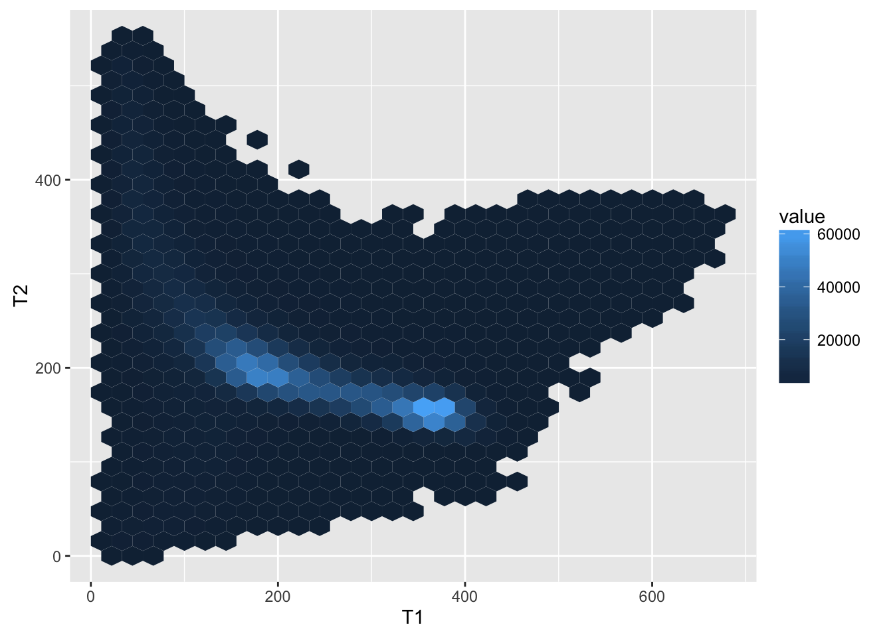<!-- -->

### Marginal distributions

Here we plot the distributions of the T1 and T2 imaging sequences separately.


```r
long = reshape2::melt(as.matrix(df))
colnames(long) = c("ind", "sequence", "value")
long$ind = NULL
```


```r
library(ggplot2)
ggplot(long, aes(x = value)) + 
  geom_line(stat = "density") +
  facet_wrap(~ sequence, 
             scales = "free_x")
```

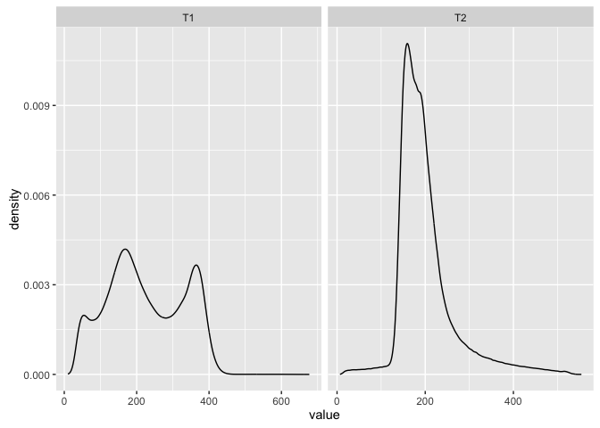<!-- -->


# Session Info


```r
devtools::session_info()
```

```
Session info --------------------------------------------------------------
```

```
 setting  value                       
 version  R version 3.3.1 (2016-06-21)
 system   x86_64, darwin13.4.0        
 ui       X11                         
 language (EN)                        
 collate  en_US.UTF-8                 
 tz       America/New_York            
 date     2016-11-09                  
```

```
Packages ------------------------------------------------------------------
```

```
 package     * version date       source                             
 abind         1.4-5   2016-07-21 cran (@1.4-5)                      
 assertthat    0.1     2013-12-06 CRAN (R 3.2.0)                     
 bitops        1.0-6   2013-08-17 CRAN (R 3.2.0)                     
 codetools     0.2-14  2015-07-15 CRAN (R 3.3.1)                     
 colorout    * 1.1-0   2015-04-20 Github (jalvesaq/colorout@1539f1f) 
 colorspace    1.2-6   2015-03-11 CRAN (R 3.2.0)                     
 DBI           0.5-1   2016-09-10 CRAN (R 3.3.0)                     
 devtools      1.12.0  2016-06-24 CRAN (R 3.3.0)                     
 digest        0.6.10  2016-08-02 cran (@0.6.10)                     
 dplyr       * 0.5.0   2016-06-24 CRAN (R 3.3.0)                     
 evaluate      0.9     2016-04-29 CRAN (R 3.2.5)                     
 EveTemplate * 0.99.14 2016-09-15 local                              
 formatR       1.4     2016-05-09 CRAN (R 3.2.5)                     
 ggplot2     * 2.1.0   2016-03-01 CRAN (R 3.3.0)                     
 gtable        0.2.0   2016-02-26 CRAN (R 3.2.3)                     
 hexbin      * 1.27.1  2015-08-19 CRAN (R 3.2.0)                     
 htmltools     0.3.6   2016-09-26 Github (rstudio/htmltools@6996430) 
 knitr         1.14    2016-08-13 CRAN (R 3.3.0)                     
 labeling      0.3     2014-08-23 CRAN (R 3.2.0)                     
 lattice       0.20-34 2016-09-06 CRAN (R 3.3.0)                     
 lazyeval      0.2.0   2016-06-12 CRAN (R 3.3.0)                     
 magrittr      1.5     2014-11-22 CRAN (R 3.2.0)                     
 matrixStats   0.51.0  2016-10-09 cran (@0.51.0)                     
 memoise       1.0.0   2016-01-29 CRAN (R 3.2.3)                     
 munsell       0.4.3   2016-02-13 CRAN (R 3.2.3)                     
 neurobase   * 1.5.1   2016-11-04 local                              
 oro.nifti   * 0.6.2   2016-11-04 Github (bjw34032/oro.nifti@fe54c8e)
 plyr          1.8.4   2016-06-08 CRAN (R 3.3.0)                     
 R.methodsS3   1.7.1   2016-02-16 CRAN (R 3.2.3)                     
 R.oo          1.20.0  2016-02-17 CRAN (R 3.2.3)                     
 R.utils       2.4.0   2016-09-14 cran (@2.4.0)                      
 R6            2.2.0   2016-10-05 cran (@2.2.0)                      
 Rcpp          0.12.7  2016-09-05 cran (@0.12.7)                     
 reshape2      1.4.1   2014-12-06 CRAN (R 3.2.0)                     
 rmarkdown     1.1     2016-10-16 CRAN (R 3.3.1)                     
 RNifti        0.2.2   2016-10-02 cran (@0.2.2)                      
 scales        0.4.0   2016-02-26 CRAN (R 3.2.3)                     
 stringi       1.1.1   2016-05-27 CRAN (R 3.3.0)                     
 stringr       1.1.0   2016-08-19 cran (@1.1.0)                      
 tibble        1.2     2016-08-26 CRAN (R 3.3.0)                     
 withr         1.0.2   2016-06-20 CRAN (R 3.3.0)                     
 yaml          2.1.13  2014-06-12 CRAN (R 3.2.0)                     
```
