All code for this document is located at [here](https://raw.githubusercontent.com/muschellij2/neuroc/master/preprocess_mri_within/index.R).


In this tutorial we will discuss within a visit registration (co-registration) of multi-sequence MRI images.


# Data Packages

For this analysis, I will use one subject from the Kirby 21 data set.  The `kirby21.base` and `kirby21.fmri` packages are necessary for this analysis and have the data we will be working on.  You need devtools to install these.  Please refer to [installing devtools](../installing_devtools/index.html) for additional instructions or troubleshooting.


```r
packages = installed.packages()
packages = packages[, "Package"]
if (!"kirby21.base" %in% packages) {
  source("https://neuroconductor.org/neurocLite.R")
  neuroc_install("kirby21.base")    
}
if (!"kirby21.smri" %in% packages) {
  source("https://neuroconductor.org/neurocLite.R")
  neuroc_install("kirby21.smri")     
}
if (!"EveTemplate" %in% packages) {
  source("https://neuroconductor.org/neurocLite.R")
  neuroc_install("EveTemplate")     
}
```

# Loading Data

We will use the `get_image_filenames_df` function to extract the filenames on our hard disk for the T1 image.  


```r
library(kirby21.smri)
library(kirby21.base)
run_mods = c("T1", "T2", "FLAIR")
fnames = get_image_filenames_list_by_visit(
  ids = 113, 
  modalities = run_mods, 
  visits = c(1,2 ))
visit_1 = fnames$`1`$`113`
visit_2 = fnames$`2`$`113`
mods = visit_1 %>% nii.stub(bn = TRUE) %>% 
  strsplit("-") %>% 
  sapply(dplyr::last)
names(visit_1) = names(visit_2) = mods
visit_1 = visit_1[run_mods]
visit_2 = visit_2[run_mods]
```

# Processing images within a visit

The function `preprocess_mri_within` from `extrantsr` wraps a series of steps.  The function below will perform:

1.  N4 inhomogeneity [@tustison_n4itk_2010] correction to each image.
2.  Estimate the transformation to the first file (T1 image).
3.  Perform this transformation, registering the images, and interpolating the images using a Lanczos windowed sinc interpolator.

`preprocess_mri_within` can also perform skull stripping using BET, but we have shown in the [brain extraction tutorial](../brain_extraction/index.html) that running BET without running neck removal.


```r
library(extrantsr)
outfiles = nii.stub(visit_1, bn = TRUE)
proc_files = paste0(outfiles, "_proc.nii.gz")
names(proc_files) = names(outfiles)
if (!all(file.exists(proc_files))) {
  extrantsr::preprocess_mri_within(
    files = visit_1,
    outfiles = proc_files,
    correct = TRUE,
    retimg = FALSE,
    correction = "N4")
}
```


```r
proc_imgs = lapply(proc_files, readnii)
```


```r
lapply(proc_imgs, ortho2)
```

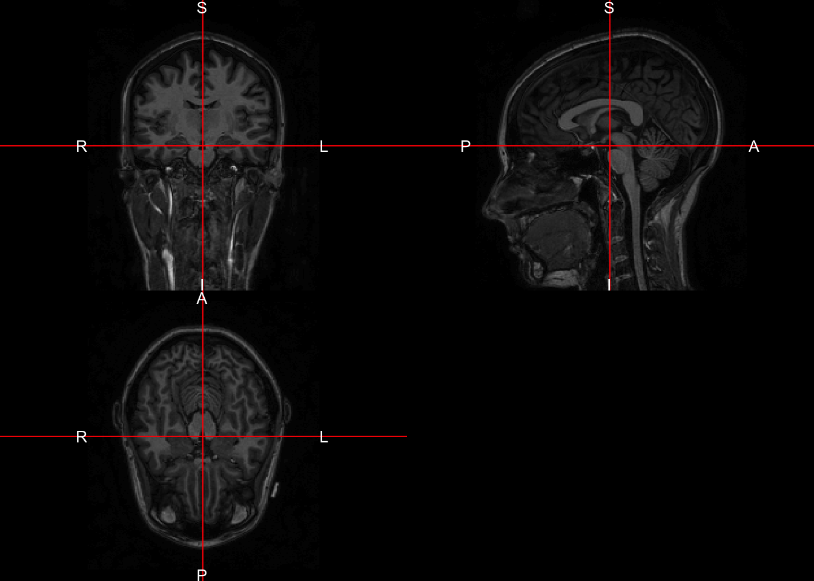<!-- -->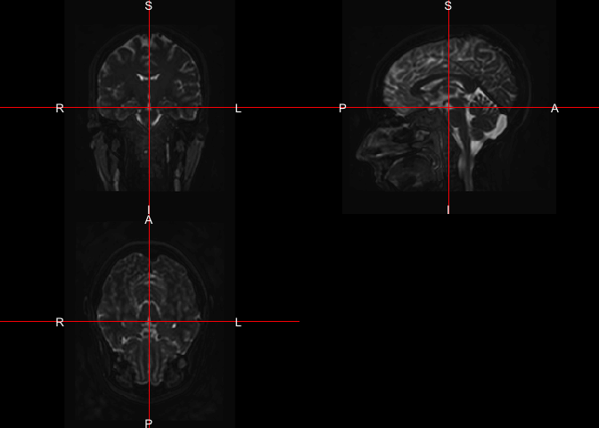<!-- -->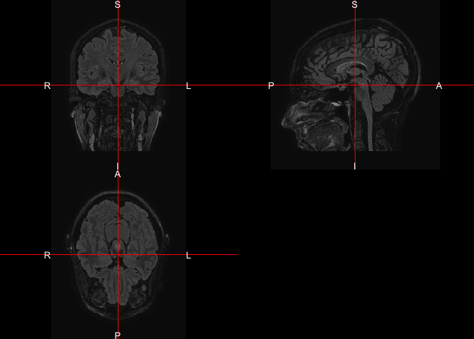<!-- -->

```
$T1
NULL

$T2
NULL

$FLAIR
NULL
```

## Brain Extraction of the T1 image

Similar to the [brain extraction tutorial](../brain_extraction/index.html), we can run `fslbet_robust` to get a good brain mask for the T1 image.  


```r
outfile = nii.stub(visit_1["T1"], bn = TRUE)
outfile = paste0(outfile, "_SS.nii.gz")
if (!file.exists(outfile)) {
  ss = extrantsr::fslbet_robust(visit_1["T1"], 
    remover = "double_remove_neck",
    outfile = outfile)
} else {
  ss = readnii(outfile)
}
```

## Applying the brain mask

As each processed image is now registered to the T1 image, we can apply this mask to all image sequences.  Here we will mask the images using `mask_img` and then we will drop empty dimensions based on the mask.  


```r
mask = ss > 0
proc_imgs = lapply(proc_imgs, mask_img, mask = mask)
dd = dropEmptyImageDimensions(mask, other.imgs = proc_imgs)
mask = dd$outimg
proc_imgs = dd$other.imgs
```

Again we will plot the masked images:


```r
lapply(proc_imgs, ortho2)
```

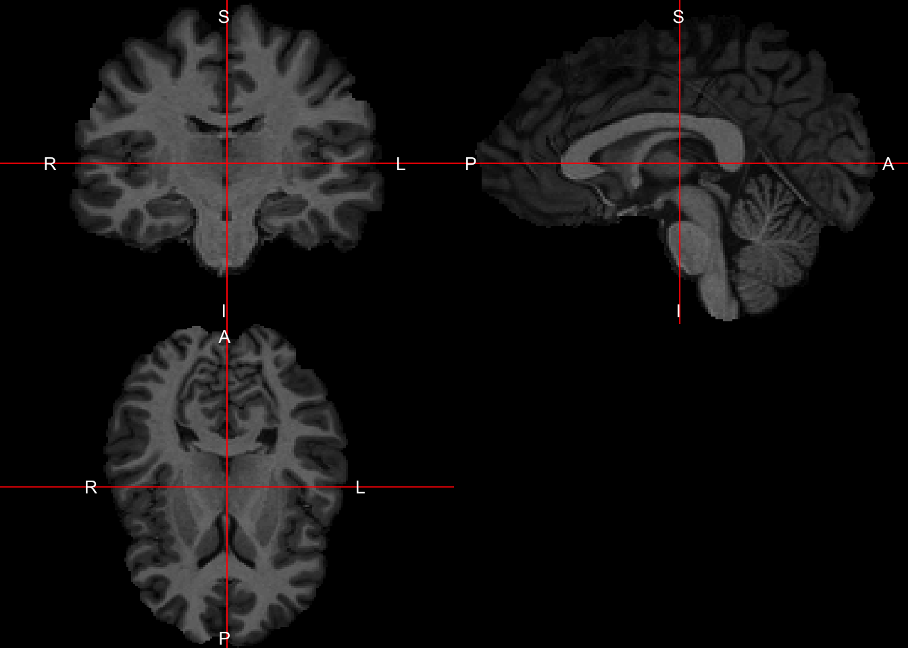<!-- -->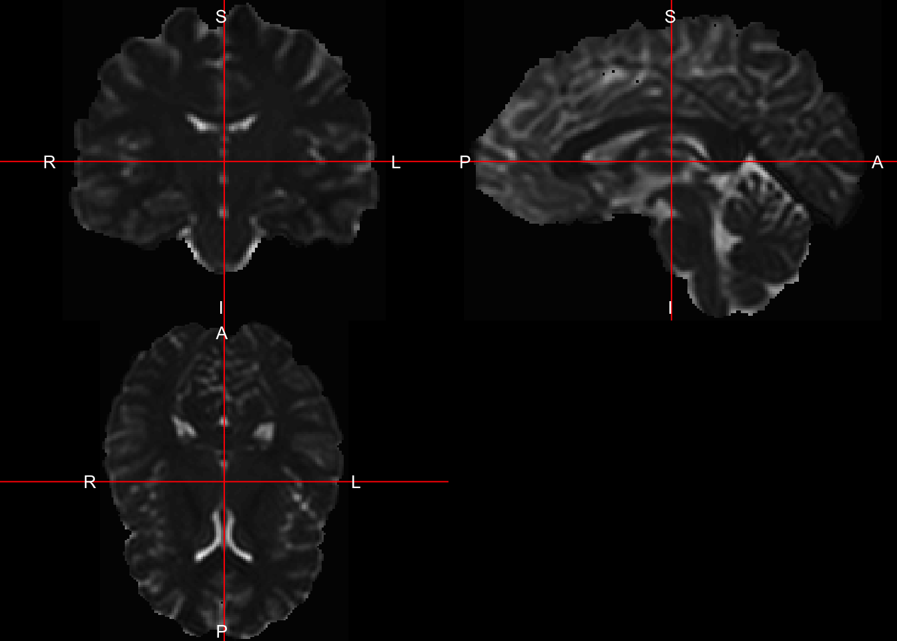<!-- -->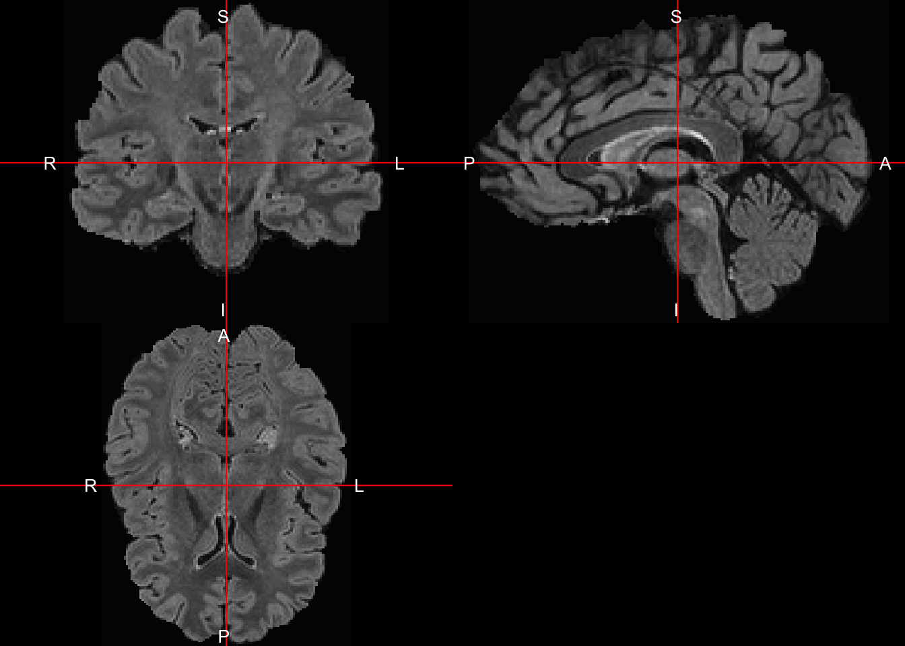<!-- -->

```
$T1
NULL

$T2
NULL

$FLAIR
NULL
```

# Inhomogeneity correction on skull-stripped images

Some believe that inhomogeneity correction should be done after skull stripping (even if done before as well).  Here we will run `extrantsr::bias_correct` which calls `ANTsR`.  We will pass in the mask:


```r
n4_proc_imgs = plyr::llply(
  proc_imgs, 
  bias_correct, 
  correction = "N4", 
  mask = mask,
  retimg = TRUE,
  .progress = "text")
```

```

  |                                                                       
  |                                                                 |   0%
  |                                                                       
  |======================                                           |  33%
  |                                                                       
  |===========================================                      |  67%
  |                                                                       
  |=================================================================| 100%
```

Here we will write out the processed images for later use (in other tutorials):


```r
outfiles = nii.stub(visit_1, bn = TRUE)
outfiles = paste0(outfiles, "_proc_N4_SS.nii.gz")
if (!all(file.exists(outfiles))) {
  mapply(function(img, outfile) {
    writenii(img, filename = outfile)
  }, n4_proc_imgs, outfiles)
}
```


# Intensity Normalization

Here we will do intensity normalization of the brain.  We will do z-score normalization, where the estimates of the mean and standard deviation are based on all voxels within the mask.  This is referred to as whole-brain normalization.


```r
norm_imgs = plyr::llply(
  n4_proc_imgs, 
  zscore_img,
  margin = NULL,
  centrality = "mean",
  variability = "sd",
  mask = mask,
  .progress = "text")
```

```

  |                                                                       
  |                                                                 |   0%
  |                                                                       
  |======================                                           |  33%
  |                                                                       
  |===========================================                      |  67%
  |                                                                       
  |=================================================================| 100%
```

## Visualizing the marginal intensities

Here we can make a `data.frame` of the normalized images.  We also create a long `data.frame` (called `long`) for plotting in `ggplot2`.


```r
df = sapply(norm_imgs, function(x){
  x[ mask == 1 ]
})
long = reshape2::melt(df)
colnames(long) = c("ind", "sequence", "value")
long$ind = NULL
df = data.frame(df)
```

### Marginal distributions

Here we plot the distributions of each imaging sequence separately.


```r
ggplot(long, aes(x = value, colour = factor(sequence))) + 
  geom_line(stat = "density")
```

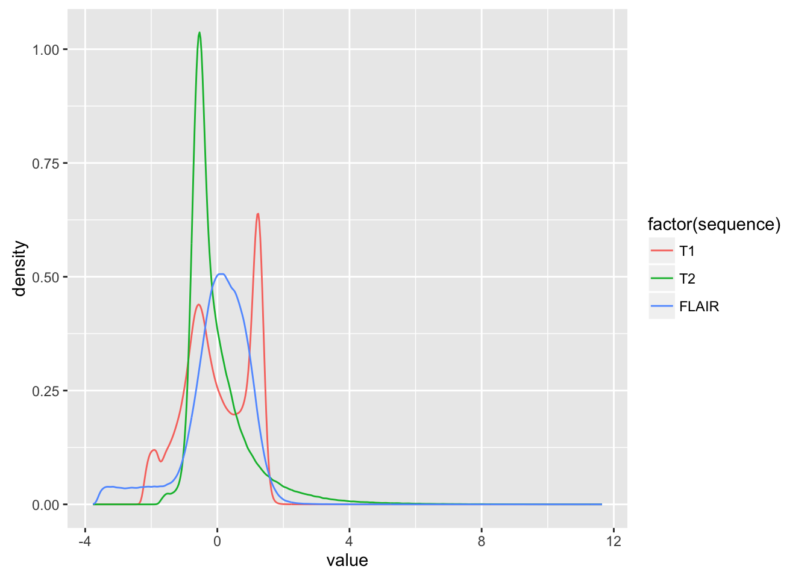<!-- -->

### Bi-variate distributions

Here we make binned hexagrams to represent the 2-dimensional distributions of each imaging sequence against the other. 


```r
g = ggplot(df) + stat_binhex()
g + aes(x = T1, y = T2)
```

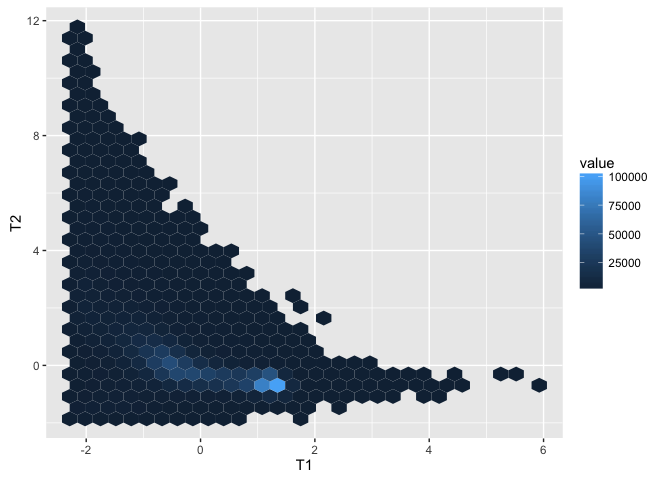<!-- -->

```r
g + aes(x = T1, y = FLAIR)
```

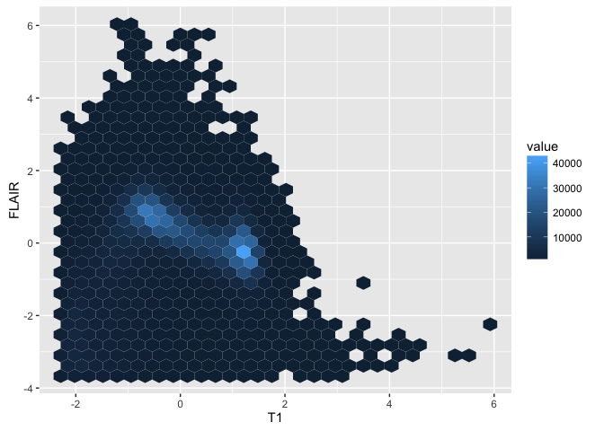<!-- -->

```r
g + aes(x = T2, y = FLAIR)
```

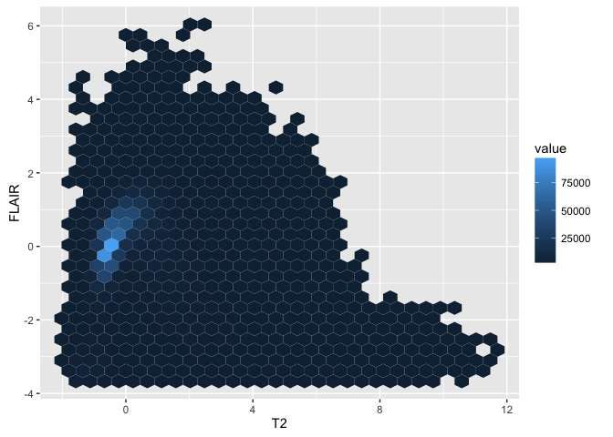<!-- -->


# Registration to the Eve template

As many MRI studies involve multiple subjects, registration to a template is sometimes necessary.  When using registration tools, it is good to note that some may inherently discard voxels less than zero.  This may be due to the cost functions used or implied masking that is done behind the scenes.  As such, here we will register the non-intensity-normalized T1 image to the template and then apply the estimated transform to the intensity-normalized data.  

We will use symmetric normalization (SyN) [@avants_symmetric_2008] which is a non-linear registration, which implicitly performs an affine registration before the non-linear component.  We will register to the "Eve" template [@oishi2009atlas,@Oishi_Faria_Mori2010], and we will register only to the brain image and not the raw image (with extracranial tissue included).  

Again we will use the `extrantsr::registration` function which wraps `antsRegistration`.  


```r
outfiles = nii.stub(visit_1, bn = TRUE)
norm_reg_files = paste0(outfiles, "_norm_eve.nii.gz")
names(norm_reg_files) = names(outfiles)
eve_brain_fname = getEvePath("Brain")

if ( !all( file.exists(norm_reg_files) )) {
  reg = registration(
    filename = n4_proc_imgs$T1, 
    template.file = eve_brain_fname,
    other.files = norm_imgs,
    other.outfiles = norm_reg_files,
    interpolator = "LanczosWindowedSinc",
    typeofTransform = "SyN")
} 
```


## Registration to Eve results

Here we will read in the Eve template brain and it's mask.  We will read in the intensity-normalized registered images, and then mask that with the Eve brain mask.


```r
eve_brain = readnii(eve_brain_fname)
eve_brain_mask = readEve(what = "Brain_Mask")
norm_reg_imgs = lapply(norm_reg_files, readnii)
norm_reg_imgs = lapply(norm_reg_imgs, mask_img, mask = eve_brain_mask)
```

Below we see good congruence from the template and the corresponding images from this patient.


```r
lapply(norm_reg_imgs, double_ortho, x = eve_brain)
```

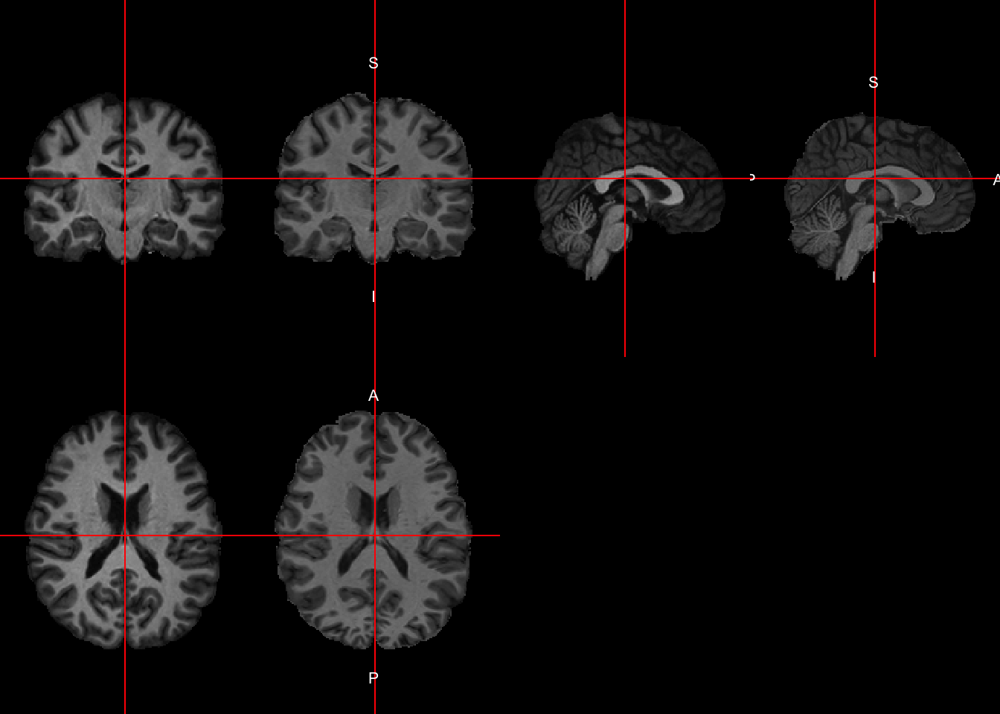<!-- -->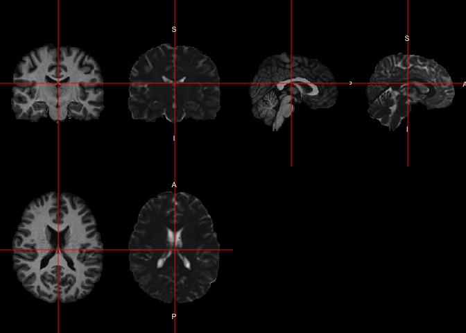<!-- --><!-- -->

```
$T1
NULL

$T2
NULL

$FLAIR
NULL
```


# Session Info


```r
devtools::session_info()
```

```
Session info --------------------------------------------------------------
```

```
 setting  value                       
 version  R version 3.3.1 (2016-06-21)
 system   x86_64, darwin13.4.0        
 ui       X11                         
 language (EN)                        
 collate  en_US.UTF-8                 
 tz       America/New_York            
 date     2016-11-09                  
```

```
Packages ------------------------------------------------------------------
```

```
 package       * version date       source                             
 abind           1.4-5   2016-07-21 cran (@1.4-5)                      
 animation     * 2.4     2015-08-16 CRAN (R 3.2.0)                     
 ANTsR         * 0.3.3   2016-10-10 Github (stnava/ANTsR@a50e986)      
 assertthat      0.1     2013-12-06 CRAN (R 3.2.0)                     
 bitops          1.0-6   2013-08-17 CRAN (R 3.2.0)                     
 codetools       0.2-14  2015-07-15 CRAN (R 3.3.1)                     
 colorout      * 1.1-0   2015-04-20 Github (jalvesaq/colorout@1539f1f) 
 colorspace      1.2-6   2015-03-11 CRAN (R 3.2.0)                     
 DBI             0.5-1   2016-09-10 CRAN (R 3.3.0)                     
 devtools        1.12.0  2016-06-24 CRAN (R 3.3.0)                     
 digest          0.6.10  2016-08-02 cran (@0.6.10)                     
 dplyr         * 0.5.0   2016-06-24 CRAN (R 3.3.0)                     
 evaluate        0.9     2016-04-29 CRAN (R 3.2.5)                     
 EveTemplate   * 0.99.14 2016-09-15 local                              
 extrantsr     * 2.5.1   2016-11-09 local                              
 formatR         1.4     2016-05-09 CRAN (R 3.2.5)                     
 fslr          * 2.4     2016-11-04 Github (muschellij2/fslr@7ce0f03)  
 ggplot2       * 2.1.0   2016-03-01 CRAN (R 3.3.0)                     
 gtable          0.2.0   2016-02-26 CRAN (R 3.2.3)                     
 hash            2.2.6   2013-02-21 CRAN (R 3.2.0)                     
 hexbin        * 1.27.1  2015-08-19 CRAN (R 3.2.0)                     
 htmltools       0.3.6   2016-09-26 Github (rstudio/htmltools@6996430) 
 igraph          1.0.1   2015-06-26 CRAN (R 3.2.0)                     
 iterators       1.0.8   2015-10-13 CRAN (R 3.2.0)                     
 kirby21.base  * 1.4.2   2016-10-05 local                              
 kirby21.flair   1.4     2016-09-29 local (@1.4)                       
 kirby21.smri  * 1.4     2016-09-30 local                              
 kirby21.t1    * 1.4     2016-09-29 local                              
 kirby21.t2      1.4     2016-09-29 local (@1.4)                       
 knitr           1.14    2016-08-13 CRAN (R 3.3.0)                     
 labeling        0.3     2014-08-23 CRAN (R 3.2.0)                     
 lattice         0.20-34 2016-09-06 CRAN (R 3.3.0)                     
 magrittr        1.5     2014-11-22 CRAN (R 3.2.0)                     
 Matrix          1.2-7.1 2016-09-01 CRAN (R 3.3.0)                     
 matrixStats   * 0.51.0  2016-10-09 cran (@0.51.0)                     
 memoise         1.0.0   2016-01-29 CRAN (R 3.2.3)                     
 mgcv            1.8-15  2016-09-14 CRAN (R 3.3.0)                     
 mmap            0.6-12  2013-08-28 CRAN (R 3.3.0)                     
 munsell         0.4.3   2016-02-13 CRAN (R 3.2.3)                     
 neurobase     * 1.5.1   2016-11-04 local                              
 neuroim         0.1.0   2016-09-27 local                              
 nlme            3.1-128 2016-05-10 CRAN (R 3.3.1)                     
 oro.nifti     * 0.6.2   2016-11-04 Github (bjw34032/oro.nifti@fe54c8e)
 plyr          * 1.8.4   2016-06-08 CRAN (R 3.3.0)                     
 R.matlab        3.6.0   2016-07-05 CRAN (R 3.3.0)                     
 R.methodsS3   * 1.7.1   2016-02-16 CRAN (R 3.2.3)                     
 R.oo          * 1.20.0  2016-02-17 CRAN (R 3.2.3)                     
 R.utils       * 2.4.0   2016-09-14 cran (@2.4.0)                      
 R6              2.2.0   2016-10-05 cran (@2.2.0)                      
 RColorBrewer  * 1.1-2   2014-12-07 CRAN (R 3.2.0)                     
 Rcpp            0.12.7  2016-09-05 cran (@0.12.7)                     
 reshape2      * 1.4.1   2014-12-06 CRAN (R 3.2.0)                     
 rmarkdown       1.1     2016-10-16 CRAN (R 3.3.1)                     
 RNifti          0.2.2   2016-10-02 cran (@0.2.2)                      
 scales          0.4.0   2016-02-26 CRAN (R 3.2.3)                     
 stringi         1.1.1   2016-05-27 CRAN (R 3.3.0)                     
 stringr       * 1.1.0   2016-08-19 cran (@1.1.0)                      
 tibble          1.2     2016-08-26 CRAN (R 3.3.0)                     
 WhiteStripe     2.0     2016-09-28 local                              
 withr           1.0.2   2016-06-20 CRAN (R 3.3.0)                     
 yaImpute        1.0-26  2015-07-20 CRAN (R 3.2.0)                     
 yaml            2.1.13  2014-06-12 CRAN (R 3.2.0)                     
 zoo           * 1.7-13  2016-05-03 CRAN (R 3.2.4)                     
```

# References
