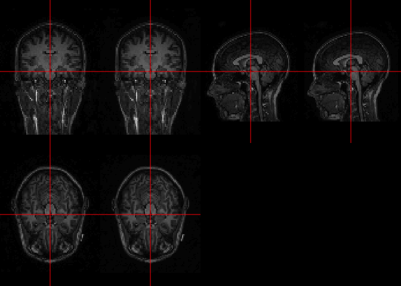
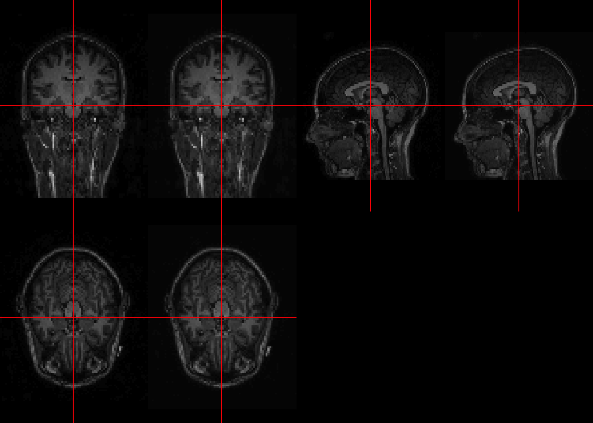

All code for this document is located at [here](https://raw.githubusercontent.com/muschellij2/neuroc/master/resample_image/index.R).


# Goal 
In this short tutorial, we will show various ways of resampling an image to different voxel sizes and image dimensions.  This procedure may be necessary in some analyses and can also be used to reduce the size of the image for demonstration purposes.  

# Reading in one file

We will read in one T1-weighted NIfTI image to see the dimensions of the image.  We can read in the data a number of ways, including the `neurobase::readnii` function, which relies on the `oro.nifti::readNIfTI` function, the `RNifti::readNifti`, and `ANTsRCore::antsImageRead` functions.  Note, all of these functions give back different types of objects.


```r
fname = kirby21.t1::get_t1_filenames()[1]
if (file.exists(fname)) {
  oro_img = readnii(fname)
  print(oro_img)
  rnif_img = readNifti(fname)
  print(rnif_img)
  ants_img = antsImageRead(fname)
  print(ants_img)
}
```

```
NIfTI-1 format
  Type            : nifti
  Data Type       : 16 (FLOAT32)
  Bits per Pixel  : 32
  Slice Code      : 0 (Unknown)
  Intent Code     : 0 (None)
  Qform Code      : 1 (Scanner_Anat)
  Sform Code      : 0 (Unknown)
  Dimension       : 170 x 256 x 256
  Pixel Dimension : 1.2 x 1 x 1
  Voxel Units     : mm
  Time Units      : sec
Image array of mode "double" (85 Mb)
- 170 x 256 x 256 voxels
- 1.2 x 1 x 1 mm per voxel
antsImage
  Pixel Type          : float 
  Components Per Pixel: 1 
  Dimensions          : 170x256x256 
  Voxel Spacing       : 1.20000004768372x1x1 
  Origin              : 202.8 0 0 
  Direction           : -1 0 0 0 1 0 0 0 1 
  Filename           : /Users/johnmuschelli/Library/R/4.0/library/kirby21.t1/visit_1/113/113-01-T1.nii.gz 
```


# Conversion between objects

Here we will show some ways to convert from one format to another.  Note, you should always check cases of conversion, such as the data type, especsially when there are missing values or `NaN` values.

## `oro.nifti` `nifti` `RNifti` `niftiImage` format

The `RNifti` function `asNifti` allows for a direct conversion of formats.  


```r
asNifti(oro_img)
```

```
Image array of mode "double" (85 Mb)
- 170 x 256 x 256 voxels
- 1.2 x 1 x 1 mm per voxel
```

```r
all(asNifti(oro_img) == rnif_img)
```

```
[1] TRUE
```

## `RNifti` `niftiImage` to `oro.nifti` `nifti` format

The `oro.nifti` function `nii2oro` will convert from `niftiImage` object to `nifti` objects.  


```r
nii2oro(rnif_img)
```

```
NIfTI-1 format
  Type            : nifti
  Data Type       : 64 (FLOAT64)
  Bits per Pixel  : 64
  Slice Code      : 0 (Unknown)
  Intent Code     : 0 (None)
  Qform Code      : 1 (Scanner_Anat)
  Sform Code      : 0 (Unknown)
  Dimension       : 170 x 256 x 256
  Pixel Dimension : 1.2 x 1 x 1
  Voxel Units     : mm
  Time Units      : sec
```

```r
all(oro_img == nii2oro(rnif_img))
```

```
[1] TRUE
```
Note, the slots for the header are directly copied from the output of `niftiHeader`, even if they are inconsistent in what `readnii` would give.  For example, the `scl_slope` argument may not be the same:


```r
scl_slope(oro_img)
```

```
[1] 1
```

```r
scl_slope(nii2oro(rnif_img))
```

```
[1] 0
```

## `ANTsRCore` `antsImage` to `oro.nifti` `nifti` format

The `extrantsr` functions `ants2oro` will convert from `ANTsRCore` `antsImage` to `oro.nifti` `nifti` objects:


```r
ants2oro(ants_img)
```

```
NIfTI-1 format
  Type            : nifti
  Data Type       : 16 (FLOAT32)
  Bits per Pixel  : 32
  Slice Code      : 0 (Unknown)
  Intent Code     : 0 (None)
  Qform Code      : 1 (Scanner_Anat)
  Sform Code      : 1 (Scanner_Anat)
  Dimension       : 170 x 256 x 256
  Pixel Dimension : 1.2 x 1 x 1
  Voxel Units     : mm
  Time Units      : Unknown
```

By default, this will write the image to disk and then read it in using `readnii`, but you can pass in a `reference` image that header information will be copied from (but not checked for consistency):


```r
ants2oro(ants_img, reference = oro_img)
```

```
NIfTI-1 format
  Type            : nifti
  Data Type       : 16 (FLOAT32)
  Bits per Pixel  : 32
  Slice Code      : 0 (Unknown)
  Intent Code     : 0 (None)
  Qform Code      : 1 (Scanner_Anat)
  Sform Code      : 0 (Unknown)
  Dimension       : 170 x 256 x 256
  Pixel Dimension : 1.2 x 1 x 1
  Voxel Units     : mm
  Time Units      : sec
```


which we see is much faster:

```r
system.time(ants2oro(ants_img))
```

```
   user  system elapsed 
  3.352   0.106   3.475 
```

```r
system.time(ants2oro(ants_img, reference = oro_img))
```

```
   user  system elapsed 
  0.898   0.035   0.935 
```

##  `oro.nifti` `nifti` to `ANTsRCore` `antsImage` format

The `extrantsr` functions `oro2ants` will convert from  `oro.nifti` `nifti` to `ANTsRCore` `antsImage` objects.  Note, this essentially writes the output to disk, then reads it back in using `antsImageRead`, but is a convenience image for this:


```r
oro2ants(oro_img)
```

```
antsImage
  Pixel Type          : float 
  Components Per Pixel: 1 
  Dimensions          : 170x256x256 
  Voxel Spacing       : 1.20000004768372x1x1 
  Origin              : 202.8 0 0 
  Direction           : -1 0 0 0 1 0 0 0 1 
  Filename           : /private/var/folders/1s/wrtqcpxn685_zk570bnx9_rr0000gr/T/RtmpKB5yJj/file6025783bd5b3.nii.gz 
```

The `as.antsImage` function should work as well (and is much faster), but doesn't carry the appropriate header information:


```r
as.antsImage(oro_img)
```

```
antsImage
  Pixel Type          : float 
  Components Per Pixel: 1 
  Dimensions          : 170x256x256 
  Voxel Spacing       : 1x1x1 
  Origin              : 0 0 0 
  Direction           : 1 0 0 0 1 0 0 0 1 
```

And can error as the header information is different:

```r
as.antsImage(oro_img) == ants_img
```

```
Error in as.antsImage(oro_img) == ants_img: Images do not occupy the same physical space
```

You can specify this with a reference, or the arguments of `spacing`, `origin`, and `direction` (which may be difficult), however:

```r
all(as.array(as.antsImage(oro_img, reference = ants_img) == ants_img) == 1)
```

```
[1] TRUE
```


Also, `niftiImage` objects work as well using `oro2ants`:

```r
oro2ants(oro_img)
```

```
antsImage
  Pixel Type          : float 
  Components Per Pixel: 1 
  Dimensions          : 170x256x256 
  Voxel Spacing       : 1.20000004768372x1x1 
  Origin              : 202.8 0 0 
  Direction           : -1 0 0 0 1 0 0 0 1 
  Filename           : /private/var/folders/1s/wrtqcpxn685_zk570bnx9_rr0000gr/T/RtmpKB5yJj/file6025776f6b5.nii.gz 
```

but does not work directly with `as.antsImage`

```r
as.antsImage(rnif_img)
```

```
Error in (function (classes, fdef, mtable) : unable to find an inherited method for function 'as.antsImage' for signature '"niftiImage"'
```


# Resampling Images

## Using FSL and `fslr`
The `fslr` package calls FSL to perform operations on images that are on disk.  For functions that pass in `nifti` objects in the `fslr` package, these images are written to disk using in a temporary location and then the FSL function is applied.  If a resulting image is returned, then it can be read back in as a `nifti` object.     

Let's just display the pixel dimensions of the original image:


```r
oro_img@pixdim[2:4]
```

```
[1] 1.2 1.0 1.0
```

The `fsl_resample` function allows you to resample an image on disk.  Thus, if you have the character path of the image or `nifti` object, these images can be resampled using `fsl_resample`.  This code calls `flirt` from FSL and uses the `applyisoxfm` to perform isotoropic sampling (all the same size).  Thus, `fsl_resample` can only resample images to cubes with all the same side length.  Some of the examples below have more flexibility.


```r
res = fsl_resample(file = fname, voxel_size = 1)
```

```
flirt -in "/Users/johnmuschelli/Library/R/4.0/library/kirby21.t1/visit_1/113/113-01-T1.nii.gz"  -ref /Users/johnmuschelli/Library/R/4.0/library/kirby21.t1/visit_1/113/113-01-T1.nii.gz -applyisoxfm 1 -out "/var/folders/1s/wrtqcpxn685_zk570bnx9_rr0000gr/T//RtmpKB5yJj/file6025407a6c6a";
```

```r
res
```

```
NIfTI-1 format
  Type            : nifti
  Data Type       : 16 (FLOAT32)
  Bits per Pixel  : 32
  Slice Code      : 0 (Unknown)
  Intent Code     : 0 (None)
  Qform Code      : 1 (Scanner_Anat)
  Sform Code      : 0 (Unknown)
  Dimension       : 204 x 256 x 256
  Pixel Dimension : 1 x 1 x 1
  Voxel Units     : mm
  Time Units      : sec
```

```r
oro_res = fsl_resample(oro_img, voxel_size = 1)
```

```
flirt -in "/private/var/folders/1s/wrtqcpxn685_zk570bnx9_rr0000gr/T/RtmpKB5yJj/file60252563c438.nii.gz"  -ref /private/var/folders/1s/wrtqcpxn685_zk570bnx9_rr0000gr/T/RtmpKB5yJj/file60252563c438.nii.gz -applyisoxfm 1 -out "/var/folders/1s/wrtqcpxn685_zk570bnx9_rr0000gr/T//RtmpKB5yJj/file602538e74bb5";
```

```r
all.equal(res, oro_res)
```

```
[1] TRUE
```

```r
res@pixdim[2:4]
```

```
[1] 1 1 1
```

## Using `RNiftyReg` `rescale` function

To resample a `niftiImage` object, you need to use the `RNiftyReg` package.  In this case, the `scales` argument is the "Scale factors along each axis", which is *not* the voxel sizes.  The output dimensions will be the current dimensions *multiplied* by the scale factors.  Alternatively, you can think of the output voxel dimensions as the current voxel dimensions *divided* by the scale factors.  Thus, if we run the following code:


```r
niftiHeader(rnif_img)$pixdim[2:4]
```

```
[1] 1.2 1.0 1.0
```

```r
RNiftyReg::rescale(rnif_img, c(2,1.5,1))
```

```
Image array of mode "double" (255 Mb)
- 340 x 384 x 256 voxels
- 0.6 x 0.6667 x 1 mm per voxel
```
The image will be scaled by 2 in the x-direction, 1.5 in the y-direction and stay the same for the z-direction.  Thus, if we want an image to be `1x1x1`, then we need to scale the dimensions as follows:


```r
RNiftyReg::rescale(rnif_img, c(1.2,1,1))
```

```
Image array of mode "double" (102 Mb)
- 204 x 256 x 256 voxels
- 1 x 1 x 1 mm per voxel
```

If we want to make the output image 2.5 mm$^3$, then we can run:


```r
pdim = niftiHeader(rnif_img)$pixdim[2:4]
RNiftyReg::rescale(rnif_img, pdim / c(2.5, 2.5, 2.5))
```

```
Image array of mode "double" (6.4 Mb)
- 81 x 102 x 102 voxels
- 2.5 x 2.5 x 2.5 mm per voxel
```

Or we can refactor the arguments such that if we want an image to be `2.5x2.3x3` we can run:


```r
rescale2 = function(img, voxel_size = c(1,1,1), ...) {
  pdim = niftiHeader(rnif_img)$pixdim[2:4]
  scales = pdim / voxel_size
  RNiftyReg::rescale(img, scales = scales, ...)
}
rescale2(rnif_img, c(2.5, 2.3, 3))
```

```
Image array of mode "double" (5.8 Mb)
- 81 x 111 x 85 voxels
- 2.5 x 2.3 x 3 mm per voxel
```

**NB**: you can pass in `nifti` objects as well, and the output is converted to a niftiImage

```r
rescale2(oro_img, c(2.5, 2.3, 3))
```

```
Image array of mode "double" (5.8 Mb)
- 81 x 111 x 85 voxels
- 2.5 x 2.3 x 3 mm per voxel
```

which you can wrap in `nii2oro`:


```r
nii2oro(rescale2(oro_img, c(2.5, 2.3, 3)))
```

```
NIfTI-1 format
  Type            : nifti
  Data Type       : 64 (FLOAT64)
  Bits per Pixel  : 64
  Slice Code      : 0 (Unknown)
  Intent Code     : 0 (None)
  Qform Code      : 1 (Scanner_Anat)
  Sform Code      : 0 (Unknown)
  Dimension       : 81 x 111 x 85
  Pixel Dimension : 2.5 x 2.3 x 3
  Voxel Units     : mm
  Time Units      : sec
```

### Additional arguments - interpolation

The `interpolation` argument in `rescale`, which is passed to `applyTransform` in `RNiftyReg` can also specify the interpolation done, using `0 (nearest neighbour), 1 (trilinear) or 3 (cubic spline)`, where cubic spline is the default:


```r
interp0 = nii2oro(rescale2(oro_img, c(2.5, 2.3, 3), interpolation = 0L))
interp3 = nii2oro(rescale2(oro_img, c(2.5, 2.3, 3), interpolation = 3L))
double_ortho(interp0, interp3)
```

<!-- -->

## Using `ANTsRCore` `resampleImage` and `extrantsr` `resample_image`

The `resampleImage` provides a flexible function to resample `antsImage` objects.  The `useVoxels` argument determines what the resample parameters are specified in, either millimeters (default) or output voxel spacing


```r
resampleImage(ants_img, resampleParams = c(1, 1, 1))
```

```
antsImage
  Pixel Type          : float 
  Components Per Pixel: 1 
  Dimensions          : 204x256x256 
  Voxel Spacing       : 1x1x1 
  Origin              : 202.8 0 0 
  Direction           : -1 0 0 0 1 0 0 0 1 
```

```r
resampleImage(ants_img, resampleParams = c(1, 1, 1), useVoxels = TRUE)
```

```
antsImage
  Pixel Type          : float 
  Components Per Pixel: 1 
  Dimensions          : 1x1x1 
  Voxel Spacing       : 204.000008106232x256x256 
  Origin              : 202.8 0 0 
  Direction           : -1 0 0 0 1 0 0 0 1 
```

```r
resampleImage(ants_img, resampleParams = c(150, 200, 200), useVoxels = TRUE)
```

```
antsImage
  Pixel Type          : float 
  Components Per Pixel: 1 
  Dimensions          : 150x200x200 
  Voxel Spacing       : 1.36000005404154x1.28x1.28 
  Origin              : 202.8 0 0 
  Direction           : -1 0 0 0 1 0 0 0 1 
```


The `extrantsr::resample_image` wrapper function refactors the arguments so that you can pass in the target voxel sizes in `mm` or dimensions.  


```r
resample_image(oro_img, parameters = c(1, 1, 1))
```

```
NIfTI-1 format
  Type            : nifti
  Data Type       : 16 (FLOAT32)
  Bits per Pixel  : 32
  Slice Code      : 0 (Unknown)
  Intent Code     : 0 (None)
  Qform Code      : 1 (Scanner_Anat)
  Sform Code      : 1 (Scanner_Anat)
  Dimension       : 204 x 256 x 256
  Pixel Dimension : 1 x 1 x 1
  Voxel Units     : mm
  Time Units      : Unknown
```

```r
resample_image(ants_img, parameters = c(1, 1, 1))
```

```
antsImage
  Pixel Type          : float 
  Components Per Pixel: 1 
  Dimensions          : 204x256x256 
  Voxel Spacing       : 1x1x1 
  Origin              : 202.8 0 0 
  Direction           : -1 0 0 0 1 0 0 0 1 
```


where we see the output depends on the input.  Also, we can perform operations where the output is not isotropic:


```r
resample_image(ants_img, parameters = c(2.5, 2.3, 1))
```

```
antsImage
  Pixel Type          : float 
  Components Per Pixel: 1 
  Dimensions          : 82x111x256 
  Voxel Spacing       : 2.5x2.3x1 
  Origin              : 202.8 0 0 
  Direction           : -1 0 0 0 1 0 0 0 1 
```

We can also specify the resampling by image dimensions:


```r
resample_image(ants_img, parameters = c(150, 200, 200), parameter_type = "voxels")
```

```
antsImage
  Pixel Type          : float 
  Components Per Pixel: 1 
  Dimensions          : 150x200x200 
  Voxel Spacing       : 1.36000005404154x1.28x1.28 
  Origin              : 202.8 0 0 
  Direction           : -1 0 0 0 1 0 0 0 1 
```

### Additional arguments - interpolation
As with `rescale`, we can perform different interpolations:

```r
formals(resample_image)$interpolator
```

```
c("nearestneighbor", "linear", "gaussian", "windowedsinc", "bspline")
```

```r
formals(resampleImage)$interpType
```

```
[1] "nearestneighbor"
```
where we see the nearest neighbor interpolation is the default:


```r
interp0 = resample_image(ants_img, parameters = c(2.5, 2.3, 3), interpolator = "nearestneighbor")
interp3 = resample_image(ants_img, parameters = c(2.5, 2.3, 3), interpolator = "bspline")
double_ortho(interp0, interp3)
```

<!-- -->

```r
ortho2(interp0, interp3 - interp0, col.y = scales::alpha(hotmetal(), 0.5))
```

<!-- -->


# Session Info


```r
devtools::session_info()
```

```
─ Session info ───────────────────────────────────────────────────────────────
 setting  value                       
 version  R version 4.0.2 (2020-06-22)
 os       macOS Catalina 10.15.7      
 system   x86_64, darwin17.0          
 ui       X11                         
 language (EN)                        
 collate  en_US.UTF-8                 
 ctype    en_US.UTF-8                 
 tz       America/New_York            
 date     2021-02-18                  

─ Packages ───────────────────────────────────────────────────────────────────
 package      * version   date       lib source                                
 abind          1.4-5     2016-07-21 [2] CRAN (R 4.0.0)                        
 ANTsR          0.5.7.5   2021-02-16 [1] Github (ANTsX/ANTsR@4abee8d)          
 ANTsRCore    * 0.7.4.9   2021-02-16 [1] Github (ANTsX/ANTsRCore@ddf445b)      
 assertthat     0.2.1     2019-03-21 [2] CRAN (R 4.0.0)                        
 bitops         1.0-6     2013-08-17 [2] CRAN (R 4.0.0)                        
 cachem         1.0.4     2021-02-13 [1] CRAN (R 4.0.2)                        
 callr          3.5.1     2020-10-13 [1] CRAN (R 4.0.2)                        
 cli            2.3.0     2021-01-31 [1] CRAN (R 4.0.2)                        
 codetools      0.2-18    2020-11-04 [1] CRAN (R 4.0.2)                        
 colorout     * 1.2-2     2020-06-01 [2] Github (jalvesaq/colorout@726d681)    
 colorspace     2.0-0     2020-11-11 [1] CRAN (R 4.0.2)                        
 crayon         1.4.1     2021-02-08 [1] CRAN (R 4.0.2)                        
 desc           1.2.0     2020-06-01 [2] Github (muschellij2/desc@b0c374f)     
 devtools       2.3.2     2020-09-18 [1] CRAN (R 4.0.2)                        
 digest         0.6.27    2020-10-24 [1] CRAN (R 4.0.2)                        
 ellipsis       0.3.1     2020-05-15 [2] CRAN (R 4.0.0)                        
 evaluate       0.14      2019-05-28 [2] CRAN (R 4.0.0)                        
 extrantsr    * 3.9.13.1  2020-09-03 [2] Github (muschellij2/extrantsr@00c75ad)
 farver         2.0.3     2020-01-16 [2] CRAN (R 4.0.0)                        
 fastmap        1.1.0     2021-01-25 [1] CRAN (R 4.0.2)                        
 fs             1.5.0     2020-07-31 [2] CRAN (R 4.0.2)                        
 fslr         * 2.25.0    2021-02-16 [1] local                                 
 git2r          0.28.0    2021-01-11 [1] Github (ropensci/git2r@4e342ca)       
 glue           1.4.2     2020-08-27 [1] CRAN (R 4.0.2)                        
 highr          0.8       2019-03-20 [2] CRAN (R 4.0.0)                        
 htmltools      0.5.1.1   2021-01-22 [1] CRAN (R 4.0.2)                        
 ITKR           0.5.3.3.0 2021-02-15 [1] Github (stnava/ITKR@ea0ac19)          
 kirby21.base   1.7.4     2020-10-01 [1] local                                 
 kirby21.t1   * 1.7.3.2   2021-01-09 [1] local                                 
 knitr          1.31      2021-01-27 [1] CRAN (R 4.0.2)                        
 lattice        0.20-41   2020-04-02 [2] CRAN (R 4.0.2)                        
 lifecycle      1.0.0     2021-02-15 [1] CRAN (R 4.0.2)                        
 magrittr       2.0.1     2020-11-17 [1] CRAN (R 4.0.2)                        
 Matrix         1.3-2     2021-01-06 [1] CRAN (R 4.0.2)                        
 matrixStats    0.58.0    2021-01-29 [1] CRAN (R 4.0.2)                        
 memoise        2.0.0     2021-01-26 [1] CRAN (R 4.0.2)                        
 mgcv           1.8-33    2020-08-27 [1] CRAN (R 4.0.2)                        
 munsell        0.5.0     2018-06-12 [2] CRAN (R 4.0.0)                        
 neurobase    * 1.31.0    2020-10-07 [1] local                                 
 nlme           3.1-152   2021-02-04 [1] CRAN (R 4.0.2)                        
 ore            1.6.3     2019-11-02 [2] CRAN (R 4.0.0)                        
 oro.nifti    * 0.11.0    2020-09-04 [2] local                                 
 pkgbuild       1.2.0     2020-12-15 [1] CRAN (R 4.0.2)                        
 pkgload        1.1.0     2020-05-29 [2] CRAN (R 4.0.0)                        
 plyr           1.8.6     2020-03-03 [2] CRAN (R 4.0.0)                        
 prettyunits    1.1.1     2020-01-24 [2] CRAN (R 4.0.0)                        
 processx       3.4.5     2020-11-30 [1] CRAN (R 4.0.2)                        
 ps             1.5.0     2020-12-05 [1] CRAN (R 4.0.2)                        
 purrr          0.3.4     2020-04-17 [2] CRAN (R 4.0.0)                        
 R.matlab       3.6.2     2018-09-27 [2] CRAN (R 4.0.0)                        
 R.methodsS3    1.8.1     2020-08-26 [1] CRAN (R 4.0.2)                        
 R.oo           1.24.0    2020-08-26 [1] CRAN (R 4.0.2)                        
 R.utils        2.10.1    2020-08-26 [1] CRAN (R 4.0.2)                        
 R6             2.5.0     2020-10-28 [1] CRAN (R 4.0.2)                        
 Rcpp           1.0.6     2021-01-15 [1] CRAN (R 4.0.2)                        
 RcppEigen      0.3.3.9.1 2020-12-17 [1] CRAN (R 4.0.2)                        
 remotes        2.2.0     2020-07-21 [2] CRAN (R 4.0.2)                        
 rlang          0.4.10    2020-12-30 [1] CRAN (R 4.0.2)                        
 rmarkdown      2.6       2020-12-14 [1] CRAN (R 4.0.2)                        
 RNifti       * 1.3.0     2020-12-04 [1] CRAN (R 4.0.2)                        
 RNiftyReg      2.7.0     2020-10-08 [1] Github (jonclayden/RNiftyReg@20c419f) 
 rprojroot      2.0.2     2020-11-15 [1] CRAN (R 4.0.2)                        
 rstudioapi     0.13      2020-11-12 [1] CRAN (R 4.0.2)                        
 scales         1.1.1     2020-05-11 [2] CRAN (R 4.0.0)                        
 sessioninfo    1.1.1     2018-11-05 [2] CRAN (R 4.0.0)                        
 stapler        0.7.2     2020-07-09 [2] Github (muschellij2/stapler@79e23d2)  
 stringi        1.5.3     2020-09-09 [1] CRAN (R 4.0.2)                        
 stringr        1.4.0     2019-02-10 [2] CRAN (R 4.0.0)                        
 testthat       3.0.2     2021-02-14 [1] CRAN (R 4.0.2)                        
 usethis        2.0.1     2021-02-10 [1] CRAN (R 4.0.2)                        
 WhiteStripe    2.3.2     2019-10-01 [2] CRAN (R 4.0.0)                        
 withr          2.4.1     2021-01-26 [1] CRAN (R 4.0.2)                        
 xfun           0.21      2021-02-10 [1] CRAN (R 4.0.2)                        
 yaml           2.2.1     2020-02-01 [2] CRAN (R 4.0.0)                        

[1] /Users/johnmuschelli/Library/R/4.0/library
[2] /Library/Frameworks/R.framework/Versions/4.0/Resources/library
```

# References
