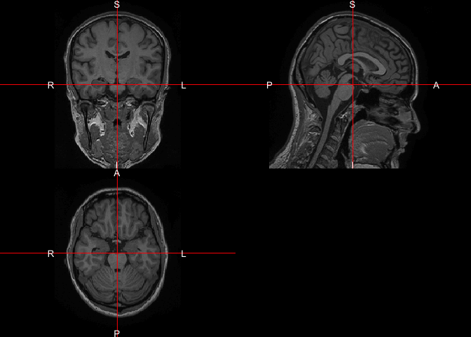
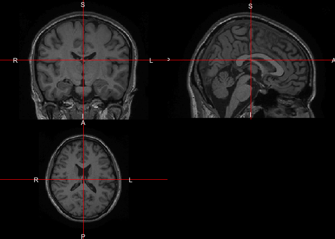
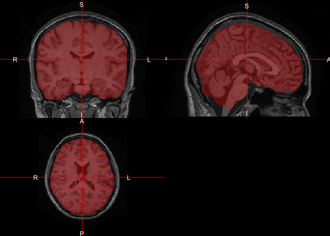
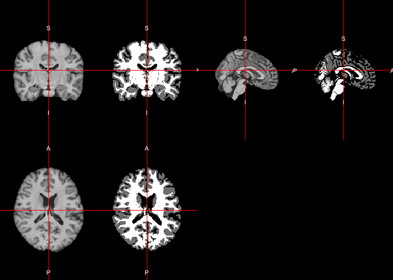

All code for this document is located at [here]().


In this tutorial I will discuss performing tissue class segmentation using the `FAST` function from `FSL` and it's wrapper function in `fslr`, `fast_nobias` [@muschelli2015fslr]. 

# Data Packages
To perform this analysis, I will select one subject from the IXI neuroimaging dataset hosted on [https://nitrc.org/](https://nitrc.org/) [@kennedy2016nitrc]. The `Rxnat` package is required to be installed in order to access the NITRC image repository as well as an account with NITRC: [new account request](https://www.nitrc.org/account/register.php)

```r
packages = installed.packages()
packages = packages[, "Package"]
if (!"Rxnat" %in% packages) {
  source("https://neuroconductor.org/neurocLite.R")
  neuroc_install("Rxnat")    
}
```

# Loading Data
Please visit the [general Rxnat tutorial](../rxnat/index.html) on how to setup the Rxnat environment variables. Next we'll read and reorient the T1 image using the `readrpi` function from the `fslr` package.

```r
library(Rxnat)
nitrc <- xnat_connect("https://nitrc.org/ir", xnat_name="NITRC")
# Download the subject T1 weighted image
file_path <- nitrc$download_dir(
                experiment_ID = 'NITRC_IR_E10464',
                scan_type = "T1",
                extract = TRUE)
t1_fname <- file_path[1]
t1 <- readrpi(t1_fname)
ortho2(t1, add.orient = TRUE)
```



# Remove neck and drop empty dimensions
The neck removal step is implemented using the `remove_neck` function from the `extrantsr` package. The empty image dimensions (including the neck slices) can be dropped by using the function `dropEmptyImageDimensions` from the `neurobase` package.

```r
noneck = remove_neck(file_path,
    template.file = fslr::mni_fname(brain = TRUE, mm = 1),
    template.mask = fslr::mni_fname(mm = 1, brain = TRUE, mask = TRUE),
    verbose = FALSE
)
red = dropEmptyImageDimensions(noneck)
red <- readrpi(red)
ortho2(red, add.orient = TRUE)
```

<!-- -->

# Inhomogeneity correction
To correct the bias field signal we use the `bias_correct` function from the `extrantsr` package, which uses the N4 inhomogeneity correction.

```r
t1_n4 = bias_correct(red,
                     correction = "N4",
                     outfile = tempfile(fileext = ".nii.gz"), retimg = FALSE
)
t1_n4 <- readrpi(t1_n4)
```

# Malf registration
Once images are bias field corrected, we apply brain extraction using a form of multi-atlas label fusion (MALF). MALF uses a collection of previously labeled brain images (atlases), aligns the T1-weighted image to each atlas, and obtains a labeled T1-weighted image for each registration. This approach is implemented using the `malf` function from the `malf.templates` package, which includes the templates from the 2012 MICCAI Multi-Atlas Labeling Challenge.


```r
timgs = mass_images(n_templates = 35)
ss = malf(infile = t1_n4,
          template.images = timgs$images,
          template.structs = timgs$masks,
          keep_images = FALSE,
          verbose = FALSE)
```

# Perform skull stripping
To do this we use the `preprocess_mri_within` function from the `extrantsr` package. This function performs N4 bias correction, image registration (if multi- sequence data is given), skull stripping (estimating the brain mask if one is not supplied), and brain mask application to the registered images.


```r
proc_outfile <- paste0("T1_Processed.nii.gz")
proc_outfile <- file.path(tempdir(),proc_outfile)
skull_ss <- preprocess_mri_within(
  files = t1_n4,
  outfiles = proc_outfile,
  correction = "N4",
  maskfile = ss,
  correct_after_mask = FALSE)
t1_ss <- readrpi(proc_outfile)
ortho2(red,
       t1_ss,
       col.y=alpha("red", 0.3),
       add.orient = TRUE)
```

<!-- -->

# Perform WhiteStripe intensity normalization
WhiteStripe intensity normalization can be implemented using the `whitestripe` and` whitestripe_norm` functions from the `WhiteStripe` package.

```r
ind = whitestripe(img = t1_ss, type = "T1", stripped = TRUE)$whitestripe.ind
```

```
Getting T1 Modes
Quantile T1 VOI
```

```r
ws_t1 = whitestripe_norm(t1_ss, ind)
```

# Perform segmentation
This is implemented here using the FAST function from FSL. FAST segments a 3D brain image into different tissue types. We will use the `fast_nobias` from the `fslr` package, which assumes that the the bias field was removed.

```r
ss_tcs = fslr::fast_nobias(ws_t1,
                  verbose = TRUE)
double_ortho(ws_t1,
             ss_tcs,
             add.orient=TRUE)
```

<!-- -->

# Session Info


```r
devtools::session_info()
```

```
─ Session info ───────────────────────────────────────────────────────────────
 setting  value                       
 version  R version 4.0.0 (2020-04-24)
 os       macOS Catalina 10.15.5      
 system   x86_64, darwin17.0          
 ui       X11                         
 language (EN)                        
 collate  en_US.UTF-8                 
 ctype    en_US.UTF-8                 
 tz       America/New_York            
 date     2020-06-23                  

─ Packages ───────────────────────────────────────────────────────────────────
 package        * version   date       lib
 abind            1.4-5     2016-07-21 [1]
 ANTsR            0.5.6.0.0 2020-05-14 [1]
 ANTsRCore        0.7.4     2020-05-13 [1]
 assertthat       0.2.1     2019-03-21 [2]
 backports        1.1.7     2020-05-13 [2]
 bitops           1.0-6     2013-08-17 [2]
 callr            3.4.3     2020-03-28 [2]
 cli              2.0.2     2020-02-28 [2]
 colorspace       1.4-1     2019-03-18 [1]
 crayon           1.3.4     2017-09-16 [2]
 desc             1.2.0     2018-05-01 [2]
 devtools         2.3.0     2020-04-10 [2]
 digest           0.6.25    2020-02-23 [2]
 dplyr          * 1.0.0     2020-05-29 [1]
 ellipsis         0.3.1     2020-05-15 [2]
 evaluate         0.14      2019-05-28 [2]
 extrantsr      * 3.9.13    2020-05-19 [1]
 fansi            0.4.1     2020-01-08 [2]
 fs               1.4.1     2020-04-04 [2]
 fslr           * 2.24.1    2019-08-05 [1]
 generics         0.0.2     2018-11-29 [1]
 glue             1.4.1     2020-05-13 [2]
 htmltools        0.4.0     2019-10-04 [2]
 httr             1.4.1     2019-08-05 [2]
 ITKR             0.5.3     2020-05-12 [1]
 knitr            1.28      2020-02-06 [1]
 lattice          0.20-41   2020-04-02 [2]
 lifecycle        0.2.0     2020-03-06 [2]
 magrittr         1.5       2014-11-22 [2]
 malf.templates * 1.2.0     2020-04-29 [1]
 Matrix           1.2-18    2019-11-27 [2]
 matrixStats      0.56.0    2020-03-13 [1]
 memoise          1.1.0     2017-04-21 [2]
 mgcv             1.8-31    2019-11-09 [2]
 munsell          0.5.0     2018-06-12 [1]
 neurobase      * 1.29.0    2020-01-14 [1]
 nlme             3.1-147   2020-04-13 [2]
 oro.nifti      * 0.10.1    2020-05-18 [1]
 pillar           1.4.4     2020-05-05 [2]
 pkgbuild         1.0.8     2020-05-07 [2]
 pkgconfig        2.0.3     2019-09-22 [2]
 pkgload          1.0.2     2018-10-29 [2]
 plyr             1.8.6     2020-03-03 [1]
 prettyunits      1.1.1     2020-01-24 [2]
 processx         3.4.2     2020-02-09 [2]
 ps               1.3.3     2020-05-08 [2]
 purrr            0.3.4     2020-04-17 [2]
 R.matlab         3.6.2     2018-09-27 [1]
 R.methodsS3      1.8.0     2020-02-14 [1]
 R.oo             1.23.0    2019-11-03 [1]
 R.utils          2.9.2     2019-12-08 [1]
 R6               2.4.1     2019-11-12 [2]
 Rcpp             1.0.4.6   2020-04-09 [2]
 RcppEigen        0.3.3.7.0 2019-11-16 [1]
 RCurl            1.98-1.2  2020-04-18 [2]
 remotes          2.1.1     2020-02-15 [2]
 rlang            0.4.6     2020-05-02 [2]
 rmarkdown        2.1       2020-01-20 [1]
 RNifti           1.1.0     2020-01-31 [1]
 rprojroot        1.3-2     2018-01-03 [2]
 Rxnat          * 1.0.9     2020-06-04 [1]
 scales         * 1.1.1     2020-05-11 [1]
 sessioninfo      1.1.1     2018-11-05 [2]
 stapler          0.7.1     2020-01-09 [1]
 stringi          1.4.6     2020-02-17 [2]
 stringr          1.4.0     2019-02-10 [1]
 testthat         2.3.2     2020-03-02 [1]
 tibble           3.0.1     2020-04-20 [1]
 tidyselect       1.1.0     2020-05-11 [2]
 usethis          1.6.1     2020-04-29 [2]
 vctrs            0.3.0     2020-05-11 [2]
 WhiteStripe    * 2.3.2     2020-05-01 [1]
 withr            2.2.0     2020-04-20 [2]
 xfun             0.13      2020-04-13 [2]
 yaml             2.2.1     2020-02-01 [2]
 source                                 
 CRAN (R 4.0.0)                         
 Neuroconductor-Devel-Releases (R 4.0.0)
 Neuroconductor-Devel-Releases (R 4.0.0)
 CRAN (R 4.0.0)                         
 CRAN (R 4.0.0)                         
 CRAN (R 4.0.0)                         
 CRAN (R 4.0.0)                         
 CRAN (R 4.0.0)                         
 CRAN (R 4.0.0)                         
 CRAN (R 4.0.0)                         
 CRAN (R 4.0.0)                         
 CRAN (R 4.0.0)                         
 CRAN (R 4.0.0)                         
 CRAN (R 4.0.0)                         
 CRAN (R 4.0.0)                         
 CRAN (R 4.0.0)                         
 Neuroconductor-Devel-Releases (R 4.0.0)
 CRAN (R 4.0.0)                         
 CRAN (R 4.0.0)                         
 CRAN (R 4.0.0)                         
 CRAN (R 4.0.0)                         
 CRAN (R 4.0.0)                         
 CRAN (R 4.0.0)                         
 CRAN (R 4.0.0)                         
 Neuroconductor-Devel-Releases (R 4.0.0)
 CRAN (R 4.0.0)                         
 CRAN (R 4.0.0)                         
 CRAN (R 4.0.0)                         
 CRAN (R 4.0.0)                         
 Neuroconductor-Devel-Releases (R 4.0.0)
 CRAN (R 4.0.0)                         
 CRAN (R 4.0.0)                         
 CRAN (R 4.0.0)                         
 CRAN (R 4.0.0)                         
 CRAN (R 4.0.0)                         
 CRAN (R 4.0.0)                         
 CRAN (R 4.0.0)                         
 Neuroconductor-Releases (R 4.0.0)      
 CRAN (R 4.0.0)                         
 CRAN (R 4.0.0)                         
 CRAN (R 4.0.0)                         
 CRAN (R 4.0.0)                         
 CRAN (R 4.0.0)                         
 CRAN (R 4.0.0)                         
 CRAN (R 4.0.0)                         
 CRAN (R 4.0.0)                         
 CRAN (R 4.0.0)                         
 CRAN (R 4.0.0)                         
 CRAN (R 4.0.0)                         
 CRAN (R 4.0.0)                         
 CRAN (R 4.0.0)                         
 CRAN (R 4.0.0)                         
 CRAN (R 4.0.0)                         
 CRAN (R 4.0.0)                         
 CRAN (R 4.0.0)                         
 CRAN (R 4.0.0)                         
 CRAN (R 4.0.0)                         
 CRAN (R 4.0.0)                         
 CRAN (R 4.0.0)                         
 CRAN (R 4.0.0)                         
 Github (adigherman/Rxnat@a3c0522)      
 CRAN (R 4.0.0)                         
 CRAN (R 4.0.0)                         
 CRAN (R 4.0.0)                         
 CRAN (R 4.0.0)                         
 CRAN (R 4.0.0)                         
 CRAN (R 4.0.0)                         
 CRAN (R 4.0.0)                         
 CRAN (R 4.0.0)                         
 CRAN (R 4.0.0)                         
 CRAN (R 4.0.0)                         
 Neuroconductor-Devel-Releases (R 4.0.0)
 CRAN (R 4.0.0)                         
 CRAN (R 4.0.0)                         
 CRAN (R 4.0.0)                         

[1] /Users/adi/Library/R/4.0/library
[2] /Library/Frameworks/R.framework/Versions/4.0/Resources/library
```

# References
