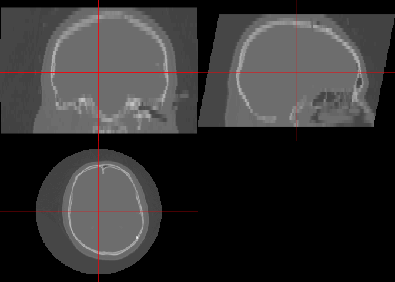
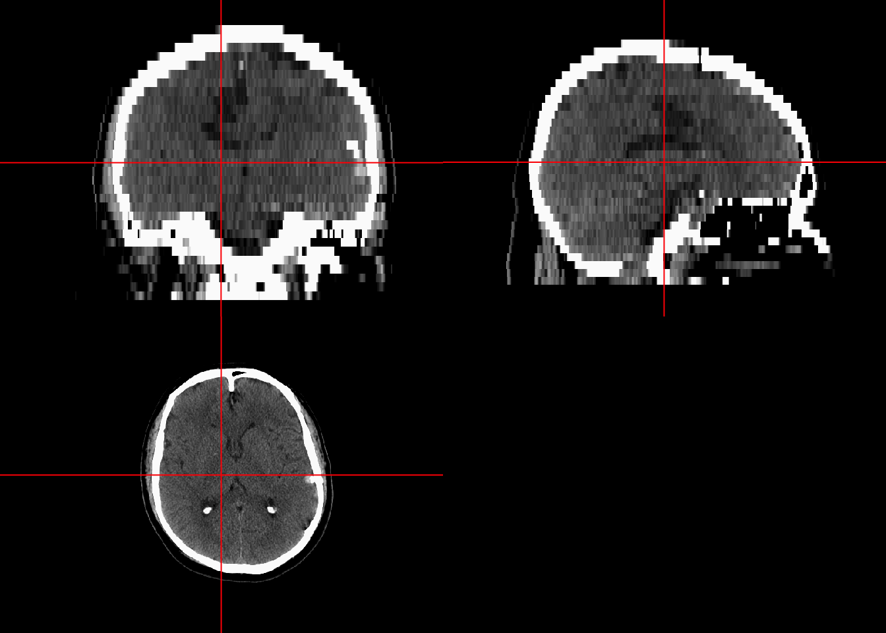
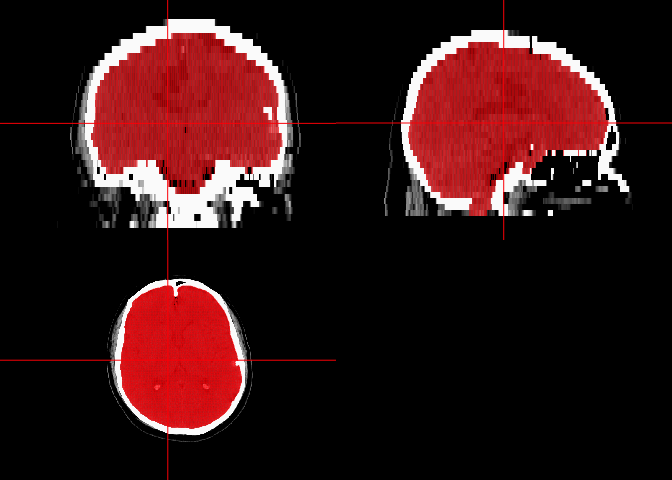
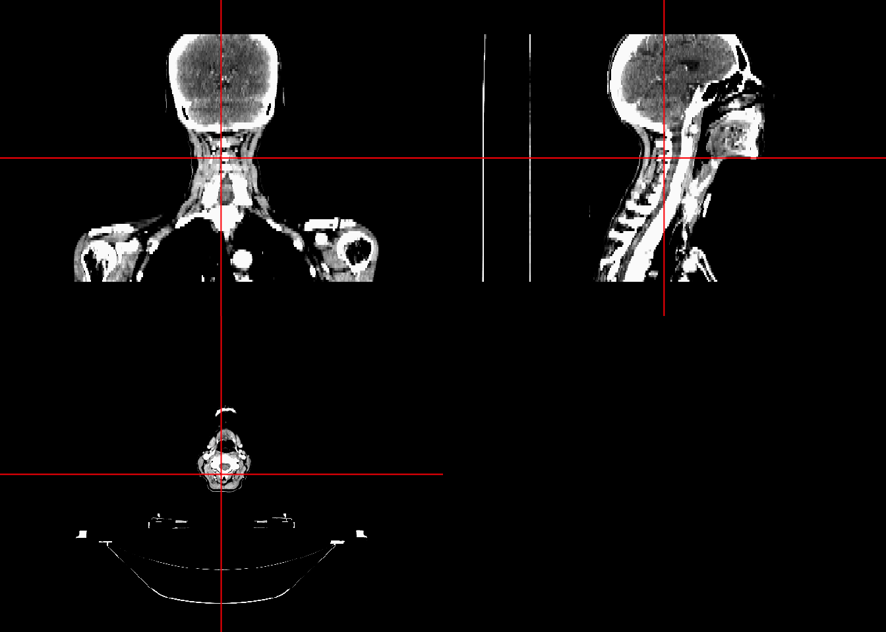
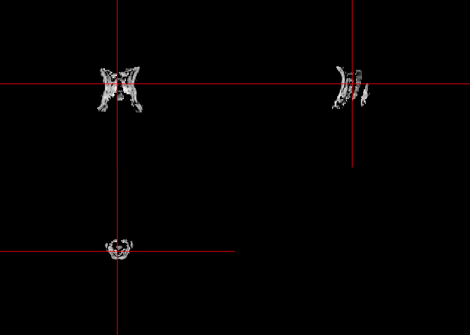
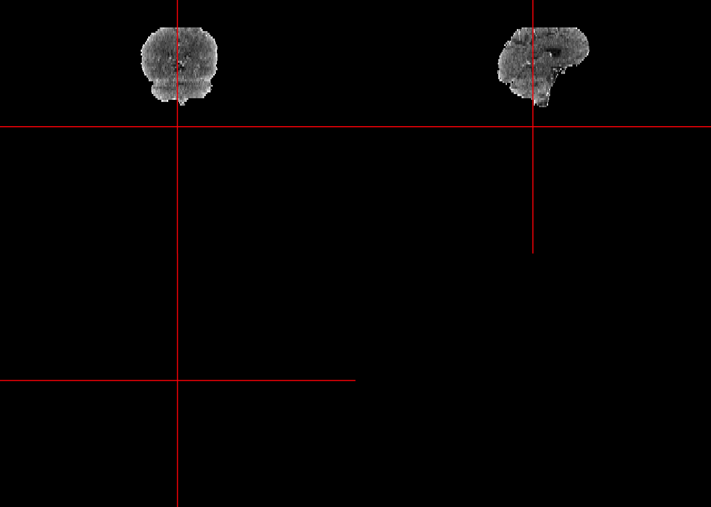

All code for this document is located at [here](https://raw.githubusercontent.com/muschellij2/neuroc/master/ss_ct/index.R).


# Goal
In this tutorial, we will discuss skull-stripping (or brain-extracting) X-ray computed tomography (CT) scans.  We will use data from TCIA (http://www.cancerimagingarchive.net/) as there is a great package called [`TCIApathfinder`](https://CRAN.R-project.org/package=TCIApathfinder) to interface with TCIA.

## Using TCIApathfinder

In order to use `TCIApathfinder`, please see the [vignette to obtain API keys](https://cran.r-project.org/web/packages/TCIApathfinder/vignettes/introduction.html).  Here we will look at the collections:


```r
library(TCIApathfinder)
library(dplyr)
collections = get_collection_names()
collections = collections$collection_names
head(collections)
```

```
[1] "4D-Lung"             "AAPM-RT-MAC"         "ACRIN-DSC-MR-Brain" 
[4] "ACRIN-FLT-Breast"    "ACRIN-FMISO-Brain"   "ACRIN-NSCLC-FDG-PET"
```

```r
mods = get_modality_names(body_part = "BREAST")
head(mods$modalities)
```

```
[1] "CR" "CT" "MG" "MR" "OT" "PT"
```

## Getting Body Part Information
Here we can see all the parts of the body examined.


```r
bp = get_body_part_names()
bp$body_parts
```

```
 [1] "ABD"             "ABD PEL"         "ABD PELV"        "ABDOMEN"        
 [5] "ABDOMEN_PELVIS " "ABDOMENPELVIS"   "AP PORTABLE CHE" "BD CT ABD WO_W "
 [9] "BLADDER"         "BRAIN"           "BRAIN W/WO_AH32" "BREAST"         
[13] "CAP"             "CAROTID"         "CERVIX"          "CHEST"          
[17] "CHEST (THORAX) " "CHEST COMPUTED " "CHEST NO GRID"   "CHEST_ABDOMEN"  
[21] "CHEST_TO_PELVIS" "CHEST/ABD"       "CHESTABDOMEN"    "CHESTABDPELVIS" 
[25] "COLON"           "CT 3PHASE REN"   "CT CHEST W_ENHA" "CT CHEST WO CE" 
[29] "CT THORAX W CNT" "CTA CHEST"       "ESOPHAGUS"       "EXTREMITY"      
[33] "FUSION"          "HEAD"            "Head-and-Neck"   "Head-Neck"      
[37] "HEADANDNECK"     "HEADNECK"        "HEART"           "J brzuszna"     
[41] "J BRZUSZNA"      "Kidney"          "KIDNEY"          "LEG"            
[45] "LIVER"           "LUMBO-SACRAL SP" "LUNG"            "MEDIASTINUM"    
[49] "NECK"            "OUTSIDE FIL"     "OVARY"           "PANCREAS"       
[53] "Pelvis"          "PELVIS"          "PET_ABDOMEN_PEL" "PET_CT SCAN CHE"
[57] "Phantom"         "PHANTOM"         "PORT CHEST"      "PROSTATE"       
[61] "RECTUM"          "SEG"             "SELLA"           "SKULL"          
[65] "SPI CHEST 5MM"   "STOMACH"         "TH CT CHEST WO " "Thorax"         
[69] "THORAX"          "THORAX CT _AH05" "THORAX CT _OT01" "THORAX_1HEAD_NE"
[73] "THORAXABD"       "THYROID"         "TSPINE"          "UNDEFINED"      
[77] "UTERUS"          "WHOLEBODY"       "WO INTER"       
```

Particularly, these areas are of interest.  There seems to be a "bug" in `TCIApathfinder::get_series_info` which is acknowledged in the help file.  Namely, the `body_part_examined` is not always a parameter to be set.  We could get all the series info for all the collections from the code below, but it takes some times (> 15 minutes):

```r
# could look for any of these
get_bp = c("BRAIN", "HEAD", "HEADNECK")

# takes a long time
res = pbapply::pblapply(collections, function(collection) {
  x = get_series_info(
    collection = collection, 
    modality = "CT")
  x$series
})
```

## Getting Series

Here we will gather the series information for a study we know to have head CT data:


```r
collection = "CPTAC-GBM"
series = get_series_info(
  collection = collection, 
  modality = "CT")
series = series$series
head(series)
```

```
  patient_id collection
1         NA  CPTAC-GBM
2         NA  CPTAC-GBM
3         NA  CPTAC-GBM
4         NA  CPTAC-GBM
5         NA  CPTAC-GBM
6         NA  CPTAC-GBM
                                                study_instance_uid
1 1.3.6.1.4.1.14519.5.2.1.2857.3707.221249410799063035815783816913
2 1.3.6.1.4.1.14519.5.2.1.2857.3707.221249410799063035815783816913
3 1.3.6.1.4.1.14519.5.2.1.2857.3707.221249410799063035815783816913
4 1.3.6.1.4.1.14519.5.2.1.2857.3707.170705714007862724678123629040
5 1.3.6.1.4.1.14519.5.2.1.2857.3707.170705714007862724678123629040
6 1.3.6.1.4.1.14519.5.2.1.2857.3707.170705714007862724678123629040
                                               series_instance_uid modality
1 1.3.6.1.4.1.14519.5.2.1.2857.3707.100565015879506080275493644685       CT
2 1.3.6.1.4.1.14519.5.2.1.2857.3707.176470763322052742670285487681       CT
3 1.3.6.1.4.1.14519.5.2.1.2857.3707.272098545527401893663335969793       CT
4 1.3.6.1.4.1.14519.5.2.1.2857.3707.254723691164851053423448594844       CT
5 1.3.6.1.4.1.14519.5.2.1.2857.3707.531177247834252562951224965872       CT
6 1.3.6.1.4.1.14519.5.2.1.2857.3707.225513954801691101397384975174       CT
                            protocol_name series_date series_description
1         1.6 CTA HEAD WITH WAND PROTOCOL  2001-01-15     SAG 10 X 2 MIP
2         1.6 CTA HEAD WITH WAND PROTOCOL  2001-01-15      AX 10 X 2 MIP
3         1.6 CTA HEAD WITH WAND PROTOCOL  2001-01-15      COR10 X 2 MIP
4 1.8 CTV HEAD Auto Transfer 75mL Iso 300  2001-01-23            CTV COR
5 1.8 CTV HEAD Auto Transfer 75mL Iso 300  2001-01-23            CTV SAG
6 1.8 CTV HEAD Auto Transfer 75mL Iso 300  2001-01-23          CTV AXIAL
  body_part_examined series_number annotations_flag       manufacturer
1               <NA>    603.000000               NA GE MEDICAL SYSTEMS
2               <NA>    601.000000               NA GE MEDICAL SYSTEMS
3               <NA>    602.000000               NA GE MEDICAL SYSTEMS
4               <NA>    602.000000               NA GE MEDICAL SYSTEMS
5               <NA>    603.000000               NA GE MEDICAL SYSTEMS
6               <NA>    601.000000               NA GE MEDICAL SYSTEMS
  manufacturer_model_name software_versions image_count
1          LightSpeed VCT              <NA>          93
2          LightSpeed VCT              <NA>         124
3          LightSpeed VCT              <NA>         101
4          LightSpeed VCT              <NA>         107
5          LightSpeed VCT              <NA>          89
6          LightSpeed VCT              <NA>          53
```

Here we grab the first series ID from this data which has a description of "HEAD STD" for standard head:


```r
std_head = series %>% 
  filter(grepl("HEAD STD", series_description))
series_instance_uid = std_head$series_instance_uid[1]

download_unzip_series = function(series_instance_uid,
                                 verbose = TRUE) {
  tdir = tempfile()
  dir.create(tdir, recursive = TRUE)
  tfile = tempfile(fileext = ".zip")
  tfile = basename(tfile)
  if (verbose) {
    message("Downloading Series")
  }
  res = save_image_series(
    series_instance_uid = series_instance_uid, 
    out_dir = tdir, 
    out_file_name = tfile)
  if (verbose) {
    message("Unzipping Series")
  }  
  stopifnot(file.exists(res$out_file))
  tdir = tempfile()
  dir.create(tdir, recursive = TRUE)
  res = unzip(zipfile = res$out_file, exdir = tdir)
  L = list(files = res,
           dirs = unique(dirname(normalizePath(res))))
  return(L)
}
# Download and unzip the image series

file_list = download_unzip_series(
  series_instance_uid = series_instance_uid)
```

```
Downloading Series
```

```
Unzipping Series
```

## Converting DICOM to NIfTI

We will use [`dcm2niix`](https://github.com/rordenlab/dcm2niix) to convert from DICOM to NIfTI.  The function `dcm2niix` is wrapped in `dcm2niir`.  We will use `dcm2niir::dcm2nii` to convert the file.  We use `check_dcm2nii` to grab the relevant output files:
 

```r
library(dcm2niir)
dcm_result = dcm2nii(file_list$dirs)
```

```
#Copying Files
```

```
# Converting to nii 
```

```
'/Library/Frameworks/R.framework/Versions/4.0/Resources/library/dcm2niir/dcm2niix' -9  -v 1 -z y -f %p_%t_%s '/var/folders/1s/wrtqcpxn685_zk570bnx9_rr0000gr/T/Rtmpq5zQ7W/file586955006f99'
```

```r
result = check_dcm2nii(dcm_result)
```

Here we read the data into `R` into a `nifti` object:

```r
library(neurobase)
img = readnii(result)
ortho2(img)
```

<!-- -->

```r
range(img)
```

```
[1] -3024  3071
```

Here we will use `neurobase::rescale_img` to make sure the minimum is $-1024$ and the maximum is $3071$.  The minimum can be lower for areas outside the field of view (FOV).  Here we plot the image and the Winsorized version to see the brain tissue:


```r
img = rescale_img(img, min.val = -1024, max.val = 3071)
ortho2(img)
```

<!-- -->

```r
ortho2(img, window = c(0, 100))
```

<!-- -->

## Skull Strip

We can skull strip the image using `CT_Skull_Strip` or `CT_Skull_Stripper`.  The `CT_Skull_Stripper` has a simple switch to use `CT_Skull_Strip` or `CT_Skull_Strip_robust`.  

```r
library(ichseg)
ss = CT_Skull_Strip(img, verbose = FALSE)
ortho2(img, ss > 0, 
       window = c(0, 100),
       col.y = scales::alpha("red", 0.5))
```

<!-- -->

The `CT_Skull_Strip_robust` function does 2 neck removals using `remove_neck` from `extrantsr` and then find the center of gravity (COG) twice to make sure the segmentation focuses on the head.  In some instances, the whole neck is included in the scan, such as some of the head-neck studies in TCIA.


# Showing a Robust Example with the neck

## Getting Series

Here we will gather the series information for the `Head-Neck Cetuximab` collection:


```r
collection = "Head-Neck Cetuximab"
series = get_series_info(
  collection = collection, 
  modality = "CT")
series = series$series
whole_body = series %>% 
  filter(grepl("WB", series_description))
```


```r
file_list = download_unzip_series(
  series_instance_uid = series$series_instance_uid[1])
```

```
Downloading Series
```

```
Unzipping Series
```


```r
dcm_result = dcm2nii(file_list$dirs, merge_files = TRUE)
```

```
#Copying Files
```

```
# Converting to nii 
```

```
'/Library/Frameworks/R.framework/Versions/4.0/Resources/library/dcm2niir/dcm2niix' -9  -m y  -v 1 -z y -f %p_%t_%s '/var/folders/1s/wrtqcpxn685_zk570bnx9_rr0000gr/T/Rtmpq5zQ7W/file58693e41bd33'
```

```r
result = check_dcm2nii(dcm_result)
```

Here we see the original data has a lot of the neck and some of the shoulders in the scan:

```r
img = readnii(result)
img = rescale_img(img, min.val = -1024, max.val = 3071)
ortho2(img, window = c(0, 100))
```

<!-- -->

We will try `CT_Skull_Strip` without adding any robust options:

```r
ss_wb = CT_Skull_Strip(img, verbose = FALSE)
ortho2(ss_wb, window = c(0, 100))
```

<!-- -->

We see that this does not work very well.  We will use the robust version.  Here we use `CT_Skull_Stripper`, which will call `CT_Skull_Strip_robust`.  This will run `extrantsr::remove_neck`, runs `CT_Skull_Strip`, then estimates a new center of gravity (COG) and then run `CT_Skull_Strip` again, and then run some hole filling:


```r
ss_wb_robust = CT_Skull_Stripper(img, verbose = FALSE, robust = TRUE)
```

```
Warning: 'rpi_orient_file' is deprecated.
Use 'rpi_orient_file is going to be deprecated in the coming releases of fslr, and things this relies on,  including readrpi and rpi_orient.  Please use orient_rpi_file, orient_rpi, and read_rpi in the future.' instead.
See help("Deprecated")
```

```r
ortho2(ss_wb_robust, window = c(0, 100))
```

<!-- -->

We see that this robust version works well for even data with the neck.  We can try it on a whole body image as well.  

# The website data
We could also look at the website, but these do not always correspond to the API and get all the necessary results.


```r
library(rvest)
library(dplyr)
x = read_html("https://www.cancerimagingarchive.net/collections/")
tab = html_table(x)[[1]]
head_tab = tab %>% 
  filter(grepl("Head|Brain", Location),
         grepl("CT", `Image Types`), 
         Access == "Public")
brain_tab = tab %>% 
  filter(grepl("Brain", Location),
         grepl("CT", `Image Types`), 
         Access == "Public")
brain_tab
```

```
                                 Collection             Cancer Type Location
1 ACRIN-DSC-MR-Brain (ACRIN 6677/RTOG 0625) Glioblastoma Multiforme    Brain
2                                 CPTAC-GBM Glioblastoma Multiforme    Brain
3            ACRIN-FMISO-Brain (ACRIN 6684)            Glioblastoma    Brain
4                                    IvyGAP            Glioblastoma    Brain
5                                  TCGA-LGG        Low Grade Glioma    Brain
6                                  TCGA-GBM Glioblastoma Multiforme    Brain
  Species Subjects               Image Types                    Supporting Data
1   Human      123                    MR, CT                           Clinical
2   Human      189 CT, CR, SC, MR, Pathology     Clinical, Genomics, Proteomics
3   Human       45                CT, MR, PT                           Clinical
4   Human       39         MR, CT, Pathology                 Clinical, Genomics
5   Human      199         MR, CT, Pathology Clinical, Genomics, Image Analyses
6   Human      262     MR, CT, DX, Pathology Clinical, Genomics, Image Analyses
  Access   Status    Updated
1 Public Complete 2020-09-09
2 Public  Ongoing 2020-03-31
3 Public Complete 2019-09-16
4 Public Complete 2016-12-30
5 Public Complete 2014-09-04
6 Public Complete 2014-05-08
```

In `brain_tab`, we see we have a few collections.  We are going to use the collection Head-Neck Cetuximab from above.

## Getting Patient Information

We could sample patients from the collection here and get the patient information:


```r
set.seed(20181203)

patients = get_patient_info(collection = collection)
info = patients$patients
head(info)
```

```
  patient_id patient_name patient_dob patient_sex patient_ethnic_group
1  0522c0001    0522c0001          NA           F                   NA
2  0522c0002    0522c0002          NA           M                   NA
3  0522c0003    0522c0003          NA           M                   NA
4  0522c0009    0522c0009          NA           M                   NA
5  0522c0013    0522c0013          NA           M                   NA
6  0522c0070    0522c0070          NA           M                   NA
           collection
1 Head-Neck Cetuximab
2 Head-Neck Cetuximab
3 Head-Neck Cetuximab
4 Head-Neck Cetuximab
5 Head-Neck Cetuximab
6 Head-Neck Cetuximab
```

Though we are not guaranteed the data will have Brain CT data.  We will use the `series` variable to grab a relevant scan.

