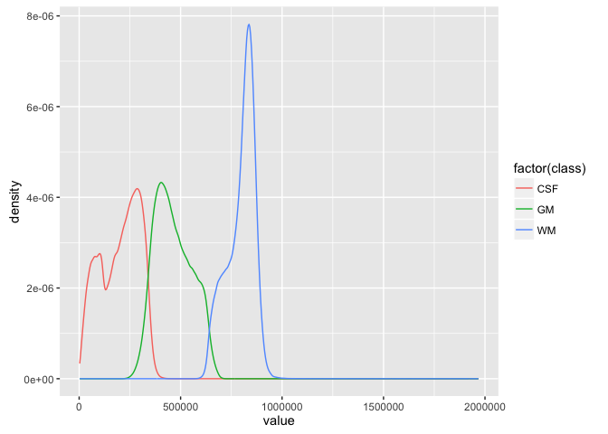
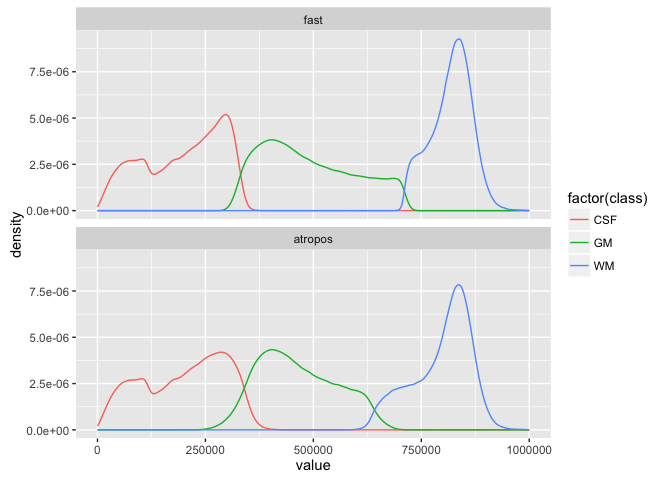
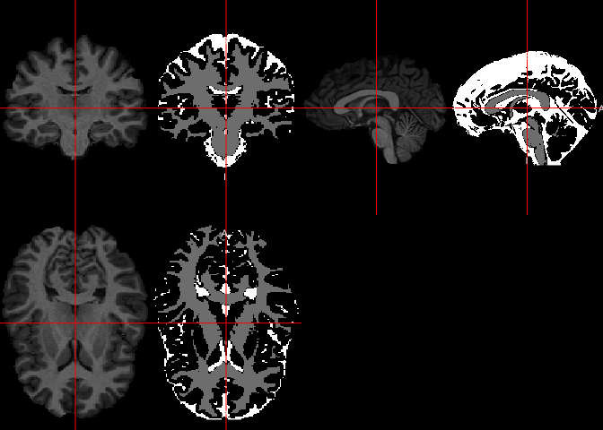
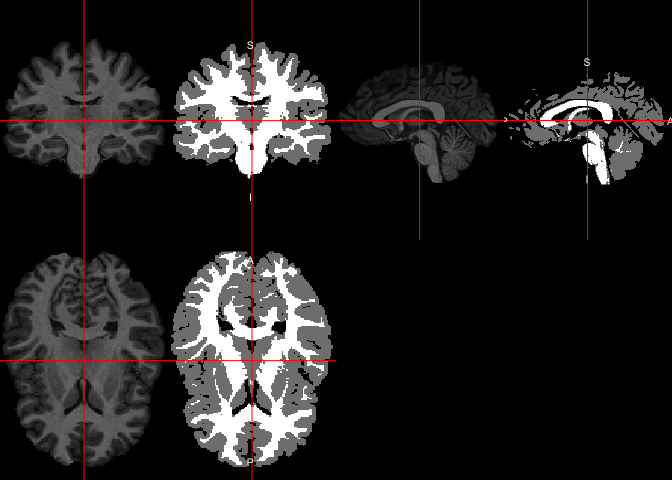
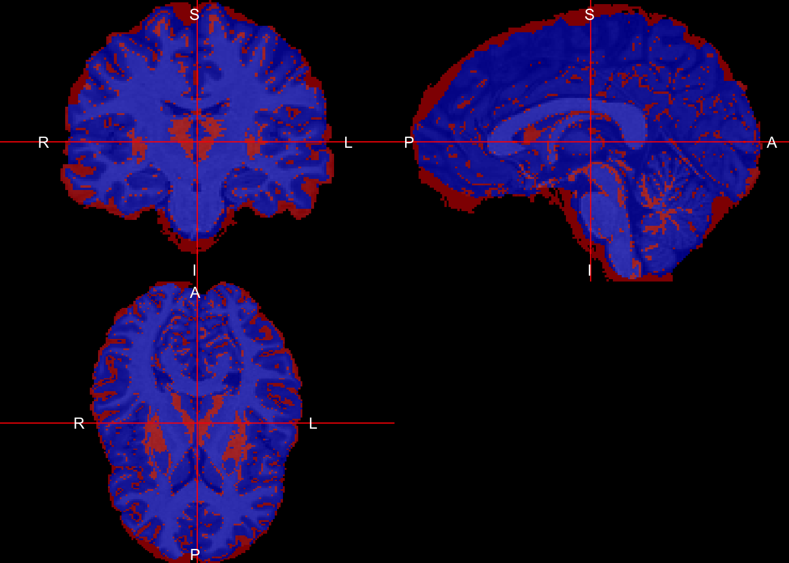
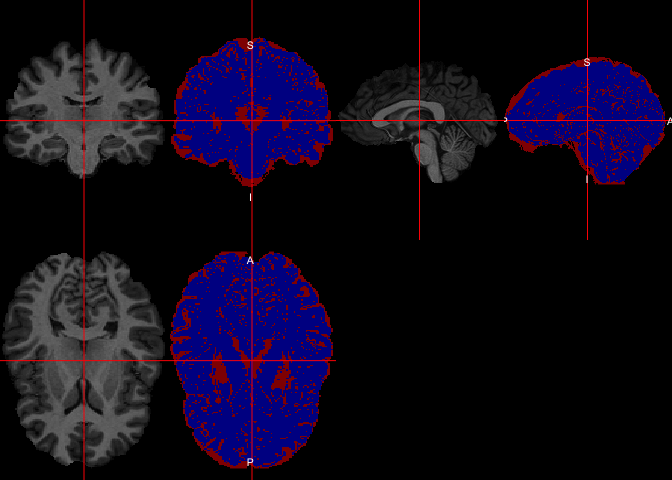
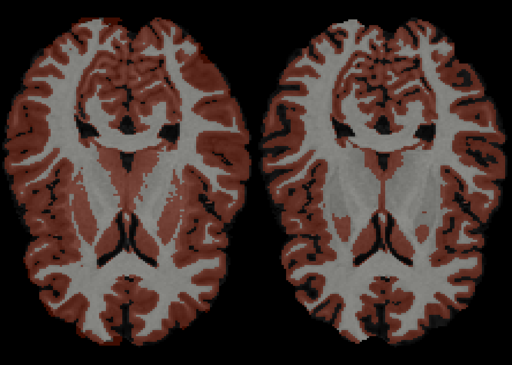
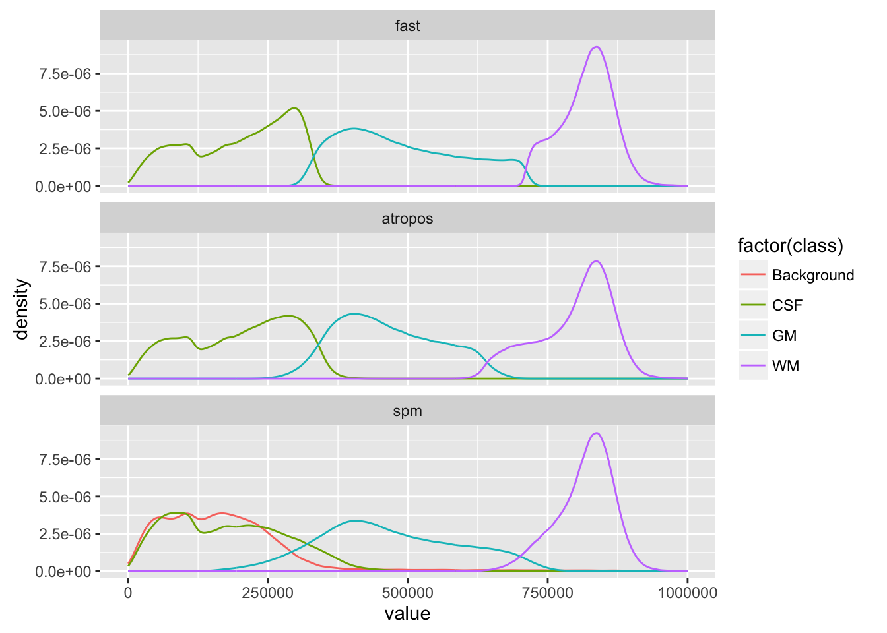

---
output:
  html_document: {}
bibliography: ../refs.bib
---

All code for this document is located at [here](https://raw.githubusercontent.com/muschellij2/neuroc/master/tissue_class_segmentation/index.R).


In this tutorial we will discuss performing tissue class segmentation using `atropos` in `ANTsR` and it's wrapper function in `extrantsr`, `otropos`. 

# Data Packages

For this analysis, I will use one subject from the Kirby 21 data set.  The `kirby21.base` and `kirby21.fmri` packages are necessary for this analysis and have the data we will be working on.  You need devtools to install these.  Please refer to [installing devtools](neuroc-help-installing-devtools) for additional instructions or troubleshooting.


```r
packages = installed.packages()
packages = packages[, "Package"]
if (!"kirby21.base" %in% packages) {
  devtools::install_github("muschellij2/kirby21.base")
}
if (!"kirby21.fmri" %in% packages) {
  devtools::install_github("muschellij2/kirby21.fmri")
}
```

# Loading Data

We will use the `get_image_filenames_df` function to extract the filenames on our hard disk for the T1 image and the fMRI images (4D).  


```r
library(kirby21.t1)
library(kirby21.base)
fnames = get_image_filenames_df(ids = 113, 
                    modalities = c("T1"), 
                    visits = c(1),
                    long = FALSE)
t1_fname = fnames$T1[1]
```

# Using information from the T1 image

## Brain extracted image

Please visit the [brain extraction tutorial](neuroc-help-brain-extraction) on how to extract a brain from this image.  We will use the output from `fslbet_robust` from that tutorial.  


```r
outfile = nii.stub(t1_fname, bn = TRUE)
outfile = file.path("..", "brain_extraction", outfile)
outfile = paste0(outfile, "_SS.nii.gz")
ss = readnii(outfile)
ss_red = dropEmptyImageDimensions(ss)
ortho2(ss_red)
```

<!-- -->

Again, we can see the zoomed-in view of the image now.

## Tissue-Class Segmentation with Atropos


```r
outfile = nii.stub(t1_fname, bn = TRUE)
prob_files = paste0(outfile,
                    "_prob_", 1:3,
                    ".nii.gz")
seg_outfile = paste0(outfile, "_Seg.nii.gz")

if (!all(file.exists(
  c(seg_outfile, prob_files)
  ))) {
  seg = extrantsr::otropos(
    ss_red, 
    x = ss_red > 0,
    v = 1)
  hard_seg = seg$segmentation
  writenii(hard_seg, seg_outfile)
  for (i in seq_along(seg$probabilityimages)) {
    writenii(seg$probabilityimages[[i]], prob_files[i]) 
  }
  # writenii(seg, )
} else {
  hard_seg = readnii(seg_outfile)
  seg = vector(mode = "list", length = 2)
  names(seg) = c("segmentation", "probabilityimages")
  seg$segmentation = hard_seg
  seg$probabilityimages = vector(mode = "list", length = 3)
  for (i in 1:3) {
    seg$probabilityimages[[i]] = readnii(prob_files[i]) 
  }  
}
```

### Atropos results 

Now we have a hard segmentation, which assigns a class with the maximum probability to that voxel.  We also have a separate probability image for each tissue class.


```r
double_ortho(ss_red, hard_seg)
```

<!-- -->

We see that much of the structures have been segmented well, but there may be errors.

### Atropos intensity histograms 

We can also look at the distribution of intensities (marginally) for each tissue class.  In `atropos`, the classes are ordered by mean intensity, so we can re-assign them to the corresponding tissue class

```r
df = data.frame(value = ss_red[ss_red > 0],
                class = hard_seg[ss_red > 0])
df$class = c("CSF", "GM", "WM")[df$class]
ggplot(df, aes(x = value, colour = factor(class))) + geom_line(stat = "density")
```

<!-- -->

```r
rm(list = "df")
```


## Tissue-Class Segmentation with FAST


```r
library(fslr)
outfile = nii.stub(t1_fname, bn = TRUE)
outfile = paste0(outfile, "_FAST")
prob_files = paste0(outfile,
                    "_pve_", 0:2,
                    ".nii.gz")
seg_outfile = paste0(outfile, "_Seg.nii.gz")

if (!all(file.exists(
  c(seg_outfile, prob_files)
  ))) {
  fast_hard_seg = fast(file = ss_red, 
                   outfile = outfile, 
                   out_type = "seg",
                   opts = "--nobias")
  writenii(fast_hard_seg, seg_outfile)
} else {
  fast_hard_seg = readnii(seg_outfile)
}
fast_seg = vector(mode = "list", length = 3)
for (i in 1:3) {
  fast_seg[[i]] = readnii(prob_files[i]) 
}  
```

### FAST results 
Let's see the results of the FAST segmentation:


```r
double_ortho(ss_red, hard_seg)
```

<!-- -->

### FAST intensity histograms 

Again, we can look at the distribution of values, ad now we can compare distributions of the values from FAST to that of atropos.


```r
df = data.frame(value = ss_red[ss_red > 0],
                fast = fast_hard_seg[ss_red > 0],
                atropos = hard_seg[ss_red > 0],
                ind = which(ss_red > 0)
                )
df = reshape2::melt(df, id.vars = c("ind", "value"), 
                    measure.vars = c("fast", "atropos"),
                    value.name = "class",
                    variable.name = "segmentation")
df = df %>% arrange(ind)
```

```
Warning: failed to assign NativeSymbolInfo for env since env is already
defined in the 'lazyeval' namespace
```

```r
df$ind = NULL

df$class = c("CSF", "GM", "WM")[df$class]
ggplot(df, aes(x = value, colour = factor(class))) + 
  geom_line(stat = "density") + 
  xlim(c(0, 1e6)) +
  facet_wrap(~ segmentation, ncol = 1)
```

```
Warning: Removed 596 rows containing non-finite values (stat_density).
```

<!-- -->

```r
rm(list = "df")
```


## Tissue-Class Segmentation with SPM

In the [brain extraction tutorial](neuroc-help-brain-extraction) we discuss the SPM segmenation procedures and show how to use them to produce hard segmentations, probability maps, and a brain extracted image.  We will use the results of that tutorial to compare to that of `atropos`.  We will exclude any tissues outside of GM, WM, and CSF (those > 3).


```r
outfile = nii.stub(t1_fname, bn = TRUE)
outfile = file.path("..", "brain_extraction", outfile)
outfile = paste0(outfile, "_SPM_Seg.nii.gz")
spm_hard_seg = readnii(outfile)
spm_hard_seg[ spm_hard_seg > 3] = 0
dd = dropEmptyImageDimensions(
  ss,
  other.imgs = spm_hard_seg)
spm_hard_seg_red = dd$other.imgs
```


### SPM results


```r
double_ortho(ss_red, spm_hard_seg_red)
```

<!-- -->

Remember however, in the SPM segmentation, 1 is GM, 2 is WM, 3 is CSF, and in Atropos/FAST, 1 is CSF, 2 is GM, 3 is WM, .


```r
spm_recode = niftiarr(spm_hard_seg_red, 0)
spm_recode[ spm_hard_seg_red %in% 1 ] = 2
spm_recode[ spm_hard_seg_red %in% 2 ] = 3
spm_recode[ spm_hard_seg_red %in% 3 ] = 1
```


```r
double_ortho(ss_red, spm_recode)
```

<!-- -->


```r
df = data.frame(spm = spm_recode[spm_recode > 0 | hard_seg > 0],
                atropos = hard_seg[spm_recode > 0 | hard_seg > 0],
                value = ss_red[spm_recode > 0 | hard_seg > 0])
df$spm = c("Background", "CSF", "GM", "WM")[df$spm + 1]
df$atropos = c("Background", "CSF", "GM", "WM")[df$atropos + 1]
df$spm = factor(df$spm, levels = c("Background", "CSF", "GM", "WM"))
df$atropos = factor(df$atropos, levels = c("Background", "CSF", "GM", "WM"))
tab = with(df, table(spm, atropos))
print(tab)
```

```
            atropos
spm          Background    CSF     GM     WM
  Background          0  27972   1053    756
  CSF             50255 102999   7146      0
  GM              23839  66622 450565  60141
  WM                455      0    946 339557
```

We can also compare the 2 segmentations.  Here, if we assume the SPM segmentation as the "gold standard" and the Atropos one as another "prediction", we can look at the differences.  Anywhere they both agree (both are a 1) it will be deemed a true positive and will be in green.  Anywhere the Atropos segmentation includes a voxel but the SPM segmentation did not, it will deemed a false positive and will be in blue, vice versa in red will be a false negative.


```r
compare = spm_recode == hard_seg
compare[ (spm_recode > 0 | hard_seg > 0) & !compare ] = 2
compare[ spm_recode == 0 & hard_seg == 0  ] = 0
```


```r
ortho2(ss_red, compare, col.y = alpha(c("blue", "red"), 0.5))
```

<!-- -->

```r
double_ortho(ss_red, compare, col.y = alpha(c("blue", "red"), 0.5))
```

<!-- -->


```r
x = list(ss_red,
             ss_red)
y = list(spm = spm_recode,
         atropos = hard_seg)
z = floor(nsli(ss_red)/2)
multi_overlay(x, y, z = z, col.y = alpha(hotmetal(), 0.25))
```

<!-- -->

### SPM intensity histograms 

Although there may be places in the brain where SPM calls a class CSF, WM, or GM where the brain mask is zero, we will exclude these in the comparison to fast and atropos for a common comparison.  We will make sure that if voxels within the brain mask are labeled as zero in the SPM segmentation, we will denote these as `Background`.


```r
df = data.frame(value = ss_red[ss_red > 0],
                fast = fast_hard_seg[ss_red > 0],
                atropos = hard_seg[ss_red > 0],
                spm = spm_recode[ss_red > 0],
                ind = which(ss_red > 0)
                )
df = reshape2::melt(df, id.vars = c("ind", "value"), 
                    measure.vars = c("fast", "atropos", "spm"),
                    value.name = "class",
                    variable.name = "segmentation")
df = df %>% arrange(ind)
df$ind = NULL

df$class = c("Background", "CSF", "GM", "WM")[df$class + 1]
ggplot(df, aes(x = value, colour = factor(class))) + 
  geom_line(stat = "density") + 
  xlim(c(0, 1e6)) +
  facet_wrap(~ segmentation, ncol = 1)
```

```
Warning: Removed 894 rows containing non-finite values (stat_density).
```

<!-- -->

```r
rm(list = "df")
```

## Discussion

Note, `atropos` and `fast` generally require a skull-stripped image.  Many skull-stripping algorithms remove the extra-cortical areas of the brain but inside the skull, which generally are CSF spaces with meninges.  These CSF spaces are dropped after skull-stripping/brain extraction.  If we are trying to consistently measure the CSF or "whole brain volume" (if that includes CSF spaces), this may cause issues.  The SPM segmentation usually includes more CSF spaces, but we have shown in the [brain extraction tutorial](neuroc-help-brain-extraction) that there are areas that BET denotes as brain and SPM does not on the surface.   
